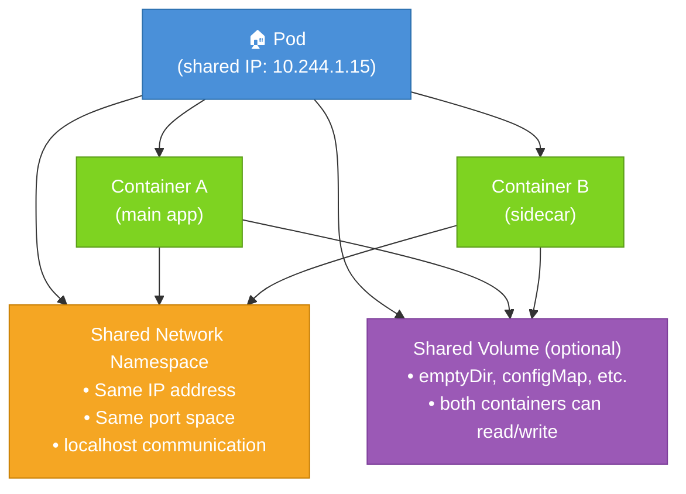

# What Is a Pod?

If you ask a Kubernetes newcomer what the basic building block of the platform is, they will often say "a container." That's understandable , containers are what you're running, after all. But Kubernetes doesn't schedule or manage containers directly. It manages something called a **Pod**, and understanding the difference between a Pod and a container is one of the most important conceptual steps you can take early in your Kubernetes journey.

## The Smallest Deployable Unit

A **Pod** is the smallest unit that Kubernetes schedules and manages. Think of it as a wrapper around one or more containers. When you ask Kubernetes to run your application, you describe what you want in a Pod (or in a higher-level object like a Deployment that manages Pods for you), and Kubernetes places that Pod onto a node in the cluster where it runs.

Every Pod gets its own IP address within the cluster. Every Pod has its own filesystem, its own lifecycle, and its own resource allocation. Kubernetes doesn't interact with containers directly , it interacts with Pods, and the container runtime (like containerd) inside each node handles the actual container execution.

So why this extra layer? Why not just schedule containers directly?

## Why Pods, Not Just Containers?

The reason Pods exist is **co-location**: sometimes you need two or more processes to run so tightly together that they must share resources , specifically, a network interface and optionally a storage volume. Containers running in the same Pod share the same network namespace. That means they share the same IP address and can communicate with each other via `localhost`, just like two programs running on the same machine. They can also be given access to shared storage volumes declared at the Pod level.

This design enables powerful patterns that would be difficult or impossible if you managed containers independently. And it gives the cluster a clean unit of scheduling: Kubernetes always schedules an entire Pod onto a single node. All containers in a Pod live on the same node, always.

## The Apartment Building Analogy

Imagine a large apartment building. Each **apartment** is a Pod. Inside the apartment, there may be one person living alone, or several **roommates** sharing the space. The roommates are the containers. They all share the same **street address** (the Pod's IP address) and the same **mailbox** (network interface). If you want to send a letter to one roommate versus another, you'd include extra information , like an apartment number or a specific name , but the outer address is identical for all of them.

Now, when the building manager (the Kubernetes scheduler) assigns an apartment to tenants, they assign the entire apartment together. They don't put one roommate on floor 3 and another on floor 7. Everyone in the apartment (all containers in a Pod) gets placed on the same floor of the same building , on the same node in the cluster.

This is the core of what makes Pods useful: they guarantee that tightly-coupled processes end up together, sharing a network, without having to work around network boundaries between containers.



## When to Use Multiple Containers in a Pod

Having more than one container in a Pod is not the default , and it should not be. Most Pods contain exactly one container. However, there are well-established patterns where multiple containers per Pod make sense.

The most common is the **sidecar pattern**. Imagine your main application writes logs to a file on disk. You want those logs shipped to a centralized logging system, but you don't want to bake that shipping logic into your application itself. You add a second container , a sidecar , that reads from the same log file (via a shared volume) and streams those logs to whatever backend you're using. The sidecar runs alongside the main container, enhancing it without modifying it.

Other examples of sidecars include:

- A proxy container (like Envoy in a service mesh) that intercepts all network traffic to and from the main container
- An agent that collects metrics and exposes them for scraping
- An initialization or configuration container that sets up something before the main app starts (though Kubernetes has a specific feature for this called **init containers**, which we'll cover in the next lesson)

The key question to ask is: *does this second process need to share the same network namespace or storage as the main process?* If yes, a multi-container Pod might be appropriate. If the two processes are independent and just happen to be related, they should probably be separate Pods.

## When NOT to Use Multi-Container Pods

Don't put containers in the same Pod just because they're part of the same application. A web frontend and a backend API are related, but they don't need to share localhost or a filesystem , they communicate over the network using Services. Putting them in the same Pod would mean they always scale together, always restart together, and can't be deployed independently. That's almost never what you want.

Similarly, don't put a database and an application server in the same Pod. The database should be its own Pod (or better, a StatefulSet), addressable by name, independently scalable, and with its own storage lifecycle.

The rule of thumb: **containers that would function incorrectly or inefficiently if separated belong in the same Pod; containers that just happen to be deployed together do not.**

:::info
A helpful mental test: if you scaled this Pod to five replicas, would it make sense to have five of container A and five of container B together? If container B doesn't need to scale with container A, they should be in different Pods.
:::

## Pods Are Ephemeral

Perhaps the most important thing to understand about Pods is that **they are ephemeral**. A Pod is not a durable entity. It can be evicted from a node if the node runs out of resources, it can be deleted when you update a Deployment, or it can simply die if the container process crashes and the restart policy is set to `Never`.

Pods are not self-healing by themselves. If a Pod dies, nothing automatically creates a new one in its place , unless a **controller** is managing it. Controllers like Deployments and ReplicaSets watch over Pods and recreate them when they disappear. That's their whole job.

:::warning
Never run a standalone Pod in production and expect it to be automatically replaced if it dies. Always use a Deployment (or another appropriate controller) so that the cluster can maintain the desired number of running Pods. Standalone Pods are useful for learning, debugging, and one-off tasks , not for production workloads.
:::

Think of Pods like cattle, not pets. In the old-school world of servers, you'd name your servers, care for them individually, and panic if one died. In the Kubernetes world, Pods are interchangeable units. If one dies, another is born. The controller doesn't mourn the old Pod; it just ensures the count is right.

## Hands-On Practice

Let's get familiar with Pods in your cluster. Open the terminal on the right.

**1. Create a simple single-container Pod:**

```bash
kubectl run nginx-pod --image=nginx:1.25
```

**2. Check that it's running:**

```bash
kubectl get pods
kubectl get pod nginx-pod -o wide
```

The `-o wide` flag shows you which node the Pod landed on and what IP address it was assigned.

**3. Inspect the Pod's details:**

```bash
kubectl describe pod nginx-pod
```

Look at the `IP:` field (the Pod's IP address), the `Node:` field (where it's scheduled), and the `Containers:` section showing the nginx container.

**4. Create a multi-container Pod using a manifest:**

Save the following to a file called `multi-container.yaml`:

```yaml
apiVersion: v1
kind: Pod
metadata:
  name: multi-container-pod
spec:
  containers:
    - name: main-app
      image: nginx:1.25
    - name: sidecar
      image: busybox:1.36
      command: ["sh", "-c", "while true; do echo 'sidecar running'; sleep 10; done"]
```

Apply it:

```bash
kubectl apply -f multi-container.yaml
kubectl get pod multi-container-pod
```

**5. Check the logs of each container separately:**

```bash
kubectl logs multi-container-pod -c main-app
kubectl logs multi-container-pod -c sidecar
```

Notice you need to specify the container name with `-c` when a Pod has more than one container.

**6. Confirm they share the same IP:**

```bash
kubectl get pod multi-container-pod -o jsonpath='{.status.podIP}'
echo ""
```

Both containers in this Pod communicate on this single IP address.

**7. Open the cluster visualizer** (telescope icon) to see your Pods appear as nodes in the visual graph.

**8. Clean up:**

```bash
kubectl delete pod nginx-pod
kubectl delete pod multi-container-pod
```

You now have a solid understanding of what a Pod is, why it exists as a concept separate from containers, when multiple containers make sense, and why Pods on their own are not meant to be long-lived production entities. In the next lesson, we'll go deep into the anatomy of a Pod manifest and explore all the fields available to you.
