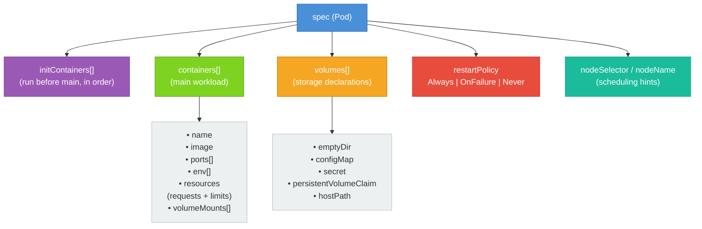

# Pod Structure and Anatomy

Now that you understand what a Pod is, it's time to open it up and look at the mechanics. A Pod manifest can look simple — just a container name and image — or it can be quite detailed, with volumes, init containers, environment variables, resource constraints, and scheduling hints. In this lesson, we'll walk through every major section of a Pod manifest so you know exactly what each field does and when to use it.

## The Complete Manifest at a Glance

Before diving into individual sections, here is a reasonably complete Pod manifest that demonstrates the most commonly used fields:

```yaml
apiVersion: v1
kind: Pod
metadata:
  name: my-pod
  labels:
    app: my-app
spec:
  containers:
    - name: main-container
      image: nginx:1.25
      ports:
        - containerPort: 80
      env:
        - name: ENV_VAR
          value: "hello"
      resources:
        requests:
          memory: "64Mi"
          cpu: "250m"
        limits:
          memory: "128Mi"
          cpu: "500m"
  restartPolicy: Always
```

This manifest creates a single Pod with one container. Let's break down every piece of it, and then go beyond it to cover fields this example doesn't show.

## `spec.containers[]`

The heart of a Pod manifest is the `spec.containers` field — a list of containers that will run inside the Pod. At minimum, each container entry needs a `name` and an `image`. Everything else is optional, though you'll almost always want at least some of it.

### `name` and `image`

The `name` must be unique within the Pod (you can't have two containers with the same name in one Pod). The `image` is the container image to pull from a registry — just like you'd pass to `docker run`. You should always specify a version tag (like `nginx:1.25`) rather than relying on `latest`, which can cause unexpected behavior when a new image version is pulled without you realizing it.

### `ports`

The `ports` section documents which ports the container listens on. It's mostly informational — it doesn't actually expose or open any ports. The real networking is configured at the Service level. But declaring ports is good practice for documentation, and some tools use this information to auto-configure things. Each port entry can have a `containerPort` (required), a `name` (optional but useful for referencing in Services), and a `protocol` (defaults to TCP).

### `env`

The `env` field is a list of environment variables to inject into the container. Each entry has a `name` and a `value`. This is the simplest form — a hardcoded string. But Kubernetes also supports reading values from ConfigMaps and Secrets using `valueFrom`:

```yaml
env:
  - name: DATABASE_URL
    valueFrom:
      secretKeyRef:
        name: db-secret
        key: url
  - name: LOG_LEVEL
    valueFrom:
      configMapKeyRef:
        name: app-config
        key: log_level
```

This keeps sensitive data out of your manifests and decouples configuration from code.

### `resources`

Resource management is critical for running a stable cluster. The `resources` field has two sub-fields: `requests` and `limits`.

**Requests** are what the container is guaranteed. The scheduler uses requests to decide which node has enough capacity to place the Pod. If your container requests `250m` CPU and `64Mi` memory, the scheduler will only place this Pod on a node that has that much available.

**Limits** are the maximum the container is allowed to use. If a container tries to use more memory than its limit, it will be **OOMKilled** (killed by the Out-Of-Memory killer). If it tries to use more CPU than its limit, it will be **throttled** (slowed down, not killed).

CPU is measured in **millicores**: `250m` means 250 millicores, or a quarter of one CPU core. Memory is measured in binary bytes: `64Mi` is 64 mebibytes.

:::info
Always set both `requests` and `limits` in production. Without `requests`, the scheduler has no information to make good placement decisions. Without `limits`, a misbehaving container can consume all the resources on a node and starve other workloads.
:::

### `volumeMounts`

If the Pod declares volumes (more on that below), containers can mount them using `volumeMounts`. Each mount specifies the volume name and where in the container's filesystem to attach it:

```yaml
volumeMounts:
  - name: data-volume
    mountPath: /var/data
  - name: config-volume
    mountPath: /etc/config
    readOnly: true
```

## `spec.volumes[]`

Volumes are declared at the Pod level — not the container level — and then mounted into one or more containers. This design allows multiple containers in the same Pod to share the same volume. Volumes have many possible types: `emptyDir` (temporary storage that lives as long as the Pod), `configMap` and `secret` (expose Kubernetes objects as files), `persistentVolumeClaim` (durable storage), `hostPath` (mounts a path from the node's filesystem), and more.

A simple example using an `emptyDir` shared between two containers:

```yaml
spec:
  volumes:
    - name: shared-logs
      emptyDir: {}
  containers:
    - name: app
      image: myapp:1.0
      volumeMounts:
        - name: shared-logs
          mountPath: /var/log/app
    - name: log-shipper
      image: logstash:8.0
      volumeMounts:
        - name: shared-logs
          mountPath: /input
```

## `spec.restartPolicy`

The `restartPolicy` field controls what happens when a container in the Pod exits. It applies to all containers in the Pod. There are three options:

- `Always` (the default): Kubernetes will always restart the container when it exits, regardless of the exit code. This is appropriate for long-running services like web servers.
- `OnFailure`: Restart only if the container exits with a non-zero exit code (i.e., it failed). Useful for batch jobs that should retry on error but not restart on success.
- `Never`: Never restart the container, regardless of how it exits. Useful for one-shot tasks.

We'll go into this field in more depth in the lesson on container restart policies.

## `spec.nodeName` and `spec.nodeSelector`

By default, the Kubernetes scheduler decides which node to place a Pod on, and you should usually let it do its job. However, there are times when you need to influence scheduling.

`spec.nodeName` is the most direct option: you hard-code the name of the node you want the Pod to run on. This bypasses the scheduler entirely. It's rarely a good idea in production because it creates a brittle coupling between your Pod and a specific node.

`spec.nodeSelector` is a more flexible approach. You provide a set of key-value pairs, and the Pod will only be scheduled on nodes that have matching labels:

```yaml
spec:
  nodeSelector:
    disktype: ssd
    region: us-east-1
```

This means the scheduler will only consider nodes that have the label `disktype=ssd` and `region=us-east-1`. Kubernetes has more powerful scheduling features (like node affinity and taints/tolerations) for advanced use cases, but `nodeSelector` covers the majority of simple placement requirements.

## Init Containers

Init containers are a special type of container that runs **before** the main containers start. They run to completion in sequence — if you have three init containers, the first must complete successfully before the second starts, and so on. Only after all init containers have successfully completed will the main containers be started.

This is useful for preparation tasks: waiting for a database to become available, downloading a configuration file, running database migrations, or initializing a shared volume with some data.

```yaml
spec:
  initContainers:
    - name: wait-for-db
      image: busybox:1.36
      command: ["sh", "-c", "until nc -z db-service 5432; do sleep 2; done"]
  containers:
    - name: app
      image: myapp:1.0
```

In this example, the `wait-for-db` init container loops until port 5432 on `db-service` is reachable. Only then does the main `app` container start. This neatly solves the startup ordering problem without building the waiting logic into your application image.

:::warning
If an init container fails (exits with a non-zero code), Kubernetes will restart the Pod according to its `restartPolicy`. If the `restartPolicy` is `Always` or `OnFailure`, the init container will be retried. Make sure your init containers are idempotent — they should be safe to run multiple times.
:::

## Full Structural Overview

The diagram below shows how the major sections of a Pod spec relate to each other:



## Hands-On Practice

Let's build and inspect a detailed Pod manifest in the cluster.

**1. Create the following manifest and save it as `detailed-pod.yaml`:**

```yaml
apiVersion: v1
kind: Pod
metadata:
  name: detailed-pod
  labels:
    app: my-app
    tier: frontend
spec:
  initContainers:
    - name: init-setup
      image: busybox:1.36
      command: ["sh", "-c", "echo 'Init container ran' > /init-data/init.txt"]
      volumeMounts:
        - name: init-volume
          mountPath: /init-data
  containers:
    - name: main-container
      image: nginx:1.25
      ports:
        - containerPort: 80
          name: http
      env:
        - name: MY_VAR
          value: "hello-from-env"
      resources:
        requests:
          memory: "64Mi"
          cpu: "100m"
        limits:
          memory: "128Mi"
          cpu: "200m"
      volumeMounts:
        - name: init-volume
          mountPath: /usr/share/nginx/html/init
  volumes:
    - name: init-volume
      emptyDir: {}
  restartPolicy: Always
```

Apply it:

```bash
kubectl apply -f detailed-pod.yaml
```

**2. Watch the Pod start (observe the init container phase):**

```bash
kubectl get pod detailed-pod --watch
```

You'll briefly see the Pod in `Init:0/1` state while the init container runs, then transition to `Running`. Press `Ctrl+C` when the Pod is running.

**3. Describe the Pod to see all sections:**

```bash
kubectl describe pod detailed-pod
```

Notice the `Init Containers:` section, the `Containers:` section, the `Volumes:` section, and the `Environment:` and `Mounts:` details for each container.

**4. Verify the init container wrote its file:**

```bash
kubectl exec detailed-pod -c main-container -- cat /usr/share/nginx/html/init/init.txt
```

The init container wrote to the shared volume, and the main container can read it.

**5. Check the environment variable inside the container:**

```bash
kubectl exec detailed-pod -- env | grep MY_VAR
```

**6. View resource requests and limits:**

```bash
kubectl get pod detailed-pod -o jsonpath='{.spec.containers[0].resources}'
echo ""
```

**7. Clean up:**

```bash
kubectl delete pod detailed-pod
```

You now have a thorough understanding of every major section of a Pod manifest. In the next lesson, we'll actually create Pods in the cluster using both imperative and declarative approaches.
