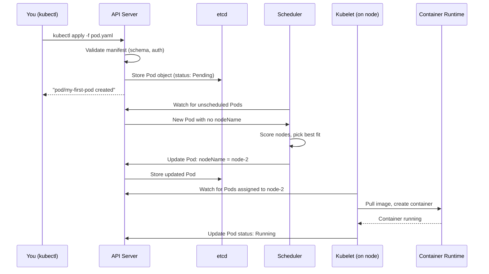

# Creating Your First Pod

There are two fundamental ways to create resources in Kubernetes: the **imperative** approach and the **declarative** approach. Understanding both, when to use each, and what happens under the hood, is a key skill for any Kubernetes practitioner.

## The Imperative Approach: `kubectl run`

The imperative approach means issuing a direct command to Kubernetes: "Create this thing, now." It's fast, requires no files, and is ideal for quick experiments or debugging sessions.

```bash
kubectl run nginx-pod --image=nginx:1.28
```

That's it. One command, one Pod. The `kubectl run` command has a few commonly used flags worth knowing:

```bash
# Run with a specific port documented on the container
kubectl run nginx-pod --image=nginx:1.28 --port=80

# Add labels to the Pod
kubectl run nginx-pod --image=nginx:1.28 --labels="app=web,tier=frontend"

# Override the command the container runs (not supported in the simulator)
kubectl run debug-pod --image=busybox:1.36 --command -- sh -c "sleep 3600"
```

:::warning
The imperative approach leaves no record. There is no file you can commit to version control, no history of exactly what was applied. It's perfect for throwaway experimentation but not for production workflows.
:::

## The Declarative Approach: `kubectl apply -f`

The declarative approach is the recommended way to manage Kubernetes resources in any serious environment. You write a YAML manifest describing what you want, save it to a file, and apply it:

```bash
kubectl apply -f pod.yaml
```

The manifest is the record of your intent. It can be stored in a Git repository, reviewed in pull requests, shared with teammates, and applied identically to multiple environments. When you run `kubectl apply`, Kubernetes compares what's in the file with what's currently in the cluster, and applies only the necessary changes.

:::info
A key benefit of `kubectl apply` over `kubectl create` is that `apply` will **update** an existing resource if you change the manifest and re-run the command. `kubectl create` will fail if the object already exists. For this reason, `kubectl apply` is the standard command for both initial creation and subsequent updates.
:::

## What Happens When You Create a Pod

The journey from `kubectl apply -f pod.yaml` to a running container involves several components working in sequence. Understanding this flow will help you debug issues when things go wrong.



Each step in sequence:

1. **Validation** The API server checks your permissions and validates the manifest against the Pod schema. Any issue is rejected immediately with a descriptive error.
2. **Storage** The valid Pod object is written to etcd. The Pod is now `Pending`: it exists, but no node is assigned and no container is running.
3. **Scheduling** The scheduler watches for Pods without a `nodeName`. It evaluates nodes (resources, selectors, taints), scores them, and writes the chosen node back to the Pod object.
4. **Kubelet** The kubelet on the selected node picks up the Pod, pulls the image if not cached, and starts the container via the container runtime.
5. **Status update** Once running, the kubelet updates the Pod's `status` in etcd to `Running` and continues monitoring container health.

## Checking Your Pod

Once you've created a Pod, there are several commands for inspecting it.

`kubectl get pod my-first-pod` gives you a quick summary with columns `READY`, `STATUS`, `RESTARTS`, and `AGE`. Add `-o wide` to also see the node name and Pod IP.

For a full human-readable breakdown, use `kubectl describe`. The `Events:` section at the bottom is invaluable for debugging: it shows the exact sequence of what happened to the Pod from scheduling to container start.

For the raw object (spec + status combined in YAML):

```bash
kubectl get pod my-first-pod -o yaml
```

This gives you everything Kubernetes knows about the Pod, including the `status` section populated by the kubelet.

:::info
You can use `kubectl get pods --watch` in the terminal to stream live updates as a Pod's status changes. This is useful when you're waiting for a Pod to become ready and want to see each state transition in real time.
:::

## Hands-On Practice

**1. Create a Pod imperatively:**

```bash
kubectl run imperative-pod --image=nginx:1.28 --port=80
kubectl get pod imperative-pod
```

**2. Create a Pod declaratively:**

Save the following file:

```yaml
# declarative-pod.yaml
apiVersion: v1
kind: Pod
metadata:
  name: declarative-pod
  labels:
    app: web
    method: declarative
spec:
  containers:
    - name: web
      image: nginx:1.28
      ports:
        - containerPort: 80
```

Apply it:

```bash
kubectl apply -f declarative-pod.yaml
kubectl get pod declarative-pod
```

**3. Watch a Pod being created in real time:**

Open the visualizer (telescope icon) and create a new Pod.

```bash
kubectl run watch-pod --image=nginx:1.28
```

Observe the status transitions: `Pending` → `ContainerCreating` → `Running`.

**4. Check the full raw YAML of a running Pod:**

```bash
kubectl get pod declarative-pod -o yaml
```

Find the `status` section at the bottom. Note the `phase: Running`, `podIP`, `hostIP`, and `containerStatuses` fields.

**5. Get just the Pod IP:**

```bash
kubectl get pod declarative-pod -o jsonpath='{.status.podIP}'
```

**6. Check the Events section via describe:**

```bash
kubectl describe pod declarative-pod
```

Look at the `Events:` section at the bottom. You should see events like `Scheduled`, `Pulling`, `Pulled`, `Created`, and `Started`.

**7. Clean up:**

```bash
kubectl delete pod imperative-pod declarative-pod watch-pod
```

You've now created Pods both ways, traced the full lifecycle from manifest to running container, and learned the core commands for inspecting Pod state. In the next lesson, we'll go deeper into what happens after a Pod is created, specifically, the phases a Pod passes through during its lifetime.
