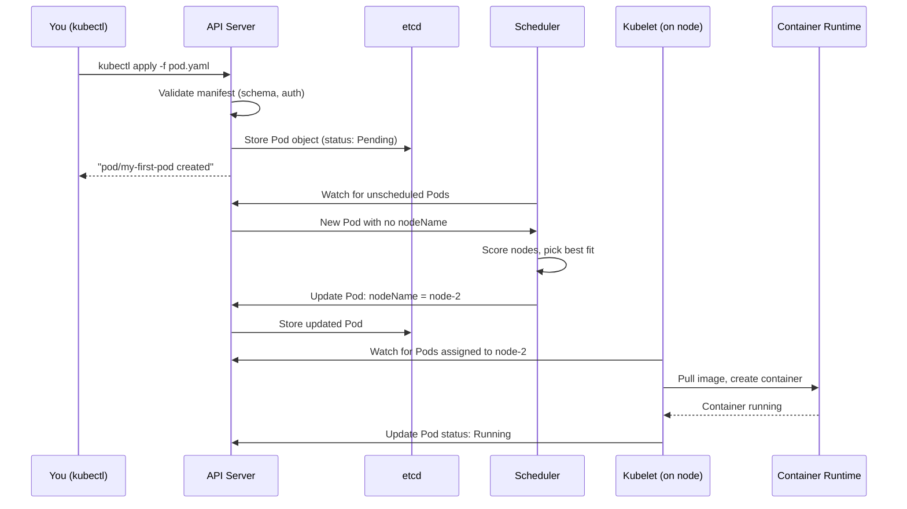

# Creating Your First Pod

There are two fundamental ways to create resources in Kubernetes: the **imperative** approach and the **declarative** approach. Understanding both — when to use each, and what happens under the hood either way — is a key skill for any Kubernetes practitioner. In this lesson, we'll create Pods using both methods, observe how they come to life in the cluster, and trace the full journey from your command to a running container.

## The Imperative Approach: `kubectl run`

The imperative approach means issuing a direct command to Kubernetes: "Create this thing, now." It's fast, requires no files, and is ideal for quick experiments or debugging sessions.

```bash
kubectl run nginx-pod --image=nginx:1.25
```

That's it. One command, one Pod. Kubernetes receives the instruction, creates the Pod object in etcd, and the machinery to actually run it starts immediately.

The `kubectl run` command has a few commonly used flags worth knowing:

```bash
# Run with a specific port documented on the container
kubectl run nginx-pod --image=nginx:1.25 --port=80

# Add labels to the Pod
kubectl run nginx-pod --image=nginx:1.25 --labels="app=web,tier=frontend"

# Override the command the container runs
kubectl run debug-pod --image=busybox:1.36 --command -- sh -c "sleep 3600"
```

The imperative approach has one significant downside: **it leaves no record**. There is no file you can commit to version control, no history of exactly what was applied. It's perfect for throwaway experimentation but not for production workflows.

## The Declarative Approach: `kubectl apply -f`

The declarative approach is the recommended way to manage Kubernetes resources in any serious environment. You write a YAML manifest describing what you want, save it to a file, and apply it:

```bash
kubectl apply -f pod.yaml
```

The manifest is the record of your intent. It can be stored in a Git repository, reviewed in pull requests, shared with teammates, and applied identically to multiple environments. When you run `kubectl apply`, Kubernetes compares what's in the file with what's currently in the cluster, and applies only the necessary changes.

Here's a complete Pod manifest you can use:

```yaml
apiVersion: v1
kind: Pod
metadata:
  name: my-first-pod
  labels:
    app: web
    env: learning
spec:
  containers:
    - name: web
      image: nginx:1.25
      ports:
        - containerPort: 80
      resources:
        requests:
          memory: "64Mi"
          cpu: "100m"
        limits:
          memory: "128Mi"
          cpu: "200m"
```

Save this as `my-first-pod.yaml` and apply it:

```bash
kubectl apply -f my-first-pod.yaml
```

You'll see output like:

```
pod/my-first-pod created
```

If you run the same command again without changing the file:

```
pod/my-first-pod unchanged
```

Kubernetes is smart about idempotency — it only acts when there's something to change.

:::info
A key benefit of `kubectl apply` over `kubectl create` is that `apply` will **update** an existing resource if you change the manifest and re-run the command. `kubectl create` will fail if the object already exists. For this reason, `kubectl apply` is the standard command for both initial creation and subsequent updates.
:::

## What Happens When You Create a Pod

The journey from `kubectl apply -f pod.yaml` to a running container involves several components working in sequence. Understanding this flow will help you debug issues when things go wrong.



Let's walk through each step:

**1. Validation.** The API server receives your request, checks that you have permission to create a Pod in this namespace, and validates the manifest against the Pod schema. If anything is missing or malformed, it rejects the request immediately with a descriptive error message.

**2. Storage.** If the manifest is valid, the Pod object is written to etcd. At this point, the Pod is in the `Pending` phase. It exists as an object, but no node has been assigned and no container is running yet.

**3. Scheduling.** The scheduler is watching the API server for newly created Pods that don't yet have a `nodeName` assigned. It picks up your Pod, evaluates all available nodes (checking resource availability, node selectors, taints, etc.), scores them, picks the best one, and writes the chosen node name back to the Pod object.

**4. Kubelet.** The kubelet on the selected node is also watching the API server for Pods that are assigned to its node. It picks up the Pod, instructs the container runtime (containerd or another CRI-compatible runtime) to pull the image if it's not already cached, and creates and starts the container.

**5. Status update.** Once the container is running, the kubelet updates the Pod's `status` field in etcd, setting the phase to `Running` and populating the container state. From now on, the kubelet continues monitoring the container and reporting its health back to the API server.

## Checking Your Pod

Once you've created a Pod, there are several commands for inspecting it.

`kubectl get pod` gives you a quick summary table:

```bash
kubectl get pod my-first-pod
```

Output:

```
NAME           READY   STATUS    RESTARTS   AGE
my-first-pod   1/1     Running   0          30s
```

`READY` shows `1/1` because one container is running and one was requested. `STATUS` shows `Running`. `RESTARTS` shows 0 — the container hasn't needed to restart yet.

For more detail, use `-o wide` to see the node and IP:

```bash
kubectl get pod my-first-pod -o wide
```

For a full human-readable breakdown:

```bash
kubectl describe pod my-first-pod
```

`kubectl describe` is invaluable for debugging. Look at the `Events:` section at the bottom — it shows a chronological log of what happened: when the Pod was scheduled, when the image was pulled, when the container started.

For the raw object (spec + status combined in YAML):

```bash
kubectl get pod my-first-pod -o yaml
```

This gives you everything Kubernetes knows about the Pod, including the `status` section populated by the kubelet.

## Tip: Watch the Cluster Visualizer

After creating a Pod, open the **cluster visualizer** by clicking the telescope icon. You'll see the Pod appear as a node in the cluster graph, connected to the node it's running on. This is a great way to develop an intuitive understanding of how resources are placed across your cluster.

:::info
You can use `kubectl get pods --watch` in the terminal to stream live updates as a Pod's status changes. This is useful when you're waiting for a Pod to become ready and want to see each state transition in real time.
:::

## Hands-On Practice

**1. Create a Pod imperatively:**

```bash
kubectl run imperative-pod --image=nginx:1.25 --port=80
kubectl get pod imperative-pod
kubectl describe pod imperative-pod
```

**2. Create a Pod declaratively:**

Save the following to `declarative-pod.yaml`:

```yaml
apiVersion: v1
kind: Pod
metadata:
  name: declarative-pod
  labels:
    app: web
    method: declarative
spec:
  containers:
    - name: web
      image: nginx:1.25
      ports:
        - containerPort: 80
      resources:
        requests:
          memory: "64Mi"
          cpu: "100m"
        limits:
          memory: "128Mi"
          cpu: "200m"
```

Apply it:

```bash
kubectl apply -f declarative-pod.yaml
kubectl get pod declarative-pod
```

**3. Watch a Pod being created in real time:**

In one terminal, start watching:

```bash
kubectl get pods --watch
```

In another (or after opening a second tab), create a new Pod:

```bash
kubectl run watch-pod --image=nginx:1.25
```

Observe the status transitions: `Pending` → `ContainerCreating` → `Running`. Press `Ctrl+C` to stop watching.

**4. Check the full raw YAML of a running Pod:**

```bash
kubectl get pod declarative-pod -o yaml
```

Find the `status` section at the bottom. Note the `phase: Running`, `podIP`, `hostIP`, and `containerStatuses` fields.

**5. Get just the Pod IP:**

```bash
kubectl get pod declarative-pod -o jsonpath='{.status.podIP}'
echo ""
```

**6. Check the Events section via describe:**

```bash
kubectl describe pod declarative-pod | grep -A 20 Events
```

You should see events like `Scheduled`, `Pulling`, `Pulled`, `Created`, and `Started`.

**7. Open the cluster visualizer** (telescope icon) to see your Pods placed on nodes.

**8. Clean up:**

```bash
kubectl delete pod imperative-pod declarative-pod watch-pod
```

You've now created Pods both ways, traced the full lifecycle from manifest to running container, and learned the core commands for inspecting Pod state. In the next lesson, we'll go deeper into what happens after a Pod is created — specifically, the phases a Pod passes through during its lifetime.
