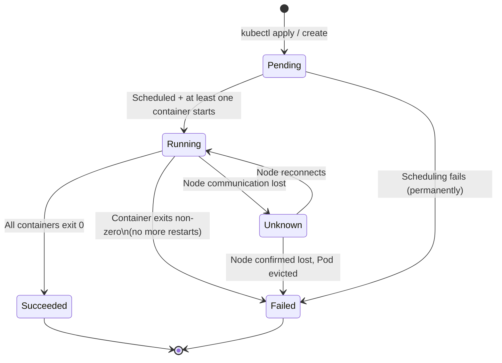

# Pod Lifecycle and Phases

A Pod is not a static thing. From the moment it's created to the moment it's gone, it passes through a defined set of states that tell you exactly where it is in its journey. Understanding these states is essential for monitoring your applications, diagnosing problems, and writing automation that reacts correctly to the cluster's condition. In this lesson, we'll explore Pod phases, container states, and the conditions that describe a Pod's overall health.

## Pod Phases

The top-level lifecycle concept for a Pod is its **phase**. The phase is a high-level summary of where the Pod is in its lifecycle. There are exactly five possible phases, and Kubernetes guarantees that a Pod will be in exactly one of them at any given moment.

### `Pending`

A Pod enters the `Pending` phase when it has been accepted by the Kubernetes API server and stored in etcd, but it isn't running yet. This can happen for several reasons. The most common is that the scheduler hasn't yet assigned the Pod to a node — it might be waiting for enough resources to become available, or it might be constrained by node selectors or affinity rules that limit which nodes can accept it.

Another reason a Pod stays `Pending` is that its container image is being pulled. Once a node is assigned, the kubelet begins pulling the required images from the registry. This can take some time depending on image size and network speed. During this window, the Pod remains `Pending`.

### `Running`

A Pod enters the `Running` phase when it has been bound to a node and at least one container is running. Note the nuance: *at least one* container. A Pod with three containers is `Running` even if only one container has started and the others are still starting. It's also `Running` if a container inside it has crashed and is being restarted — as long as the restart is in progress.

`Running` is the normal, healthy state for long-lived workloads like web servers and background services.

### `Succeeded`

A Pod reaches the `Succeeded` phase when **all** containers in the Pod have exited with a zero exit code and will not be restarted. This is the expected terminal state for Jobs and batch workloads — tasks that are meant to run once, complete their work, and exit cleanly.

A `Succeeded` Pod is not running anymore, but it hasn't failed either. It did exactly what it was supposed to do.

### `Failed`

A Pod reaches the `Failed` phase when **at least one** container has exited with a non-zero exit code, and the restart policy does not allow further retries. It's the terminal state that signals something went wrong and Kubernetes has given up trying to fix it.

A Pod with `restartPolicy: Never` will immediately enter `Failed` if any container exits with an error. A Pod with `restartPolicy: OnFailure` will keep retrying on failure, so it won't reach `Failed` until... well, it depends on other factors like the Job controller managing it.

### `Unknown`

`Unknown` is an error state. It means the API server cannot determine what state the Pod is in because it lost communication with the node the Pod was running on. This typically happens when a node fails catastrophically or is partitioned from the network. Once communication is re-established, the Pod will transition back to a known phase, or it will be evicted and recreated elsewhere.

:::warning
If you see Pods stuck in `Unknown`, investigate the health of the node they're running on. Check `kubectl get nodes` for a `NotReady` status. `Unknown` Pods are not necessarily dead — the node might just be temporarily unreachable — but they need attention.
:::

## The Phase State Machine

The diagram below shows how a Pod transitions between phases over its lifetime:



## Container States: The Next Level of Detail

While Pod phases give you the broad picture, **container states** tell you what's happening inside each individual container. You can see container states in the output of `kubectl describe pod`. Each container can be in one of three states:

### `Waiting`

A container is `Waiting` when it's not yet running but is in the process of getting ready. The `reason` field inside `Waiting` tells you why. Common reasons include:

- `ContainerCreating`: The container is being set up (volumes being mounted, etc.)
- `PodInitializing`: Waiting for init containers to complete
- `ImagePullBackOff`: The image pull failed and Kubernetes is backing off before retrying
- `CrashLoopBackOff`: The container keeps crashing; Kubernetes is delaying the next restart attempt

`CrashLoopBackOff` is one of the most common error states you'll encounter. It means the container started, ran briefly, crashed, and Kubernetes tried to restart it — only for it to crash again, repeatedly. The "BackOff" part means Kubernetes is using an **exponential backoff** delay between restart attempts to avoid hammering the system. We'll cover this in the restart policies lesson.

### `Running`

The container state `Running` means the container process is actively executing. A running container has a `startedAt` timestamp you can inspect.

### `Terminated`

A container enters the `Terminated` state when it has finished — either successfully or with an error. The `Terminated` state includes an `exitCode` (0 for success, non-zero for failure) and a `reason` field. Common reasons include:

- `Completed`: The container exited normally with exit code 0
- `OOMKilled`: The container was killed by the kernel's out-of-memory killer because it exceeded its memory limit
- `Error`: The container process exited with a non-zero code

`OOMKilled` deserves special mention. When a container exceeds its memory `limit`, Kubernetes doesn't wait for it to crash on its own — the Linux kernel kills the process immediately. You'll see `OOMKilled` in the container state, and the restart behavior depends on the `restartPolicy`. If you see this frequently, your memory limit is too low.

:::info
You can view container states directly with:

```bash
kubectl get pod <name> -o jsonpath='{.status.containerStatuses[*].state}'
```

Or more readably, via `kubectl describe pod <name>` — look for the `State:` and `Last State:` fields under each container.
:::

## Pod Conditions

In addition to phases and container states, Pods have a set of **conditions** — boolean flags that indicate specific checkpoints in the Pod's readiness. You can see them in `kubectl describe pod` under the `Conditions:` heading, or in `kubectl get pod -o yaml` under `status.conditions`.

The four standard conditions are:

**`PodScheduled`**: Has the Pod been assigned to a node? This becomes `True` when the scheduler selects a node. If scheduling fails (say, no node has enough resources), this stays `False` with a reason explaining why.

**`Initialized`**: Have all init containers completed successfully? This becomes `True` only after every init container has exited with code 0.

**`ContainersReady`**: Are all containers in the Pod reporting that they are ready? This requires that the container is running and — if configured — that its readiness probe is passing.

**`Ready`**: Is the Pod ready to serve traffic? This is the top-level condition that aggregates the others. A Pod is `Ready` when it is scheduled, initialized, and all containers are ready. Only when `Ready` is `True` will a Service route traffic to this Pod.

The `Ready` condition is what Kubernetes uses to determine whether a Pod should receive traffic. If a container becomes unhealthy (its readiness probe starts failing), `Ready` becomes `False`, and the Service will stop routing traffic to that Pod — even though the container is still running. This is how Kubernetes gracefully handles a slow or partially broken container without killing it outright.

## Hands-On Practice

Let's observe phases, container states, and conditions live in the cluster.

**1. Create a normal Pod and watch its phase transitions:**

```bash
kubectl run lifecycle-pod --image=nginx:1.25
kubectl get pod lifecycle-pod --watch
```

You should see the phase go from `Pending` to `ContainerCreating` to `Running`. Press `Ctrl+C` when done.

**2. Inspect the full status including conditions:**

```bash
kubectl describe pod lifecycle-pod
```

Look for the `Conditions:` section and the `State:` field under `Containers:`.

**3. View conditions in raw form:**

```bash
kubectl get pod lifecycle-pod -o jsonpath='{.status.conditions}' | python3 -m json.tool
```

**4. Simulate a failing container to observe CrashLoopBackOff:**

```bash
kubectl run crash-pod --image=busybox:1.36 --restart=Always -- sh -c "exit 1"
```

Then watch it:

```bash
kubectl get pod crash-pod --watch
```

You'll see it cycle through `Error` → `CrashLoopBackOff` → `Error` repeatedly. Press `Ctrl+C` after a minute.

**5. Describe the crash Pod for details:**

```bash
kubectl describe pod crash-pod
```

Look at the `Last State:` field under the container — it will show `Terminated` with `Reason: Error` and `Exit Code: 1`. Also note `Restart Count:` increasing with each cycle.

**6. Create a short-lived Pod that succeeds:**

```bash
kubectl run success-pod --image=busybox:1.36 --restart=Never -- sh -c "echo 'Job done'; sleep 2"
kubectl get pod success-pod --watch
```

Watch it go from `Pending` to `Running` to `Completed`. The `Completed` status corresponds to the `Succeeded` phase.

**7. Check the exit code of the completed Pod:**

```bash
kubectl get pod success-pod -o jsonpath='{.status.containerStatuses[0].state.terminated.exitCode}'
echo ""
```

The exit code should be `0`.

**8. Clean up:**

```bash
kubectl delete pod lifecycle-pod crash-pod success-pod
```

With a firm grasp of Pod phases, container states, and conditions, you now have the vocabulary to read and interpret the cluster's signals — whether things are running smoothly or something has gone sideways. These signals are your first line of defense when debugging production issues.
