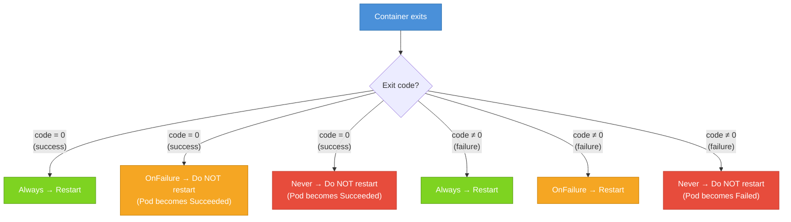

# Container Restart Policies

When a container inside a Pod stops running , whether because it completed its work, crashed with an error, or was killed for using too much memory , what happens next? Does Kubernetes try again? Does it give up? Does it wait a while before trying? The answer to all of these questions depends on a single field in your Pod spec: `restartPolicy`. Understanding restart policies is crucial for matching the right behavior to each type of workload you run in the cluster.

## Where `restartPolicy` Lives

One important thing to understand right away: `restartPolicy` is a **Pod-level** field, not a per-container field. You can't say "restart container A but not container B." The policy applies to all containers in the Pod equally. It lives in `spec.restartPolicy`:

```yaml
spec:
  restartPolicy: Always
  containers:
    - name: web
      image: nginx:1.25
```

There are exactly three valid values: `Always`, `OnFailure`, and `Never`.

## `Always`: The Default for Long-Running Services

`Always` is the default value for `restartPolicy`. If you omit the field entirely, Kubernetes behaves as if you wrote `restartPolicy: Always`.

With `Always`, Kubernetes will restart a container **no matter how it exits:**  whether it exits cleanly with code 0 or crashes with a non-zero code. This is the right policy for web servers, background workers, proxies, databases, and any other process that is supposed to run continuously and indefinitely.

Imagine your nginx container crashes unexpectedly due to a bug. With `restartPolicy: Always`, Kubernetes will pick it back up and restart it, typically within a few seconds. Your service may have a brief interruption, but it will recover automatically. For production services, this self-healing behavior is exactly what you want.

:::info
When Pods are managed by a Deployment, the Deployment controller ensures that the right number of Pods are always running. But the `restartPolicy` within each Pod also provides a second line of defense , if a container inside a running Pod crashes, it will be restarted on the same node without needing the Deployment controller to intervene.
:::

## `OnFailure`: For Batch Jobs That Should Retry

`OnFailure` instructs Kubernetes to restart a container only if it **exits with a non-zero exit code:**  that is, only if it failed. If the container exits cleanly with code 0 (indicating success), Kubernetes will leave it alone and not restart it.

This policy is designed for batch workloads and one-time tasks. Consider a data processing job that downloads files, processes them, and then exits. If it exits with code 0, it succeeded , you don't want it to start over. But if it exits with code 1 because it hit a transient network error or a database connection failure, you do want it to retry.

```yaml
spec:
  restartPolicy: OnFailure
  containers:
    - name: data-processor
      image: my-batch-job:1.0
```

With `OnFailure`, a successful run is final, but a failed run is retried. This makes it well-suited for Kubernetes Jobs, which we'll cover in a later module.

## `Never`: For Tasks That Should Not Retry

`Never` tells Kubernetes to never restart the container under any circumstances. If the container exits, whether successfully or with an error, it stays stopped. The Pod will then transition to `Succeeded` (if the container exited with 0) or `Failed` (if it exited with non-zero).

This policy is appropriate for one-shot tasks where retrying would be harmful or meaningless , perhaps a migration script where running it twice would corrupt data, or a diagnostic tool that you run once and inspect the output of.

```yaml
spec:
  restartPolicy: Never
  containers:
    - name: db-migration
      image: my-migrator:1.0
```

With `Never`, you're saying: "Run this once. Whatever happens, don't run it again."

## The Three Policies at a Glance



## The Exponential Backoff: CrashLoopBackOff

Here's something important: when Kubernetes restarts a container (under `Always` or `OnFailure`), it doesn't just immediately try again over and over. If a container keeps crashing, restarting it immediately every single time would waste CPU, flood logs, and potentially cause problems in the cluster. Instead, Kubernetes uses an **exponential backoff** delay between restart attempts.

The progression of delays works like this:

- **First restart**: 10 seconds
- **Second restart**: 20 seconds
- **Third restart**: 40 seconds
- **Fourth restart**: 80 seconds
- **Fifth restart**: 160 seconds
- ...up to a maximum of **300 seconds (5 minutes)**

After the maximum delay is reached, Kubernetes continues retrying at 5-minute intervals indefinitely. The container is stuck in a cycle of crashing and waiting for the next restart attempt. This is what you see in your cluster as **`CrashLoopBackOff`** in the `STATUS` column of `kubectl get pods`.

`CrashLoopBackOff` is not a phase or a container state , it's a reason code shown inside the container's `Waiting` state. It means: "This container has been crashing repeatedly, and Kubernetes is currently waiting before trying again." The underlying problem could be anything: a missing environment variable, a misconfigured database connection string, a bug in the application code, an image that fails to start, or a missing secret.

The most common response to `CrashLoopBackOff` is to check the container logs from the last crash:

```bash
kubectl logs <pod-name> --previous
```

The `--previous` flag is critical , it shows the logs from the *last* (crashed) container instance, not the current waiting one. Without `--previous`, you might get no output at all because the container isn't running.

:::warning
`CrashLoopBackOff` is often a sign that the exponential backoff is actively protecting your cluster. If a container crashes and immediately restarts hundreds of times, it could eat up CPU and memory on the node. The backoff gives you time to notice the problem and act without the cluster being overwhelmed by rapid restart cycles.
:::

## Checking Restart Counts

The `RESTARTS` column in `kubectl get pods` shows you the cumulative number of times containers in a Pod have been restarted. A healthy long-running Pod should have 0 or very few restarts. A high restart count is a signal that something is wrong.

```bash
kubectl get pods
```

Output example:

```
NAME          READY   STATUS             RESTARTS   AGE
healthy-pod   1/1     Running            0          2d
crashy-pod    0/1     CrashLoopBackOff   47         1h
```

`crashy-pod` has restarted 47 times in an hour. Something is clearly wrong. Use `kubectl describe` and `kubectl logs --previous` to investigate.

For more detail on each restart, `kubectl describe pod` shows the `Restart Count` per container and the `Last State` with the exit code from the most recent crash:

```bash
kubectl describe pod crashy-pod
```

Look for:
```
Last State:  Terminated
  Reason:    Error
  Exit Code: 1
  Started:   ...
  Finished:  ...
Restart Count: 47
```

This tells you the exit code, which often points directly to the problem.

## Hands-On Practice

Let's explore all three restart policies with real examples.

**1. `Always` in action , observe self-healing:**

```bash
kubectl run always-pod --image=nginx:1.25 --restart=Always
kubectl get pod always-pod
```

Now trigger a restart by killing the nginx process inside the container:

```bash
kubectl exec always-pod -- nginx -s stop
```

Then immediately watch:

```bash
kubectl get pod always-pod --watch
```

You'll see the restart count increment as Kubernetes restarts the container. Press `Ctrl+C` when you see it come back to `Running`.

**2. `Never` with success , Pod becomes Completed:**

```bash
kubectl run success-never --image=busybox:1.36 --restart=Never -- sh -c "echo done; exit 0"
kubectl get pod success-never --watch
```

Watch it complete and reach `Completed` status. Press `Ctrl+C`.

**3. `Never` with failure , Pod becomes Failed:**

```bash
kubectl run fail-never --image=busybox:1.36 --restart=Never -- sh -c "exit 1"
kubectl get pod fail-never --watch
```

Watch it reach `Error` status (which represents the `Failed` phase). Press `Ctrl+C`.

**4. `OnFailure` cycling , observe backoff:**

```bash
kubectl run crashy --image=busybox:1.36 --restart=OnFailure -- sh -c "exit 1"
kubectl get pod crashy --watch
```

Watch the RESTARTS column increase and STATUS cycle between `Error` and `CrashLoopBackOff`. Press `Ctrl+C` after 2–3 restarts.

**5. Check logs from the previous (crashed) container:**

```bash
kubectl logs crashy --previous
```

(In this case the container outputs nothing, but this is the command you'd use for a real crashing container.)

**6. Describe the crashy pod to see exit code and restart count:**

```bash
kubectl describe pod crashy
```

Find `Last State`, `Exit Code`, and `Restart Count` in the output.

**7. Clean up:**

```bash
kubectl delete pod always-pod success-never fail-never crashy
```

Restart policies are a simple concept with significant practical impact. Choosing the right one for each workload is part of designing reliable Kubernetes applications , and recognizing `CrashLoopBackOff` as a signal to investigate (rather than just a status to ignore) is one of the most valuable debugging instincts you can develop.
