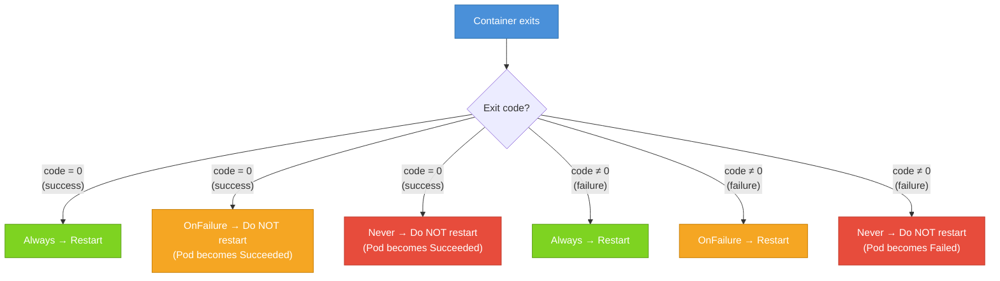

# Container Restart Policies

When a container inside a Pod stops running, whether because it completed its work, crashed with an error, or was killed for using too much memory, what happens next? The answer depends on a single field in your Pod spec: `restartPolicy`. Choosing the right policy for each workload type is one of the simplest yet most impactful decisions you make when writing Pod manifests.

## Where `restartPolicy` Lives

`restartPolicy` is a **Pod-level** field, not a per-container field. You can't say "restart container A but not container B." The policy applies to all containers in the Pod equally:

```yaml
spec:
  restartPolicy: Always
  containers:
    - name: web
      image: nginx:1.25
```

There are exactly three valid values: `Always`, `OnFailure`, and `Never`.

## `Always`: The Default for Long-Running Services

`Always` is the default value, if you omit the field entirely, Kubernetes behaves as if you wrote `restartPolicy: Always`. With this policy, Kubernetes restarts a container **no matter how it exits**: whether it exits cleanly with code 0 or crashes with a non-zero code.

This is the right policy for web servers, background workers, proxies, databases, and any other process that is supposed to run continuously. If your nginx container crashes unexpectedly, Kubernetes picks it back up and restarts it, typically within a few seconds.

:::info
When Pods are managed by a Deployment, the Deployment controller ensures that the right number of Pods are always running. But `restartPolicy: Always` within each Pod provides a second line of defense, if a container inside a running Pod crashes, it will be restarted on the same node without needing the Deployment controller to intervene.
:::

## `OnFailure`: For Batch Jobs That Should Retry

`OnFailure` instructs Kubernetes to restart a container only if it **exits with a non-zero exit code**, that is, only if it failed. If the container exits cleanly with code 0, Kubernetes leaves it alone and the Pod moves to `Succeeded`.

This policy is designed for batch workloads and one-time tasks. Consider a data processing job that downloads files, processes them, and exits. If it exits with code 0, it succeeded, no restart needed. If it exits with code 1 due to a transient network error, you do want it to retry.

```yaml
spec:
  restartPolicy: OnFailure
  containers:
    - name: data-processor
      image: my-batch-job:1.0
```

`OnFailure` is well-suited for Kubernetes Jobs, which we'll cover in a later module.

## `Never`: For Tasks That Should Not Retry

`Never` tells Kubernetes to never restart the container under any circumstances. If the container exits, whether successfully or with an error, it stays stopped. The Pod transitions to `Succeeded` (exit code 0) or `Failed` (non-zero).

This policy is appropriate for one-shot tasks where retrying would be harmful, a migration script where running it twice would corrupt data, or a diagnostic tool you run once and inspect the output of.

```yaml
spec:
  restartPolicy: Never
  containers:
    - name: db-migration
      image: my-migrator:1.0
```

## The Three Policies at a Glance



## The Exponential Backoff: CrashLoopBackOff

When Kubernetes restarts a container under `Always` or `OnFailure`, it doesn't retry immediately every time. If a container keeps crashing, Kubernetes uses an **exponential backoff** delay between restart attempts to avoid wasting resources and flooding logs:

- **1st restart**: 10 seconds
- **2nd restart**: 20 seconds
- **3rd restart**: 40 seconds
- **4th restart**: 80 seconds
- **5th restart**: 160 seconds
- ...up to a maximum of **300 seconds (5 minutes)**, then retries indefinitely at that interval

This is what you see as **`CrashLoopBackOff`** in `kubectl get pods`. It's not a phase or container state, it's a reason code inside the container's `Waiting` state, meaning: "This container has been crashing repeatedly; Kubernetes is waiting before trying again."

The underlying problem could be anything: a missing environment variable, a misconfigured connection string, a bug in application code, or a missing secret. The most useful first step is checking logs from the last crash:

```bash
kubectl logs <pod-name> --previous
```

The `--previous` flag is critical, it shows logs from the *last* (crashed) container instance, not the current waiting one. Without it, you might get no output at all.

:::warning
`CrashLoopBackOff` is often a sign that the exponential backoff is actively protecting your cluster. If a container crashes and immediately restarts hundreds of times, it could eat up CPU and memory on the node. The backoff gives you time to notice and act without the cluster being overwhelmed.
:::

## Checking Restart Counts

The `RESTARTS` column in `kubectl get pods` shows the cumulative number of times containers in a Pod have been restarted. A healthy long-running Pod should have 0 or very few restarts. A high restart count is a signal that something is wrong.

```
NAME          READY   STATUS             RESTARTS   AGE
healthy-pod   1/1     Running            0          2d
crashy-pod    0/1     CrashLoopBackOff   47         1h
```

`crashy-pod` has restarted 47 times in an hour. Use `kubectl describe` and `kubectl logs --previous` to investigate. The `Last State` section in `kubectl describe pod` shows the exit code from the most recent crash:

```
Last State:  Terminated
  Reason:    Error
  Exit Code: 1
Restart Count: 47
```

## Hands-On Practice

Let's explore all three restart policies with real examples.

**1. `Always` in action, observe self-healing:**

```bash
kubectl run always-pod --image=nginx:1.25 --restart=Always
kubectl get pod always-pod
```

Now trigger a restart by killing the nginx process inside the container:

```bash
kubectl exec always-pod -- nginx -s stop
```

Then immediately watch:

```bash
kubectl get pod always-pod --watch
```

You'll see the restart count increment as Kubernetes restarts the container. Press `Ctrl+C` when you see it come back to `Running`.

**2. `Never` with success, Pod becomes Completed:**

```bash
kubectl run success-never --image=busybox:1.36 --restart=Never -- sh -c "echo done; exit 0"
kubectl get pod success-never --watch
```

Watch it complete and reach `Completed` status. Press `Ctrl+C`.

**3. `Never` with failure, Pod becomes Failed:**

```bash
kubectl run fail-never --image=busybox:1.36 --restart=Never -- sh -c "exit 1"
kubectl get pod fail-never --watch
```

Watch it reach `Error` status (which represents the `Failed` phase). Press `Ctrl+C`.

**4. `OnFailure` cycling, observe backoff:**

```bash
kubectl run crashy --image=busybox:1.36 --restart=OnFailure -- sh -c "exit 1"
kubectl get pod crashy --watch
```

Watch the RESTARTS column increase and STATUS cycle between `Error` and `CrashLoopBackOff`. Press `Ctrl+C` after 2–3 restarts.

**5. Check logs from the previous (crashed) container:**

```bash
kubectl logs crashy --previous
```

(In this case the container outputs nothing, but this is the command you'd use for a real crashing container.)

**6. Describe the crashy pod to see exit code and restart count:**

```bash
kubectl describe pod crashy
```

Find `Last State`, `Exit Code`, and `Restart Count` in the output.

**7. Clean up:**

```bash
kubectl delete pod always-pod success-never fail-never crashy
```

Restart policies are a simple concept with significant practical impact. Choosing the right one for each workload is part of designing reliable Kubernetes applications, and recognizing `CrashLoopBackOff` as a signal to investigate (rather than just a status to ignore) is one of the most valuable debugging instincts you can develop.
