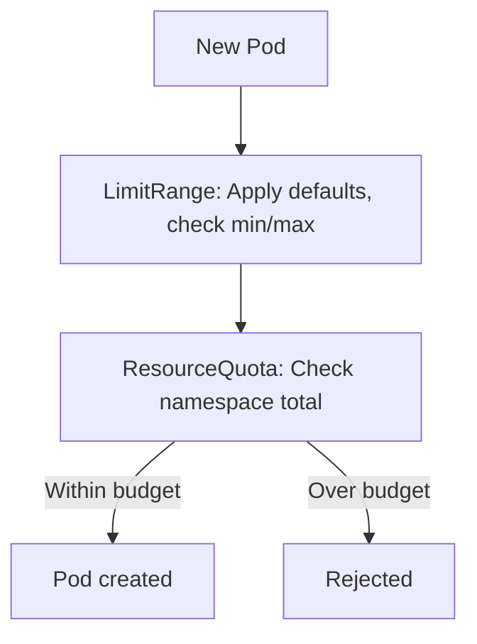

# What Are Limit Ranges?

ResourceQuotas set a **total budget** for a namespace — "This namespace can use up to 8 CPU cores." But they don't control how that budget is spent by individual Pods. Without additional guardrails, a single Pod could request all 8 cores, leaving nothing for everyone else.

**LimitRanges** fill this gap. They set rules for individual Pods and containers: default resource requests and limits, minimum and maximum allowed values, and constraints on PVC sizes. Think of ResourceQuota as the household budget and LimitRange as the spending rules — "No single purchase can exceed $500."

## LimitRange vs ResourceQuota

These two mechanisms work at different levels:

| | ResourceQuota | LimitRange |
|---|---|---|
| **Scope** | Total namespace consumption | Per-object constraints |
| **Question** | "How much can this namespace use overall?" | "How much can one Pod/container/PVC use?" |
| **Example** | Total CPU across all Pods ≤ 8 cores | Each container ≤ 2 cores, default 500m |

They complement each other perfectly. LimitRange ensures each object is well-behaved; ResourceQuota ensures the namespace as a whole stays within bounds.



:::info
LimitRanges are especially valuable when combined with ResourceQuotas. When a namespace has a compute quota, all Pods must specify requests/limits. A LimitRange can inject sensible defaults automatically, so developers don't have to add them to every manifest.
:::

## A Basic LimitRange

Here's a LimitRange that sets defaults for containers and caps their maximum:

```yaml
apiVersion: v1
kind: LimitRange
metadata:
  name: cpu-mem-limits
  namespace: dev
spec:
  limits:
    - type: Container
      default:
        cpu: "500m"
        memory: 512Mi
      defaultRequest:
        cpu: "100m"
        memory: 128Mi
      max:
        cpu: "2"
        memory: 2Gi
      min:
        cpu: "50m"
        memory: 64Mi
```

What this does:

- **default** — If a container doesn't specify `limits`, it gets 500m CPU and 512Mi memory
- **defaultRequest** — If a container doesn't specify `requests`, it gets 100m CPU and 128Mi memory
- **max** — No container can request or be limited to more than 2 CPU cores or 2Gi memory
- **min** — No container can request less than 50m CPU or 64Mi memory

## LimitRange Types

LimitRanges support three types:

- **Container** — Per-container CPU, memory, ephemeral storage. This is the most commonly used type.
- **Pod** — Aggregate min/max across all containers in the Pod. Prevents a multi-container Pod from being too greedy.
- **PersistentVolumeClaim** — Min/max storage size for PVCs. Prevents requests for absurdly large (or tiny) volumes.

You can define multiple types in a single LimitRange.

## Checking a LimitRange

Use `kubectl get limitrange -n <namespace>` to list LimitRanges, and `kubectl describe limitrange <name> -n <namespace>` to see all configured defaults, minimums, and maximums.

:::warning
If you set `max` without `default`, containers that don't specify limits won't get defaults — and depending on configuration, they may be rejected. Always provide both `default` and `defaultRequest` for predictable behavior.
:::

---

## Hands-On Practice

### Step 1: Check Existing LimitRanges

```bash
kubectl get limitranges -A
```

See if any namespaces already have LimitRanges configured.

### Step 2: Create a LimitRange Manifest

Create `lr.yaml`:

```bash
cat <<'EOF' > lr.yaml
apiVersion: v1
kind: LimitRange
metadata:
  name: cpu-mem-limits
  namespace: dev
spec:
  limits:
    - type: Container
      default:
        cpu: "500m"
        memory: 512Mi
      defaultRequest:
        cpu: "100m"
        memory: 128Mi
      max:
        cpu: "2"
        memory: 2Gi
EOF
```

Create the namespace if needed: `kubectl create namespace dev`

### Step 3: Apply and Verify

```bash
kubectl apply -f lr.yaml
kubectl describe limitrange cpu-mem-limits -n dev
```

The output shows defaults, minimums, and maximums for containers in the namespace.

### Step 4: Clean Up

```bash
kubectl delete limitrange cpu-mem-limits -n dev
rm -f lr.yaml
```

## Wrapping Up

LimitRanges ensure that individual Pods, containers, and PVCs play by the rules — sensible defaults, no extreme requests, no tiny allocations. Combined with ResourceQuotas, they form a complete governance model: LimitRanges handle per-object policy, ResourceQuotas handle namespace totals. In the next lessons, we'll dive deeper into container-level limits and Pod/PVC-level limits.
