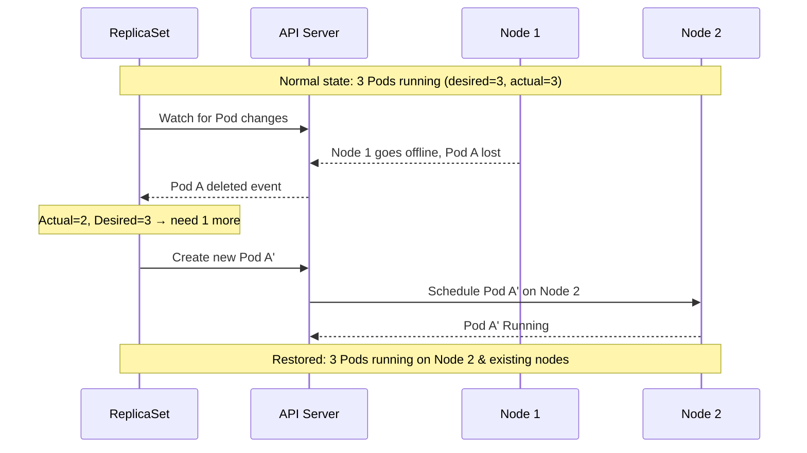

# Why ReplicaSets? The Problem with Bare Pods

In earlier lessons you learned how to create Pods , the fundamental unit of work in Kubernetes. You can describe a container, apply the manifest, and within seconds your application is running. Simple and satisfying. But if you stop there and run Pods directly, you're leaving one of Kubernetes's most important capabilities on the table: self-healing. This lesson explains the fragility of bare Pods and introduces the ReplicaSet as the solution.

## The Fragility of a Bare Pod

A Pod, on its own, is not resilient. It's a mortal object. When you create a Pod with `kubectl apply`, the API server records it in etcd, the scheduler assigns it to a Node, and the kubelet on that Node starts the container. As long as that Node is healthy and the container keeps running, everything is fine. But consider what happens when something goes wrong.

If the container crashes, the kubelet will restart it according to the Pod's `restartPolicy`. So far, so good , that's a form of resilience. But if the **Node** itself fails , a hardware fault, a network partition, a kernel panic , the Pod is simply gone. It was running on that node, and now that node is unreachable. Kubernetes will eventually mark the Node as `NotReady`, but it will not automatically recreate the Pod somewhere else. The Pod's record in etcd stays there, stuck in a `Terminating` or `Unknown` state, until an administrator cleans it up manually. Your application is down.

This is not an edge case. Nodes fail. Cloud instances get terminated by spot pricing mechanisms. Kernels crash. Hardware degrades. In a production system, you absolutely cannot rely on any single Node being available forever.

Even without catastrophic failure, bare Pods have a mundane problem: they don't scale. If you want to run three copies of your web server for availability and performance, you'd need to write three separate Pod manifests and manage them individually. That's three separate names, three separate YAML files, and three separate things to update whenever you change the container image. It's repetitive, error-prone, and doesn't scale beyond a handful of replicas.

## Enter the ReplicaSet

A ReplicaSet is a Kubernetes controller whose entire job is to ensure that a specified number of identical Pods , called replicas , are always running at any given moment. It acts as a constant, watchful guardian over its flock of Pods.

The mental model that works well here is a **restaurant manager**. Imagine a restaurant that needs exactly four waiters on the floor during dinner service. The manager doesn't wait to be told if a waiter calls in sick or suddenly quits , she continuously monitors the floor, and the moment she sees only three waiters, she immediately calls in a replacement. She doesn't care which specific waiter is there; she just cares that there are always exactly four. When it's slow, she can send one home (scale down). When it's particularly busy, she can call in extra staff (scale up). The headcount on the floor is always exactly what she wants it to be.

A ReplicaSet operates exactly this way. You tell it: "I want three replicas of this Pod running at all times." It looks at the cluster, counts how many qualifying Pods are currently running, and if the number doesn't match, it acts immediately , creating new Pods if there are too few, or deleting extras if there are too many.

## Self-Healing in Action

The self-healing behavior is what makes ReplicaSets , and the controllers built on top of them , so fundamental to running reliable software on Kubernetes.

When a Pod managed by a ReplicaSet disappears (due to a node failure, an accidental `kubectl delete pod`, or any other reason), the ReplicaSet detects the discrepancy within seconds. Its desired state says three Pods; the actual state now has two. The ReplicaSet immediately creates a new Pod on a healthy node. From the perspective of your application's availability, the failure was a brief blip rather than a prolonged outage.

This happens without any human intervention. No pager alert at 2 AM to manually recreate a crashed Pod. No runbook entry that says "if a Pod disappears, run this command." The system heals itself.



## Horizontal Scaling

Beyond self-healing, ReplicaSets make horizontal scaling trivially easy. Want to go from three replicas to ten because traffic just spiked? One command. Want to scale back down to two replicas at night to save resources? One command. The ReplicaSet handles creating or deleting the necessary Pods; you just state your intention.

This also opens the door to automation. Kubernetes's Horizontal Pod Autoscaler (HPA) works by adjusting the `replicas` field of a ReplicaSet (or Deployment, which manages ReplicaSets) based on observed CPU or memory usage, or custom metrics. The same mechanism that lets you scale manually is what enables fully automatic, metrics-driven scaling.

## How a ReplicaSet Finds Its Pods

This is an important detail, and it connects back to what you learned about labels. A ReplicaSet doesn't track "its" Pods by name or by some internal ID. Instead, it uses a **label selector:**  exactly the same selector mechanism covered in the Labels module.

When a ReplicaSet is created, you specify a `selector` that describes which Pods it should be responsible for. Every time the ReplicaSet reconciles, it runs an equivalent of `kubectl get pods -l <your selector>` and counts the results. If the count matches the desired `replicas`, nothing happens. If not, it creates or deletes Pods accordingly.

This design has an important implication: the ReplicaSet doesn't know or care whether it created a particular Pod itself. It just counts Pods that match its selector. This leads to the interesting behavior of **Pod adoption**, which you'll explore in a later lesson , but for now, the key takeaway is that the selector is the link between the ReplicaSet and the Pods it governs.

:::info
Because a ReplicaSet uses label selectors to find its Pods, it's critical that the labels you define in the Pod template match the selector. The Kubernetes API enforces this relationship , a mismatch will cause the ReplicaSet creation to fail with a validation error. You'll see exactly how this works in the next lesson.
:::

:::warning
Never manually delete a Pod managed by a ReplicaSet expecting it to stay gone. The ReplicaSet will create a replacement almost immediately. If you want to reduce the number of running Pods, you need to change the `replicas` count on the ReplicaSet itself.
:::

## Hands-On Practice

Let's observe the fragility of a bare Pod first, then see how a ReplicaSet fixes the problem.

**1. Create a bare Pod**

```bash
kubectl run bare-pod --image=nginx:1.25
kubectl get pod bare-pod
```

**2. Simulate a failure by deleting the Pod**

```bash
kubectl delete pod bare-pod
# Wait a moment, then check
kubectl get pods
# bare-pod is gone , no one recreated it
```

**3. Create a simple ReplicaSet**

```bash
kubectl apply -f - <<EOF
apiVersion: apps/v1
kind: ReplicaSet
metadata:
  name: web-rs
spec:
  replicas: 3
  selector:
    matchLabels:
      app: web
  template:
    metadata:
      labels:
        app: web
    spec:
      containers:
        - name: nginx
          image: nginx:1.25
EOF
```

**4. Observe the Pods being created**

```bash
kubectl get pods -l app=web
kubectl get rs web-rs
```

**5. Simulate a Pod failure , watch the self-healing**

```bash
# Get one of the Pod names
POD=$(kubectl get pods -l app=web -o name | head -1)
echo "Deleting $POD"
kubectl delete $POD

# Watch the ReplicaSet immediately create a replacement
kubectl get pods -l app=web -w
# Press Ctrl+C when you see 3 Pods running again
```

**6. Check the ReplicaSet status**

```bash
kubectl describe rs web-rs
# Notice the Events section , it shows every Pod creation
```

**7. Clean up**

```bash
kubectl delete rs web-rs
```

Open the cluster visualizer (telescope icon) after step 3 to see the three Pods appear simultaneously, all linked to the ReplicaSet. After step 5, watch the visualizer as one Pod disappears and a replacement appears in near real-time.
