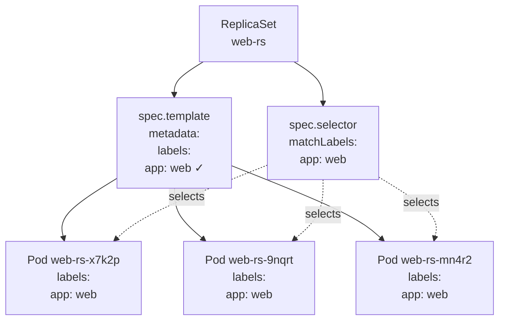

# Creating a ReplicaSet

Now that you understand _why_ ReplicaSets exist, it's time to learn _how_ to create one. A ReplicaSet manifest follows the same structure as every other Kubernetes object: `apiVersion`, `kind`, `metadata`, and `spec`. But the `spec` section has a few fields that work together in a specific way, and understanding those relationships will save you from the most common mistakes.

:::info
A ReplicaSet has three interdependent `spec` fields: `replicas` (desired Pod count), `selector` (how it finds Pods), and `template` (how it creates them). The labels in `template` must satisfy `selector`, the API server enforces this constraint at creation time.
:::

## Anatomy of a ReplicaSet Manifest

Let's start with a complete, working ReplicaSet manifest and walk through each section:

```yaml
apiVersion: apps/v1
kind: ReplicaSet
metadata:
  name: web-rs
spec:
  replicas: 3
  selector:
    matchLabels:
      app: web
  template:
    metadata:
      labels:
        app: web
    spec:
      containers:
        - name: web
          image: nginx:1.28
          ports:
            - containerPort: 80
```

### `apiVersion` and `kind`

ReplicaSets live in the `apps/v1` API group, not in the core `v1` group like Pods and Services. This means you must write `apiVersion: apps/v1`, if you write `apiVersion: v1`, the API server will tell you it doesn't know what a `ReplicaSet` is in that group.

### `metadata`

Just like any other resource, `metadata` gives the ReplicaSet a name and an optional namespace. The name must be unique within the namespace. The ReplicaSet itself will use this name as a prefix when generating names for the Pods it creates (e.g., `web-rs-x7k2p`, `web-rs-9nqrt`).

### `spec.replicas`

This is the desired number of Pods. If you omit this field, it defaults to `1`. The ReplicaSet's entire job is to make the actual Pod count match this number at all times.

### `spec.selector`

This is the label selector that tells the ReplicaSet which Pods to count as "its own". It supports the same `matchLabels` and `matchExpressions` syntax you learned in the label selectors lesson. Here, `matchLabels: app: web` means "I own any Pod that has the label `app=web`."

### `spec.template`

This is the Pod template, a complete definition of the Pod that the ReplicaSet will create whenever it needs more replicas. It's essentially a full Pod spec, but without `apiVersion` and `kind` (those are implied). The template has its own `metadata` section where you define the labels for the generated Pods, and a `spec` section where you define the containers.

## The Critical Constraint: Selector Must Match Template Labels

This is the most important rule to understand when writing a ReplicaSet manifest: **the labels in `spec.template.metadata.labels` must be a superset of `spec.selector`**. In plain English, the Pods that the ReplicaSet creates must carry all the labels that the selector looks for. If they don't, the ReplicaSet would create Pods that it immediately doesn't count as its own, an impossible situation.

The Kubernetes API enforces this. If your selector says `app: web` but your template labels say `app: webapp`, the API server will reject the manifest with a validation error:

```
The ReplicaSet "web-rs" is invalid: spec.template.metadata.labels:
  Invalid value: map[string]string{"app":"webapp"}:
  `selector` does not match template `labels`
```

This validation happens at the server level before anything gets scheduled, a helpful guardrail that catches a very common mistake early.



## The Pod Template Is a Full Pod Spec

The `spec.template` field accepts everything a normal Pod `spec` accepts: multiple containers, init containers, volumes, resource requests and limits, environment variables, liveness and readiness probes, security contexts, everything. The only thing it doesn't need is a `name` in the Pod metadata, because the ReplicaSet generates unique names automatically.

This means you can express quite sophisticated Pod configurations through a ReplicaSet. Here's a slightly more complete example with resource limits and a readiness probe:

```yaml
apiVersion: apps/v1
kind: ReplicaSet
metadata:
  name: web-rs
spec:
  replicas: 3
  selector:
    matchLabels:
      app: web
  template:
    metadata:
      labels:
        app: web
        version: '1.25'
    spec:
      containers:
        - name: web
          image: nginx:1.28
          ports:
            - containerPort: 80
          resources:
            requests:
              cpu: '100m'
              memory: '64Mi'
            limits:
              cpu: '250m'
              memory: '128Mi'
          readinessProbe:
            httpGet:
              path: /
              port: 80
            initialDelaySeconds: 5
            periodSeconds: 10
```

All three replicas will be created from this same template, giving you three identical, consistently configured Pods.

## Verifying Your ReplicaSet

After applying the manifest with `kubectl apply -f replicaset.yaml`, the first command to run is:

```bash
kubectl get rs
```

The output shows four key columns:

```
NAME     DESIRED   CURRENT   READY   AGE
web-rs   3         3         3       30s
```

- **DESIRED:** the value of `spec.replicas`; what you asked for.
- **CURRENT:** how many Pods have been created (may be equal to DESIRED before they're all Running).
- **READY:** how many of those Pods are passing their readiness probes and ready to serve traffic.
- **AGE:** how long ago the ReplicaSet was created.

If `READY` is lower than `DESIRED` for more than a few seconds, something is wrong, typically a bad image name, a failing readiness probe, or insufficient resources on the cluster.

To see the Pods themselves:

```bash
kubectl get pods -l app=web
```

```
NAME             READY   STATUS    RESTARTS   AGE
web-rs-mn4r2     1/1     Running   0          42s
web-rs-x7k2p     1/1     Running   0          42s
web-rs-9nqrt     1/1     Running   0          42s
```

Notice the auto-generated names: each Pod gets the ReplicaSet's name as a prefix, followed by a random suffix. This naming makes it easy to tell at a glance which ReplicaSet owns a given Pod.

For deeper inspection, `kubectl describe rs web-rs` shows the full status, the events log, and the current Pod template. Look at the `Events:` section at the bottom, it will show a creation event for each Pod, with a timestamp. If something went wrong, the events section is often the first place to find out why.

:::warning
Never edit the `spec.selector` of a ReplicaSet after it has been created, the API will reject the change because selectors are immutable on ReplicaSets (and Deployments). If you need a different selector, delete the ReplicaSet and create a new one. If you delete the ReplicaSet without the `--cascade=orphan` flag, Kubernetes will also delete all the Pods it manages.
:::

## Hands-On Practice

Let's create a ReplicaSet step by step and explore the output at each stage.

**1. Save the manifest to a file**

Create the replicaset:

```yaml
#web-rs.yaml
apiVersion: apps/v1
kind: ReplicaSet
metadata:
  name: web-rs
spec:
  replicas: 3
  selector:
    matchLabels:
      app: web
  template:
    metadata:
      labels:
        app: web
    spec:
      containers:
        - name: web
          image: nginx:1.28
          ports:
            - containerPort: 80
```

**2. Apply the manifest**
Watch the ReplicaSet and the Pods being created in the visualizer:

```bash
kubectl apply -f web-rs.yaml
```

**3. Check the ReplicaSet status**

```bash
kubectl get rs web-rs
```

**4. Inspect the ReplicaSet in detail**

```bash
kubectl describe rs web-rs
```

**5. Look at the automatically assigned labels on one of the Pods**

```bash
kubectl get pods -l app=web --show-labels
```

**6. Confirm Pod ownership via ownerReferences**

```bash
kubectl get pod <pod-name> -o jsonpath='{.metadata.ownerReferences[0].name}'
# Should print: web-rs
```

**7. Try to deliberately break the selector (observe the error)**

```bash
nano broken-rs.yaml
```

```yaml
apiVersion: apps/v1
kind: ReplicaSet
metadata:
  name: broken-rs
spec:
  replicas: 2
  selector:
    matchLabels:
      app: web
  template:
    metadata:
      labels:
        app: different-app # Intentional mismatch
    spec:
      containers:
        - name: nginx
          image: nginx:1.28
```

```bash
kubectl apply -f broken-rs.yaml
```

Observe the validation error from the API server

**8. Clean up**

```bash
kubectl delete rs web-rs
```
