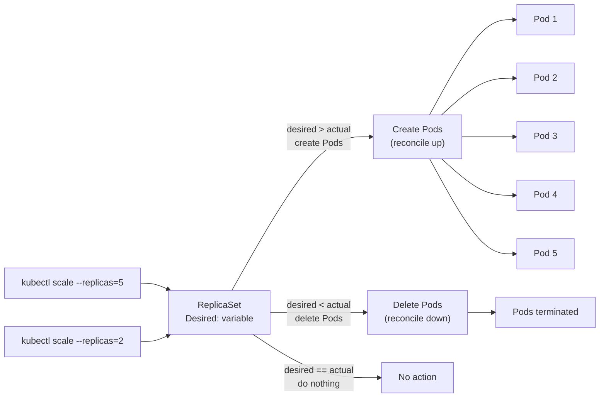

# Scaling and Self-Healing with ReplicaSets

A ReplicaSet isn't a static configuration — it's a living controller that continuously responds to what's happening in your cluster. In this lesson you'll see two of its most powerful behaviors in action: scaling the number of replicas up or down on demand, and automatically healing from Pod failures without any human intervention. You'll also encounter a surprising behavior called adoption, which is a direct consequence of how ReplicaSets find their Pods.

## The Reconciliation Loop

Before diving into specific operations, it helps to understand the mental model that underlies everything a ReplicaSet does: the **reconciliation loop**. 

The ReplicaSet controller is constantly running a simple cycle. It reads the desired state (the `spec.replicas` count you declared) and compares it to the observed state (the number of Pods currently matching the selector). If those two numbers differ — for any reason — it takes action to make them equal. Create Pods if there are too few. Delete Pods if there are too many. Do nothing if they match.

This loop runs continuously and reacts to events. A Pod deletion triggers it. A change to `spec.replicas` triggers it. A Node failure that causes Pods to disappear triggers it. The controller doesn't need to be told about these events explicitly — it watches the API server and responds to changes automatically. This reactive, loop-based design is a core pattern in Kubernetes and is what makes controllers so robust.

## Scaling Up

When traffic to your application increases and you need more capacity, scaling up is a single command:

```bash
kubectl scale rs web-rs --replicas=5
```

The ReplicaSet's `spec.replicas` field is updated to 5. The controller immediately sees that desired (5) exceeds actual (3), and creates two new Pods from the same template. The new Pods come up in parallel — there's no sequential queue. Within seconds, assuming the container image is already cached on the nodes, all five Pods are running and serving traffic.

You can also scale by editing the YAML file and re-applying it:

```bash
# Edit web-rs.yaml, change replicas from 3 to 5, then:
kubectl apply -f web-rs.yaml
```

Both approaches have the same effect: they update the `spec.replicas` field in the API server, which the controller observes and acts upon. The `kubectl scale` command is faster for quick adjustments; updating the file is better for changes you want to commit to version control.

## Scaling Down

Scaling down works identically — you simply specify a lower replica count:

```bash
kubectl scale rs web-rs --replicas=2
```

The ReplicaSet now sees that actual (5) exceeds desired (2), so it needs to delete three Pods. It selects which Pods to delete based on a deterministic ordering that favors removing the most recently created or least ready Pods, but in most cases you should treat the selection as approximately random — don't depend on a specific Pod surviving a scale-down.

The deleted Pods are terminated gracefully: Kubernetes sends a SIGTERM to the containers and waits for the `terminationGracePeriodSeconds` (default 30 seconds) before force-killing them. During this window, the Pod is removed from any Service's Endpoints list, so it stops receiving new traffic before it's shut down.



## Self-Healing

Self-healing is where the reconciliation loop truly shines. Delete a Pod that belongs to a ReplicaSet, and the controller replaces it before you've even had time to run `kubectl get pods` again.

```bash
# With 3 replicas running, delete one Pod manually
kubectl delete pod web-rs-x7k2p

# Run immediately after:
kubectl get pods -l app=web
```

You'll see one Pod in `Terminating` status and a brand-new Pod already in `ContainerCreating`. Within a few seconds, the count is back to three. The ReplicaSet has no memory of the specific Pod that was deleted — it just sees that the count dropped from 3 to 2 and creates a replacement from the template.

This same mechanism handles node failures. When a Node becomes unreachable, the node lifecycle controller eventually marks the Pods on that node as `Unknown`. After a configurable timeout (default 5 minutes), those Pods are forcibly deleted from the API server, which causes the ReplicaSet to detect the shortfall and create replacements on healthy nodes.

:::info
The default timeout before failed Pods are evicted from unreachable nodes is controlled by `--pod-eviction-timeout` on the controller manager (default 5m0s). This means there's a delay of several minutes between a node failing and the ReplicaSet creating replacement Pods. For workloads where even a few minutes of reduced capacity is unacceptable, you might tune this setting or use Pod Disruption Budgets alongside multiple replicas.
:::

## Pod Adoption

Here's a behavior that often surprises newcomers: if you create a bare Pod with labels that match an existing ReplicaSet's selector, the ReplicaSet will **adopt** that Pod. It will treat it as one of its own and count it toward the desired replica count.

Imagine you have a ReplicaSet with `replicas: 3` and `selector: app=web`. Three Pods are running, and the ReplicaSet is satisfied. Now you create a fourth Pod independently with the label `app=web`:

```bash
kubectl run extra-pod --image=nginx:1.25 --labels="app=web"
```

The ReplicaSet controller sees this new Pod match its selector. Its count goes from 3 to 4, but it only wants 3. So it selects one Pod to delete — possibly your `extra-pod`, possibly one of the original three — and terminates it. The result is still three Pods, but not necessarily the four you thought you'd have.

The reverse is also true: if you manually remove a label from one of the ReplicaSet's Pods so it no longer matches the selector, the ReplicaSet "releases" it and creates a new replacement to restore the count. The relabeled Pod becomes a free-floating bare Pod. This technique is occasionally used for debugging — you extract one Pod from the herd by changing its label so you can inspect it in isolation while the ReplicaSet keeps the fleet at full strength.

:::warning
Label collisions between different ReplicaSets can cause chaotic behavior. If two ReplicaSets in the same namespace have overlapping selectors, they'll fight over the same Pods — each one trying to maintain its own desired count, randomly adopting and deleting Pods that the other considers its own. Always make sure each ReplicaSet's selector uniquely identifies its Pods. A label like `instance: web-rs-prod` that includes the ReplicaSet's own name is a good way to ensure uniqueness.
:::

## Watching the Reconciliation in Real Time

`kubectl get` with the `-w` flag (watch) streams updates to the terminal as Kubernetes events occur. This is the best way to observe the reconciliation loop live:

```bash
kubectl get pods -l app=web -w
```

Leave this running while you perform operations in another terminal — scale up, scale down, delete a Pod — and you'll see the events stream in: `Pending`, `ContainerCreating`, `Running`, `Terminating`. The speed of the reconciliation becomes viscerally clear.

## Hands-On Practice

Start with a running ReplicaSet and work through scaling and self-healing exercises.

**1. Create the ReplicaSet**

```bash
kubectl apply -f - <<EOF
apiVersion: apps/v1
kind: ReplicaSet
metadata:
  name: web-rs
spec:
  replicas: 3
  selector:
    matchLabels:
      app: web
  template:
    metadata:
      labels:
        app: web
    spec:
      containers:
        - name: web
          image: nginx:1.25
EOF
kubectl get pods -l app=web
```

**2. Scale up to 5 replicas**

```bash
kubectl scale rs web-rs --replicas=5
kubectl get pods -l app=web
kubectl get rs web-rs
```

**3. Scale down to 2 replicas**

```bash
kubectl scale rs web-rs --replicas=2
kubectl get pods -l app=web
# Notice: only 2 remain, 3 were terminated
```

**4. Demonstrate self-healing**

```bash
# First scale back to 3 for a clear demo
kubectl scale rs web-rs --replicas=3
kubectl get pods -l app=web

# Delete one Pod and immediately watch for replacement
POD=$(kubectl get pods -l app=web -o name | head -1)
kubectl delete $POD & kubectl get pods -l app=web -w
# Ctrl+C after watching the replacement appear
```

**5. Demonstrate Pod adoption**

```bash
# Scale to 3 first
kubectl scale rs web-rs --replicas=3
kubectl get pods -l app=web

# Create an extra Pod with the matching label
kubectl run intruder --image=nginx:1.25 --labels="app=web"

# Watch what happens (the RS will delete one Pod to maintain count=3)
kubectl get pods -l app=web -w
# Ctrl+C after a few seconds
```

**6. Extract a Pod from the fleet by changing its label**

```bash
# Get a Pod name
POD=$(kubectl get pods -l app=web -o name | head -1 | cut -d/ -f2)
echo "Extracting: $POD"

# Remove the label that the RS watches
kubectl label pod $POD app-

# The RS will create a replacement — you now have 4 pods total:
# 3 managed by the RS + 1 free-floating
kubectl get pods --show-labels

# The extracted Pod is now a bare Pod you can inspect safely
# Re-attach the label if you want the RS to reclaim it:
kubectl label pod $POD app=web
```

**7. Clean up**

```bash
kubectl delete rs web-rs
```
