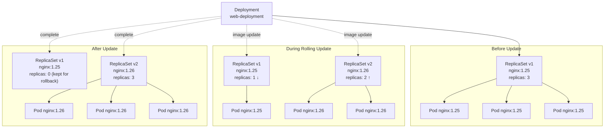

# Limitations of ReplicaSets, Why Deployments Exist

ReplicaSets are powerful: they guarantee replica counts, self-heal, and scale with a single command through a clean, label-based mechanism. So what's the catch? Why does virtually every production Kubernetes guide tell you to "use Deployments, not ReplicaSets directly"?

The answer comes down to one fundamental question: what happens when you need to update your application?

## The Update Problem

:::warning
Updating a ReplicaSet's Pod template **does not restart existing Pods**. Running Pods keep their old image until they are replaced for some other reason, leaving you with a mixed-version fleet, indefinitely.
:::

Imagine you're running `nginx:1.25` across three replicas and you need to upgrade to `nginx:1.26`. You edit the ReplicaSet manifest, change the image tag, and apply it:

```bash
kubectl apply -f web-rs.yaml
```

The ReplicaSet's Pod template is now updated in the API server. But nothing else happens. The three existing Pods are still running `nginx:1.25`. The ReplicaSet controller looks at the cluster, counts three Pods matching its selector, and concludes: "Desired is 3, actual is 3, nothing to do." It doesn't know, and doesn't care, that those Pods were created from an older version of the template.

ReplicaSets are blind to the contents of their Pods. They count Pods by label; they don't inspect container images. This is a deliberate design choice: the ReplicaSet's scope is quantity, not quality. The new template only takes effect when the ReplicaSet needs to create a *new* Pod, for example, if one of the existing Pods crashes. That crash victim will be replaced with `nginx:1.26`. The other two will keep running `nginx:1.25`. Your fleet is now running a mixture of versions, indefinitely.

## The Manual Workaround, and Its Costs

To actually update all Pods with a plain ReplicaSet, you'd have to do one of the following:

**Option A: Scale to zero and back up.** Scale the ReplicaSet to 0 replicas, wait for all Pods to terminate, then scale back to 3. The new Pods will be created from the updated template. This works, but it means a complete service outage during the transition. For a user-facing application, that's unacceptable.

**Option B: Delete Pods one at a time.** Delete each Pod individually. The ReplicaSet creates a replacement using the updated template. If you're careful and patient, you can roll through all three Pods without a complete outage, but you'd always have some capacity loss (one Pod terminating while its replacement starts up). There's no coordination, no traffic draining, and no automatic rollback if something goes wrong.

Neither option is safe, repeatable, or automatable in the way production deployments require. There's also no concept of **rollback** in a ReplicaSet. If your new image is broken and you need to go back to the previous version, you'd have to manually edit the manifest again and repeat the painful process.

## Enter the Deployment

The Deployment controller was created specifically to solve this problem. A Deployment doesn't manage Pods directly, it manages ReplicaSets. When you update a Deployment's Pod template, here's what actually happens behind the scenes:

1. The Deployment controller creates a brand-new ReplicaSet with the updated Pod template.
2. It gradually scales the new ReplicaSet up (creating new Pods with the new image) while simultaneously scaling the old ReplicaSet down (terminating old Pods).
3. It monitors the rollout, checking that new Pods become Ready before proceeding, and pauses or rolls back automatically if something goes wrong.
4. The old ReplicaSet is kept around (scaled to zero) so that a rollback to the previous version is instant: just scale the old RS back up and scale the new one down.

This is called a **rolling update**, and it gives you zero-downtime upgrades out of the box, with built-in rollback capabilities.



The Deployment sits above the ReplicaSet in the hierarchy, orchestrating a careful transition between old and new states. You interact with the Deployment, you never need to touch the individual ReplicaSets it creates.

## The Full Hierarchy: Deployment → ReplicaSet → Pods

Understanding this three-tier hierarchy is fundamental to how Kubernetes workloads operate in production:

- **Deployment** holds your intent: desired version, replica count, rollout strategy. Stores the history of every change and knows how to move between them.
- **ReplicaSet** implements the counting guarantee: at this moment, there must be exactly N Pods matching this selector. It doesn't think about versions or history.
- **Pods** where your containers actually run.

When you run `kubectl get rs` in a namespace where Deployments are in use, you'll see ReplicaSets with auto-generated names like `web-deployment-6d4f9b7c8`. Each one represents one version of the Deployment's Pod template, the currently-active one has a non-zero replica count; older ones are scaled to zero but retained for rollback.

:::info
If you inspect a Deployment-managed ReplicaSet with `kubectl describe rs <name>`, you'll see in its `ownerReferences` that it's owned by a Deployment. And the Pods have `ownerReferences` pointing to the ReplicaSet. This chain, Deployment → ReplicaSet → Pods, is how Kubernetes tracks ownership and cascading garbage collection.
:::

## When Would You Use a ReplicaSet Directly?

Rarely. The Kubernetes documentation itself recommends using Deployments in almost every case. There are a few legitimate edge cases where a bare ReplicaSet makes sense:

**Custom orchestration**: If you're building a higher-level controller that manages Pod lifecycle in a completely custom way and needs the basic counting guarantee without rolling-update semantics, you might use a ReplicaSet as a primitive.

**Stateful scenarios with very specific Pod lifecycle needs**: Some advanced operators manage ReplicaSets directly when they need fine-grained control over exactly which Pods are created and destroyed and when, control that a Deployment's rollout strategy would interfere with. StatefulSets are usually the better answer for stateful workloads, but occasionally a bare ReplicaSet is used.

**Learning and exploration**: Understanding ReplicaSets directly, as you've done in this module, is essential for deeply understanding how Deployments work. When something goes wrong with a Deployment rollout, you'll often debug it by inspecting the underlying ReplicaSets.

In every other case, and that's essentially all production workloads, use a Deployment.

:::warning
If you find yourself reaching for a bare ReplicaSet to deploy a stateless web service, step back and ask: "Will I ever need to update the container image without downtime?" If yes (and the answer is almost always yes), use a Deployment instead. You'll thank yourself the first time you need to roll out a bug fix at 3 AM.
:::

## Hands-On Practice

Let's observe the update limitation of a bare ReplicaSet, then see how a Deployment handles the same situation gracefully.

**1. Create a ReplicaSet with nginx:1.24**

```bash
kubectl apply -f - <<EOF
apiVersion: apps/v1
kind: ReplicaSet
metadata:
  name: web-rs
spec:
  replicas: 3
  selector:
    matchLabels:
      app: web
  template:
    metadata:
      labels:
        app: web
    spec:
      containers:
        - name: web
          image: nginx:1.24
EOF
kubectl get pods -l app=web -o wide
```

**2. Check which image the Pods are running**

```bash
kubectl get pods -l app=web -o jsonpath='{range .items[*]}{.metadata.name}: {.spec.containers[0].image}{"\n"}{end}'
```

**3. Update the ReplicaSet image to nginx:1.25 and observe that nothing changes**

```bash
kubectl patch rs web-rs --type='json' \
  -p='[{"op": "replace", "path": "/spec/template/spec/containers/0/image", "value": "nginx:1.25"}]'

# Check the RS spec, it now says 1.25
kubectl get rs web-rs -o jsonpath='{.spec.template.spec.containers[0].image}'
echo ""

# But the Pods are STILL running 1.24
kubectl get pods -l app=web -o jsonpath='{range .items[*]}{.metadata.name}: {.spec.containers[0].image}{"\n"}{end}'
```

**4. Delete one Pod and see that its replacement uses the new image**

```bash
POD=$(kubectl get pods -l app=web -o name | head -1)
kubectl delete $POD

# Wait for the replacement, then check images again
sleep 5
kubectl get pods -l app=web -o jsonpath='{range .items[*]}{.metadata.name}: {.spec.containers[0].image}{"\n"}{end}'
# Mixed fleet: 2x nginx:1.24, 1x nginx:1.25
```

**5. Clean up the ReplicaSet and create a Deployment instead**

```bash
kubectl delete rs web-rs

kubectl apply -f - <<EOF
apiVersion: apps/v1
kind: Deployment
metadata:
  name: web-deploy
spec:
  replicas: 3
  selector:
    matchLabels:
      app: web
  template:
    metadata:
      labels:
        app: web
    spec:
      containers:
        - name: web
          image: nginx:1.24
EOF
kubectl rollout status deployment/web-deploy
```

**6. Update the Deployment image and observe the rolling update**

```bash
kubectl set image deployment/web-deploy web=nginx:1.25

# Watch the rolling update happen automatically
kubectl rollout status deployment/web-deploy

# All Pods are now on nginx:1.25
kubectl get pods -l app=web -o jsonpath='{range .items[*]}{.metadata.name}: {.spec.containers[0].image}{"\n"}{end}'
```

**7. Observe the two ReplicaSets the Deployment created**

```bash
kubectl get rs
# You'll see two RS: one with 3 replicas (new) and one with 0 (old, kept for rollback)
```

**8. Roll back to the previous version**

```bash
kubectl rollout undo deployment/web-deploy
kubectl rollout status deployment/web-deploy

# Pods are back on nginx:1.24
kubectl get pods -l app=web -o jsonpath='{range .items[*]}{.metadata.name}: {.spec.containers[0].image}{"\n"}{end}'
```

**9. Clean up**

```bash
kubectl delete deployment web-deploy
```

Open the cluster visualizer throughout this exercise, particularly during step 6. You'll see the Deployment node, connected to two ReplicaSet nodes, which are in turn connected to their Pods. Watch the replica counts shift on the two ReplicaSets as the rolling update progresses.
