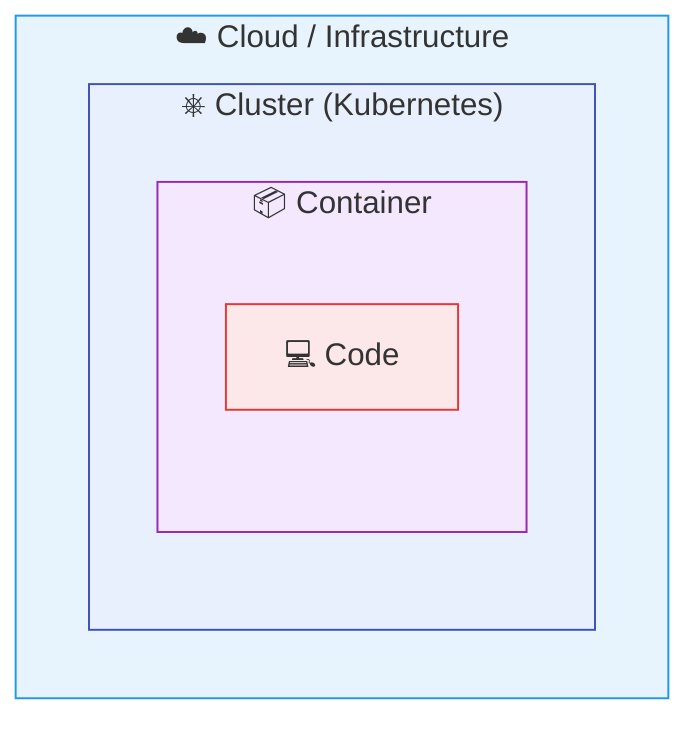

# The 4C Security Model

Imagine you are responsible for securing a large office building. You would not just install locks on individual desk drawers and call it done — you would also secure the rooms, the floors, and the building entrance itself. Each layer of protection reinforces the others, and a weakness in an outer layer can undermine everything inside.

Kubernetes security works the same way. The **4C model** gives you a clear mental map: four nested layers, each depending on the one around it. Let's explore what they are and why they matter.

## The Four Layers

The 4C model organizes security into four concentric layers — from the outermost infrastructure down to your application code.



**1. Cloud (or Co-location)** — the outermost layer. This is the infrastructure your cluster runs on: compute instances, networks, storage, and cloud IAM policies. Think of it as the building itself — its walls, fences, and entry gates. Network isolation, firewall rules, and least-privilege cloud policies belong here. Secure this first, because everything else sits inside it.

**2. Cluster** — the Kubernetes control plane and worker nodes. This includes the API server, etcd (the cluster's database), the kubelet on each node, and the scheduler. RBAC, audit logging, and encryption at rest protect this layer. A breach here can compromise every workload in the cluster.

**3. Container** — what actually runs on your nodes. This covers the container runtime, the images you deploy, and how workloads are isolated from each other. Use trusted base images, run containers as non-root, and drop unnecessary Linux capabilities. Image scanning catches known vulnerabilities before they reach production.

**4. Code** — the innermost layer. Your application source code and its dependencies live here. Address library vulnerabilities with dependency scanning, never hardcode secrets, and follow secure coding practices.

:::info
Each layer depends on the security of the layers outside it. A perfectly hardened container cannot protect you if the cluster's API server is exposed to the internet without authentication. Always work from the outside in.
:::

## Why the Order Matters

You might wonder: "Can I skip the cloud layer and just focus on my containers?" Unfortunately, no. If an attacker gains access to your cloud account, they can bypass every Kubernetes security control — deleting nodes, reading etcd snapshots, or replacing container images entirely.

Think of it like a house: reinforcing the bedroom door is pointless if the front door is wide open. Map each security control to its layer so you understand what depends on what.

## Checking Your Starting Point

Before diving deeper, it helps to understand what your current access looks like. The commands in the hands-on section below give you a quick picture of your position within the cluster. You will use `kubectl auth can-i` frequently throughout this security module — it is your go-to tool for verifying access.

## A First Taste of Hardening

Here is a Pod manifest that applies security settings at the Container layer — running as non-root, preventing privilege escalation, and making the root filesystem read-only:

```yaml
apiVersion: v1
kind: Pod
metadata:
  name: secured-app
spec:
  securityContext:
    runAsNonRoot: true
  containers:
    - name: app
      image: myapp
      securityContext:
        allowPrivilegeEscalation: false
        readOnlyRootFilesystem: true
```

Do not worry if some of these fields are unfamiliar — we will cover each one in detail later in this module. The key takeaway is that a few lines of YAML can significantly reduce your attack surface.

## Mapping Controls to Layers

When you design or audit security for a cluster, try mapping every control to its layer:

| Layer       | Example Controls                                   |
| ----------- | -------------------------------------------------- |
| Cloud       | VPC isolation, firewall rules, cloud IAM policies   |
| Cluster     | RBAC, audit logging, etcd encryption at rest        |
| Container   | Image scanning, securityContext, non-root execution |
| Code        | Dependency scanning, secret management, input validation |

Gaps in outer layers increase risk for everything inside them. A missing firewall rule (Cloud) matters more than a missing seccomp profile (Container), because it exposes a wider attack surface.

---

## Hands-On Practice

### Step 1: Check your cluster nodes

```bash
kubectl get nodes
```

### Step 2: See what is running across all namespaces

```bash
kubectl get pods -A
```

Notice the system components in `kube-system` — these are part of the Cluster security layer.

### Step 3: Test your permissions

```bash
kubectl auth can-i list nodes
kubectl auth can-i delete secrets --all-namespaces
```

This gives you a quick view of what your current identity is allowed to do.

## Wrapping Up

The 4C model gives you a structured way to think about Kubernetes security: start from the infrastructure and work inward, ensuring each layer is solid before relying on the next. In the upcoming lessons, we will zoom into the Cluster layer — exploring how to protect the API server, encrypt sensitive data, and manage access with RBAC.
