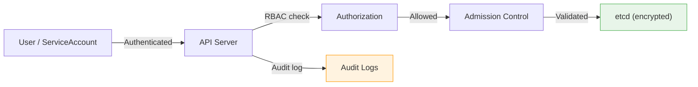

# Cluster Security Basics

In the previous lesson, we saw that the Cluster layer sits just inside the Cloud layer in the 4C model. Now let's zoom in. The cluster layer encompasses the Kubernetes control plane — the API server, etcd, kubelet, and scheduler — along with the worker nodes that run your workloads. If an attacker compromises this layer, they can potentially control every Pod, Secret, and resource in your environment.

Think of the cluster as the nervous system of your application. Protecting it is not optional — it is foundational.

## The Core Practices

Cluster security rests on a few key pillars. Let's walk through each one.

### Least-Privilege API Access with RBAC

RBAC (Role-Based Access Control) lets you define exactly who can do what within the cluster. The golden rule: grant the minimum permissions necessary for each user or service account. Avoid giving `cluster-admin` for routine operations — that is like handing out master keys to every employee in the building.

We will explore RBAC in depth later in this module. For now, remember: every permission you grant is a potential attack surface.

### Audit Logging

Audit logs record who did what and when — every API request, every change. They are essential for incident response ("What happened at 3 AM?") and compliance ("Can you prove that only authorized users accessed this namespace?"). Without audit logs, you are flying blind.

### Encryption at Rest for Secrets

Here is a question that catches many people off guard: by default, Kubernetes Secrets are stored **unencrypted** in etcd. Anyone with access to etcd backups or snapshots can read them in plain text.

To fix this, you enable an `EncryptionConfiguration` on the API server. This tells Kubernetes to encrypt Secret data before writing it to etcd:

```yaml
apiVersion: apiserver.config.k8s.io/v1
kind: EncryptionConfiguration
resources:
  - resources:
      - secrets
    providers:
      - aescbc:
          keys:
            - name: key1
              secret: <base64-encoded-key>
      - identity: {}
```

The API server uses the first provider in the list for encryption. The `identity` provider at the end serves as a fallback during key rotation — it can still read old, unencrypted data.

:::warning
Without encryption at rest, anyone who obtains an etcd snapshot can read every Secret in your cluster. Enable `EncryptionConfiguration` and treat your encryption keys with the same care as the Secrets they protect.
:::

### Pod Security

Pod Security Standards and `securityContext` settings restrict what containers are allowed to do on a node. They limit privileges, prevent root access, and enforce resource boundaries. We will cover these in detail in later chapters — they are a critical part of defense in depth.

## Verifying Your Security Posture

Let's put theory into practice. These commands help you check how your cluster is configured today.

**Check your permissions:**

```bash
kubectl auth can-i get secrets --namespace default
kubectl auth can-i create clusterrolebindings
kubectl auth can-i '*' '*' --all-namespaces
```

The last command tests for full cluster-admin access. If it returns "yes," that identity has unrestricted power — worth investigating.

**Inspect RBAC bindings and audit configuration:**

```bash
# List all RBAC bindings across namespaces
kubectl get clusterrolebinding,rolebinding -A

# Check audit log configuration (on control plane nodes)
grep -r audit /etc/kubernetes/
```

:::info
Regular auditing of ClusterRoleBindings can reveal overly broad permissions that accumulate over time. Treat this as routine maintenance, not a one-time task.
:::

## How the Pieces Fit Together

The following diagram shows how these practices protect different parts of the cluster layer:



Every request flows through authentication, authorization, and admission before reaching etcd. Audit logs capture the entire journey. Encryption at rest protects data once it is stored. Together, these layers create a strong security posture — no single control does everything, but combined they leave few gaps.

## Wrapping Up

Cluster security is about protecting the brain of your Kubernetes environment — from controlling who can talk to the API server all the way down to encrypting data at rest. With RBAC, audit logging, and encryption working together, you build a foundation that the inner layers (Container and Code) can safely rely on. Let's move inward next, exploring how to harden the workloads that run inside your cluster.
