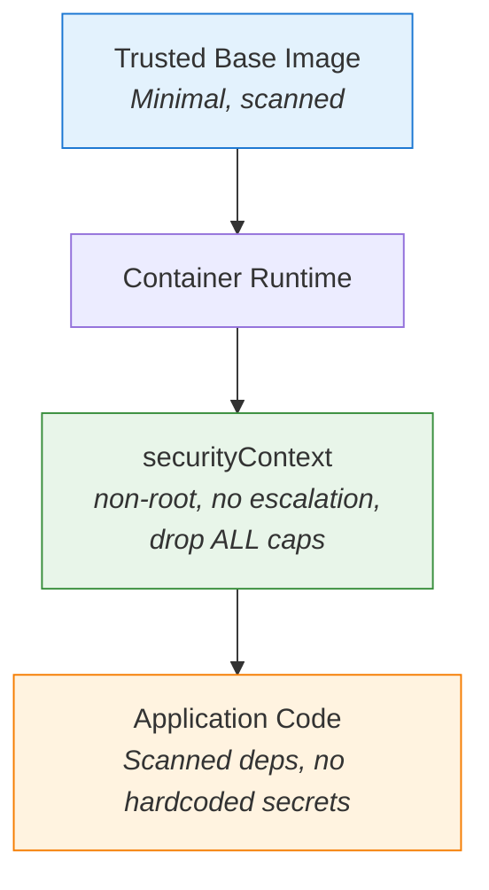

# Container and Code Security

We have secured the Cloud and Cluster layers. Now let's focus on the two innermost rings of the 4C model: **Container** and **Code**. These are the layers closest to your application, and they deserve careful attention. Even if your cluster is locked down, a vulnerable container image or an insecure dependency can give an attacker a foothold inside your environment.

Think of it this way: a well-guarded building still has a problem if someone leaves a window open on the ground floor.

## Why These Layers Deserve Attention

Containers share the host's kernel. They are isolated — but that isolation is not absolute. A process that runs as root inside a container, or that has unnecessary Linux capabilities, could exploit a kernel vulnerability to escape onto the node. Meanwhile, at the Code layer, a single vulnerable library in your application can be the entry point for an attack, regardless of how tightly you have configured the container around it.

Hardening both layers reduces the **blast radius** of a compromise — the amount of damage an attacker can do once inside. If they get into your container, they find fewer tools, fewer permissions, and fewer paths to escalate.

## Securing the Container Layer

Let's walk through the key practices for container security.

**Start with trusted base images.** Use minimal, well-maintained images from trusted registries. Distroless images or Alpine-based images contain fewer packages — and fewer packages mean fewer potential vulnerabilities. Scan images for known CVEs (Common Vulnerabilities and Exposures) before they reach production.

**Run as non-root.** By default, many images run as root (UID 0). Setting `runAsNonRoot: true` in your Pod spec ensures Kubernetes rejects any container that would run as root. This is one of the highest-impact, lowest-effort changes you can make.

**Drop unnecessary capabilities.** Linux capabilities grant fine-grained permissions to processes. Most applications need none of them. Setting `capabilities.drop: [ALL]` removes them all; if your app genuinely needs a specific capability, you can add just that one back.

**Use immutable image references.** Avoid the `latest` tag. Instead, reference images by digest or a specific version tag (e.g., `myapp:v1.2.3`). This makes deployments reproducible and prevents unexpected changes when the upstream image is updated.

## Securing the Code Layer

The Code layer is about what your application does and what it depends on.

**Scan your dependencies.** Tools like <a target="_blank" href="https://trivy.dev/">Trivy</a>, <a target="_blank" href="https://snyk.io/">Snyk</a>, or <a target="_blank" href="https://github.com/dependabot">Dependabot</a> can detect known vulnerabilities in your application's libraries. Integrate scanning into your CI/CD pipeline so vulnerabilities are caught before deployment.

**Never hardcode secrets.** Database passwords, API keys, and tokens should come from Kubernetes Secrets or an external secrets manager — never from your source code or environment variable defaults baked into the image.

**Apply least privilege in your code.** If your application only needs to list Pods in its own namespace, do not bind it to a ServiceAccount with cluster-wide permissions. We will cover ServiceAccounts and RBAC in detail later.

## Putting It Together: A Hardened Pod Spec

This example combines Pod-level and container-level security settings. It runs as non-root, drops all capabilities, disables privilege escalation, enforces a read-only root filesystem, and applies a default seccomp profile:

```yaml
spec:
  securityContext:
    runAsNonRoot: true
    runAsUser: 1000
    seccompProfile:
      type: RuntimeDefault
  containers:
    - name: app
      image: myapp:v1.2.3
      securityContext:
        allowPrivilegeEscalation: false
        capabilities:
          drop:
            - ALL
        readOnlyRootFilesystem: true
```



:::info
These settings are low-effort and high-impact. Adding `runAsNonRoot`, `allowPrivilegeEscalation: false`, and `capabilities.drop: [ALL]` to your Pod specs significantly reduces your attack surface — and they work with most applications out of the box.
:::

## Building Secure Images

The best security starts before deployment — in your Dockerfile. Build images with a non-root `USER` directive, choose a minimal base (like distroless or Alpine), and avoid installing packages you do not need. When you build security into the image itself, the Pod spec has less work to do.

:::warning
If a Pod is rejected with a "must run as non-root" error, the image's default user is root. Either add a `USER` directive in the Dockerfile or set `runAsUser` in the Pod spec. If an application fails with `readOnlyRootFilesystem`, add an `emptyDir` volume for writable paths like `/tmp`.
:::

---

## Hands-On Practice

### Step 1: Inspect image names of running Pods

```bash
kubectl get pods -A -o jsonpath='{range .items[*]}{.metadata.namespace}{"\t"}{.metadata.name}{"\t"}{.spec.containers[*].image}{"\n"}{end}'
```

This lists namespace, Pod name, and container image for each running Pod. Knowing which images you deploy is the first step toward trusting and scanning them.

## Wrapping Up

The Container and Code layers are your last lines of defense. By combining trusted images, non-root execution, and dropped capabilities with dependency scanning and proper secret management, you minimize what an attacker can do even if they breach the outer layers. With all four layers of the 4C model covered, we are ready to explore how API requests actually flow through the cluster — and how Kubernetes decides who gets access to what.
