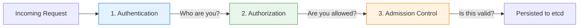

# API Request Flow

Every time you run a `kubectl` command, every time a Pod calls the Kubernetes API, every time a controller reconciles a resource — the request follows the same path. Understanding this path is like understanding how mail gets delivered: you need to know the route to figure out where something went wrong.

Let's explore the three stages every API request passes through before Kubernetes acts on it.

## The Three Stages

Think of the Kubernetes API server as a building with three security checkpoints. Every visitor must pass through all three — in order — before they are allowed inside.



**1. Authentication — "Who are you?"**
The API server verifies the identity of the requester. It does not yet check permissions — it simply establishes who is making the request. If authentication fails, the request is immediately rejected with a `401 Unauthorized` error. Authorization is never even considered.

**2. Authorization — "What are you allowed to do?"**
Once the identity is established, the authorizer (typically RBAC) checks whether that identity has permission to perform the requested action. A `403 Forbidden` response means the identity is recognized, but the action is not permitted.

**3. Admission Control — "Should this be allowed or modified?"**
Even after a request is authenticated and authorized, admission controllers get the final say. They can validate the request (rejecting it if it violates a policy) or mutate it (adding default values or modifying fields). Only after all three stages pass is the object written to etcd.

:::info
These stages are strictly sequential. A request that fails authentication never reaches authorization. A request that fails authorization never reaches admission control. This layered approach ensures that no single stage carries the full security burden.
:::

## How Authentication Works

Kubernetes supports several authentication methods. The API server can have multiple methods enabled simultaneously — the first one that successfully identifies the requester wins.

- **X.509 client certificates** — presented during the TLS handshake. This is common for administrators and `kubectl` configurations.
- **Bearer tokens** — sent in the `Authorization` header. Used by ServiceAccounts and external identity providers (like OIDC).
- **ServiceAccount tokens** — automatically mounted into Pods at `/var/run/secrets/kubernetes.io/serviceaccount/token`. This is how workloads running inside the cluster authenticate.
- **Bootstrap tokens** — used during cluster setup for node and component bootstrapping.

You might wonder: what happens if multiple methods are configured? The API server tries each one in turn. The first method that successfully authenticates the request determines the identity. If none succeed, the request is rejected with `401 Unauthorized`.

## Testing Your Permissions

One of the most useful commands in your security toolkit is `kubectl auth can-i`. It lets you check whether a specific identity has a specific permission — without actually performing the action. The `--as` flag is particularly powerful — it lets you impersonate another user or ServiceAccount to verify their effective permissions. This is invaluable when debugging access issues.

## Checking Your Current Identity

Sometimes the question is not "what can I do?" but "who am I?" Use `kubectl config current-context` to see which context you are using, and `kubectl config view --minify` for details about your current configuration.

## Troubleshooting Access Issues

When an API request fails, the error message tells you which stage failed:

- **`401 Unauthorized`** — Authentication failed. The API server could not identify the requester. Check your kubeconfig, token, or client certificate.
- **`403 Forbidden`** — Authorization failed. The identity is valid, but it lacks permission. Check RBAC Roles and RoleBindings.
- **`403` with valid credentials but an unexpected message** — This might come from admission control. ResourceQuota, LimitRange, or Pod Security admission can reject requests after authorization succeeds.

:::warning
A `403 Forbidden` after successful authentication almost always points to a missing or incorrect RBAC RoleBinding. Use `kubectl auth can-i` and `kubectl describe rolebinding` to investigate.
:::

---

## Hands-On Practice

### Step 1: Test create permission on Pods

```bash
kubectl auth can-i create pods --namespace default
```

Returns `yes` or `no`. If `yes`, your current identity can create Pods in the default namespace.

### Step 2: Test permission to delete nodes

```bash
kubectl auth can-i delete nodes --all-namespaces
```

Deleting nodes is a highly privileged action. If this returns `yes`, your identity has cluster-admin or equivalent broad permissions.

## Wrapping Up

Every API request flows through authentication, authorization, and admission control — three stages that work together like checkpoints in a secure facility. Understanding this flow helps you diagnose access problems quickly: identify which stage rejected the request, and you know exactly where to look. In the next lesson, we will dive into admission control — the final gatekeeper that can validate and even modify requests before they are stored.
