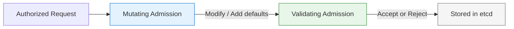

# Admission Control

You have learned that every API request passes through authentication, then authorization, before anything happens. But there is a third checkpoint — and in many ways, it is the most versatile. **Admission controllers** are the final gatekeepers. They run after a request is authenticated and authorized, and they can do something the other stages cannot: they can modify the request itself.

Think of admission control as the quality inspector on an assembly line. The earlier stages confirm that the worker is authorized to be there. The inspector checks that the product meets specifications — and can even add missing parts before it ships.

## Two Types of Admission Controllers

Admission controllers come in two flavors, and understanding the difference is essential.

**Mutating controllers** modify the request before it is stored. For example, when you create a PersistentVolumeClaim without specifying a StorageClass, the `DefaultStorageClass` controller adds one for you. When a Pod does not specify a ServiceAccount, the `ServiceAccount` controller sets it to `default` and mounts the token.

**Validating controllers** check whether a request meets certain criteria and reject it if it does not. The `PodSecurity` controller, for example, evaluates Pod specs against the Pod Security Standards and blocks Pods that violate the policy.

Here is the key: mutating controllers run **first**, then validating controllers run **second**. This ensures that any modifications are validated before the object is saved.



## Common Built-in Controllers

Kubernetes ships with several admission controllers enabled by default. Here are the ones you will encounter most often:

**PodSecurity** enforces the Pod Security Standards (Privileged, Baseline, Restricted) at the namespace level. It is one of the most important controllers for workload security — we will cover it in detail in a later chapter.

**ResourceQuota** enforces namespace-level resource limits. If a namespace has a quota and a new Pod would exceed it, the request is rejected.

**LimitRanger** sets default resource requests and limits for containers that omit them. This is a mutating controller — it injects values into your Pod spec automatically.

**ServiceAccount** ensures every Pod has a ServiceAccount assigned and mounts the corresponding token. If you do not specify one, it assigns `default`.

**DefaultStorageClass** adds a default StorageClass to PersistentVolumeClaims that do not specify one.

## LimitRanger in Action

Here is a practical example. This LimitRange defines default resource values for containers in the `dev` namespace:

```yaml
apiVersion: v1
kind: LimitRange
metadata:
  name: default-limits
  namespace: dev
spec:
  limits:
    - default:
        memory: "256Mi"
        cpu: "200m"
      defaultRequest:
        memory: "128Mi"
        cpu: "100m"
      type: Container
```

When someone creates a Pod in the `dev` namespace without specifying resource requests or limits, LimitRanger automatically injects these values. The validating step then verifies that the injected values stay within any ResourceQuota defined for the namespace.

:::info
Admission control fills a gap that RBAC cannot cover. RBAC answers "who can do what," but admission control answers "should this specific request be allowed, and what should it look like?" Use them together for comprehensive access control.
:::

## Webhook Admission Controllers

Beyond the built-in controllers, Kubernetes supports **admission webhooks** — external HTTP services that the API server calls during admission. There are two types:

- `MutatingAdmissionWebhook` — can modify requests (runs in the mutating phase)
- `ValidatingAdmissionWebhook` — can accept or reject requests (runs in the validating phase)

Policy engines like OPA/Gatekeeper, Kyverno, and custom operators use webhooks to enforce organization-specific rules that go far beyond what the built-in controllers offer. For example, you could enforce that every Deployment must have specific labels, or that no container image may come from an untrusted registry.

:::warning
If an admission webhook is unavailable (its service is down), it can block all matching API requests. Configure `failurePolicy` carefully — `Fail` blocks requests when the webhook is unreachable, while `Ignore` allows them through. Choose based on your risk tolerance.
:::

---

## Hands-On Practice

### Step 1: List API resources

```bash
kubectl api-resources
```

This shows all resource types the API server knows about. Admission controllers validate requests against these resources — understanding what exists is the first step to understanding admission behavior.

## Wrapping Up

Admission control is the final and most flexible checkpoint in the API request flow. Mutating controllers add sensible defaults; validating controllers enforce policies. Together with RBAC, they give you fine-grained control over not just who can act, but what those actions look like. Next, we will shift our focus to ServiceAccounts — the identities that workloads use to authenticate with the API server.
