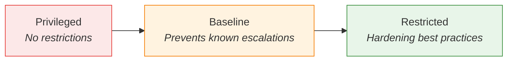

# Pod Security Standards: Three Levels

RBAC controls *who* can create resources. But what about the *content* of those resources? A user with permission to create Pods could deploy a container that runs as root, uses host networking, or escalates privileges — effectively bypassing the security boundaries you have worked hard to build.

This is where **Pod Security Standards** come in. They define three levels of security policy that you apply at the namespace level. Think of them as building codes for your workloads: just as a building code specifies safety requirements that every structure must meet, Pod Security Standards specify security requirements that every Pod must satisfy.

## The Three Levels

Kubernetes defines three progressively stricter policy levels:



**Privileged** — completely unrestricted. Any Pod configuration is allowed. This level is intended for trusted system-level workloads, like those in `kube-system`, that genuinely need elevated access to do their job. It is *not* appropriate for application workloads.

**Baseline** — prevents known privilege escalation paths while remaining compatible with most applications. It blocks dangerous settings like host namespaces, privileged containers, and certain capabilities, but does not require full hardening. Most standard applications can run under Baseline with minimal changes.

**Restricted** — the strictest level, aligned with current hardening best practices. It requires non-root execution, a read-only root filesystem, dropping all capabilities, and a restricted seccomp profile. Applications that meet Restricted have a significantly smaller attack surface.

:::info
If you are unsure where to start, **Baseline** is a safe default for most namespaces. It blocks the most dangerous Pod configurations without breaking typical applications. Move to **Restricted** for namespaces where workloads are known to be compatible.
:::

## How Pod Security Standards Work

Pod Security Standards are enforced through **namespace labels**. When you label a namespace with a policy level, the built-in **PodSecurity admission controller** evaluates every Pod created or updated in that namespace against the chosen standard. If the Pod violates the policy, the admission controller can reject it, warn about it, or log it — depending on the mode you configure (more on modes in a later lesson).

The three label keys are:
- `pod-security.kubernetes.io/enforce` — the level to enforce
- `pod-security.kubernetes.io/audit` — the level to audit (log violations)
- `pod-security.kubernetes.io/warn` — the level to warn about

## Applying a Policy to a Namespace

Here is a namespace configured to enforce the Baseline level:

```yaml
apiVersion: v1
kind: Namespace
metadata:
  name: app
  labels:
    pod-security.kubernetes.io/enforce: baseline
    pod-security.kubernetes.io/enforce-version: latest
```

You can also label an existing namespace:

```bash
kubectl label namespace app pod-security.kubernetes.io/enforce=baseline
```

Once this label is in place, any Pod that violates the Baseline standard — for example, one that uses `hostNetwork: true` or `privileged: true` — will be rejected at admission time.

## Choosing the Right Level

The level you choose depends on the workloads running in the namespace:

- **System infrastructure** (CNI plugins, monitoring agents with host access) — Privileged
- **Standard applications** (web servers, APIs, background workers) — Baseline
- **Security-sensitive workloads** (payment processing, credential management) — Restricted

:::warning
Avoid applying Privileged to application namespaces. It disables all Pod security checks, which means any misconfiguration — accidental or intentional — goes undetected. Reserve Privileged for `kube-system` and similarly trusted namespaces.
:::

---

## Hands-On Practice

### Step 1: Label a namespace with Baseline policy

```bash
kubectl create namespace pss-demo --dry-run=client -o yaml | kubectl apply -f -
kubectl label namespace pss-demo pod-security.kubernetes.io/enforce=baseline --overwrite
```

Creates a namespace and applies the Baseline Pod Security level. Use a dedicated namespace like `pss-demo` to avoid affecting existing workloads.

### Step 2: Verify the label and test (optional)

```bash
kubectl get namespace pss-demo -o jsonpath='{.metadata.labels}'
```

Shows the enforce label. You can then try creating a Pod that violates Baseline (e.g. with `privileged: true`) to see the admission controller reject it.

## Wrapping Up

Pod Security Standards give you namespace-level guardrails for workload security. The three levels — Privileged, Baseline, and Restricted — represent a spectrum from completely open to fully hardened. Applying them through namespace labels is straightforward and integrates naturally with Kubernetes admission control. In the next lesson, we will compare Baseline and Restricted in detail, with concrete Pod specs that meet each level.
