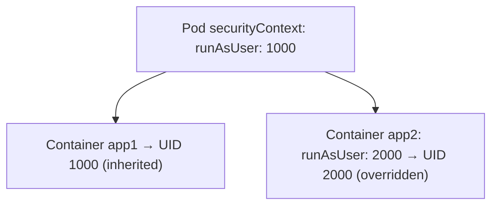

# runAsUser and runAsNonRoot

Most container base images default to running as root — UID 0. That means if an attacker compromises your application, they have root privileges inside the container. While container isolation limits what they can do, root access still expands the attack surface significantly.

The fix is straightforward: don't run as root. Kubernetes gives you two securityContext fields to enforce this.

## Why Non-Root Matters

Think of root as having the master key to the container. A process running as root can:
- Modify any file in the container
- Change file ownership and permissions
- Potentially exploit kernel vulnerabilities that only work from root

A non-root process is constrained by standard file permissions and capability limits. It's **defense in depth** — even if your application is compromised, the attacker has significantly less room to maneuver.

## runAsUser — Setting the User ID

`runAsUser` explicitly sets the UID that container processes run as:

```yaml
spec:
  containers:
    - name: app
      image: myapp
      securityContext:
        runAsUser: 1000
        runAsGroup: 3000
```

- **UID 0** = root (avoid this)
- **Any other value** = non-root
- `runAsGroup` sets the primary group ID for the process

Use a high UID (10000+) to avoid conflicts with system users on the host. Some images define a non-root `USER` in their Dockerfile — in that case, `runAsUser` overrides it.

## runAsNonRoot — The Safety Net

`runAsNonRoot: true` tells Kubernetes to **reject the Pod** if the container would run as root — regardless of what the image specifies:

```yaml
spec:
  securityContext:
    runAsNonRoot: true
  containers:
    - name: app
      image: myapp
      securityContext:
        runAsUser: 1000
```

This is a safety check. Even if someone changes the image to one that runs as root, Kubernetes won't start the container.

:::info
Combining `runAsUser` with `runAsNonRoot: true` gives you defense in depth: `runAsUser` sets the specific UID, and `runAsNonRoot` blocks root as a safety net. Use both for maximum protection.
:::

## Pod-Level vs Container-Level

Security context can be set at two levels:

```yaml
spec:
  securityContext:
    runAsUser: 1000          # Default for ALL containers
  containers:
    - name: app1
      image: app1
      # Runs as 1000 (inherited from Pod)
    - name: app2
      image: app2
      securityContext:
        runAsUser: 2000      # Override — runs as 2000
```

**Pod-level** settings apply to all containers as a default. **Container-level** settings override the Pod-level for that specific container. This lets you set a baseline for the Pod while allowing exceptions where needed.



## Troubleshooting

**Pod rejected with "must run as non-root"** — The image's default user is root and `runAsNonRoot: true` is set. Add `runAsUser: 1000` (or higher).

**Permission denied on files** — The container is running as non-root but files are owned by root. Use `fsGroup` (covered in the next lesson) or fix file permissions in the image.

**Init containers that need root** — Set a separate `securityContext` on the init container if it needs root, while keeping the main containers non-root.

:::warning
Some legacy images only work as root because they bind to privileged ports (below 1024) or write to root-owned directories. The solution is to switch to a non-root compatible image, configure the app to use non-privileged ports, or mount writable volumes where needed.
:::

---

## Hands-On Practice

### Step 1: Create a Pod with runAsUser and runAsNonRoot

Create `nonroot-pod.yaml`:

```yaml
apiVersion: v1
kind: Pod
metadata:
  name: nonroot-test
spec:
  securityContext:
    runAsNonRoot: true
    runAsUser: 1000
  containers:
    - name: app
      image: nginx
```

Apply it:

```bash
kubectl apply -f nonroot-pod.yaml
```

### Step 2: Wait for the Pod to be Running

```bash
kubectl wait --for=condition=Ready pod/nonroot-test --timeout=60s
```

### Step 3: Verify the user inside the container

```bash
kubectl exec nonroot-test -- id
kubectl exec nonroot-test -- whoami
```

Output should show `uid=1000` and `whoami` returns a non-root user (typically a numeric UID or `nginx` if the image defines one).

### Step 4: Clean up

```bash
kubectl delete pod nonroot-test
```

## Wrapping Up

`runAsUser` sets the UID your container runs as — always use a non-zero value. `runAsNonRoot: true` blocks root as a safety net. Pod-level settings apply to all containers; container-level overrides when needed. Use UIDs of 10000 or higher to avoid host user conflicts. In the next lesson, we'll cover `fsGroup` — the solution for volume permission issues when running as non-root.
