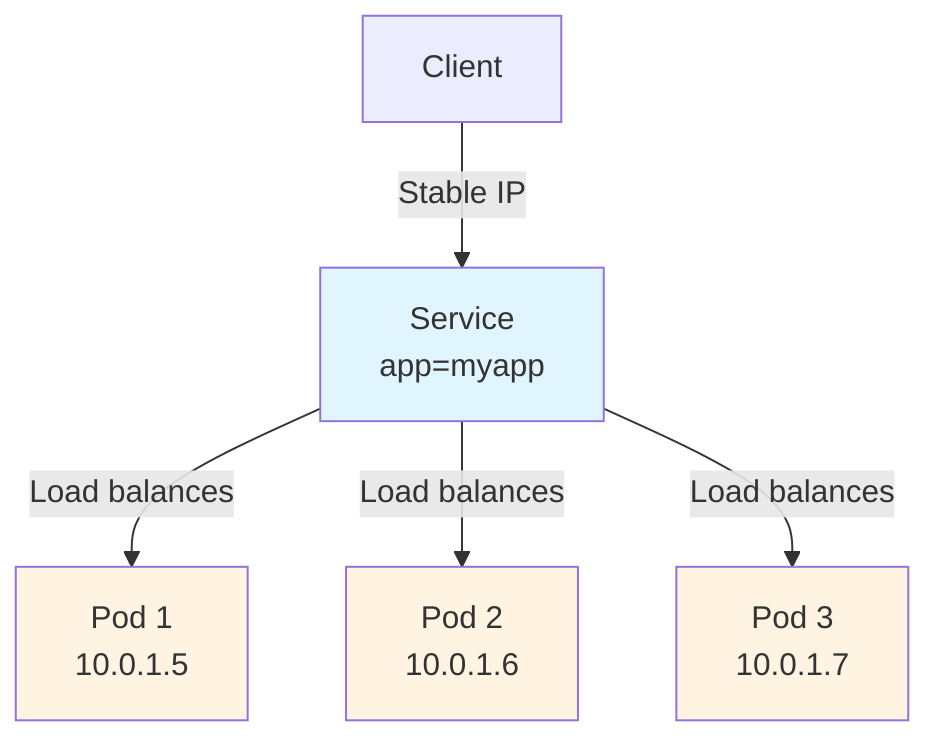

# What is a Service?

A Service in Kubernetes is an abstraction that helps you expose groups of Pods over a network. Think of it as a stable front door to your application, even when the rooms (Pods) behind it change constantly.

## The Problem Services Solve

Imagine you're running a web application with three backend Pods. Each Pod gets its own IP address when it starts. But here's the challenge: Pods in Kubernetes are ephemeral, they can be created, destroyed, or recreated at any time. When a Pod is recreated, it gets a new IP address.

This creates a real problem: if frontend Pods need to connect to backend Pods, how do they know which IP addresses to use? The IPs keep changing, and you'd have to constantly update your frontend code with new addresses.

## Service Solution

Services solve this problem elegantly by providing:
- **A stable IP address** that never changes, even when Pods are recreated
- **A DNS name** that makes it easy to find the Service
- **Automatic load balancing** across all healthy Pods
- **Service discovery** without needing to modify your application code

The key benefit is that you don't need to modify your existing application to use an unfamiliar service discovery mechanism. Whether you're running cloud-native code or older containerized applications, Services work seamlessly.

## Service Abstraction

A Service defines a logical set of endpoints (usually Pods) along with a policy about how to make those Pods accessible. This abstraction enables decoupling between frontends and backends, frontends don't need to track individual Pod IPs or know how many Pods are running.

For example, if you have a stateless image-processing backend running with 3 replicas, those replicas are interchangeable. While the actual Pods may change, your frontend clients don't need to be aware of that.
