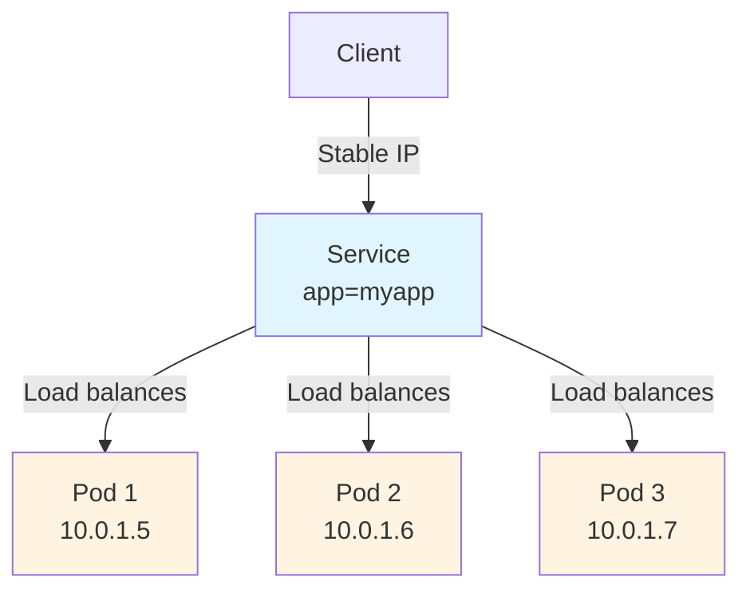

# Qu'est-ce qu'un Service ?

Un Service dans Kubernetes est une abstraction qui vous aide à exposer des groupes de Pods sur un réseau. Pensez-y comme à une porte d'entrée stable vers votre application, même lorsque les pièces (Pods) derrière changent constamment.

## Le problème que les Services résolvent

Imaginez que vous exécutez une application web avec trois Pods backend. Chaque Pod obtient sa propre adresse IP lorsqu'il démarre. Mais voici le défi : les Pods dans Kubernetes sont éphémères, ils peuvent être créés, détruits ou recréés à tout moment. Lorsqu'un Pod est recréé, il obtient une nouvelle adresse IP.

Cela crée un vrai problème : si les Pods frontend doivent se connecter aux Pods backend, comment savent-ils quelles adresses IP utiliser ? Les IP changent constamment, et vous devriez constamment mettre à jour votre code frontend avec de nouvelles adresses.

## Solution des Services

Les Services résolvent ce problème élégamment en fournissant :
- **Une adresse IP stable** qui ne change jamais, même lorsque les Pods sont recréés
- **Un nom DNS** qui facilite la recherche du Service
- **Un équilibrage de charge automatique** sur tous les Pods sains
- **Une découverte de services** sans avoir besoin de modifier votre code d'application

L'avantage clé est que vous n'avez pas besoin de modifier votre application existante pour utiliser un mécanisme de découverte de services inconnu. Que vous exécutiez du code cloud-native ou des applications conteneurisées plus anciennes, les Services fonctionnent de manière transparente.

## Abstraction des Services

Un Service définit un ensemble logique de points de terminaison (généralement des Pods) ainsi qu'une politique sur la façon de rendre ces Pods accessibles. Cette abstraction permet le découplage entre les frontends et les backends, les frontends n'ont pas besoin de suivre les IP individuelles des Pods ou de savoir combien de Pods fonctionnent.

Par exemple, si vous avez un backend de traitement d'images sans état qui fonctionne avec 3 répliques, ces répliques sont interchangeables. Bien que les Pods réels puissent changer, vos clients frontend n'ont pas besoin d'en être conscients.
