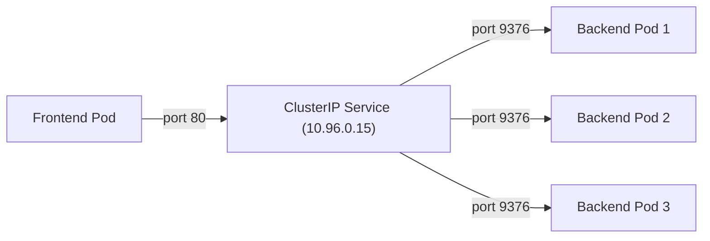

# ClusterIP Service

When you create a Service without specifying a type, Kubernetes defaults to **ClusterIP** — and for good reason. It's the most common Service type, designed for internal communication between Pods within the cluster.

Think of ClusterIP as an internal phone extension. It works within the building (your cluster), but external callers can't dial it directly. Every internal team can reach it, and it never changes even when people (Pods) move desks.

## How ClusterIP Works

When you create a ClusterIP Service, Kubernetes:

1. Assigns a **virtual IP** from a reserved pool (the "cluster IP")
2. Makes this IP reachable **only from within the cluster**
3. Configures `kube-proxy` on each node to redirect traffic from this IP to the backend Pods

The cluster IP is stable — it doesn't change when Pods are created or destroyed. Traffic sent to this IP is automatically load-balanced across all matching Pods.



## Creating a ClusterIP Service

```yaml
apiVersion: v1
kind: Service
metadata:
  name: my-service
spec:
  selector:
    app.kubernetes.io/name: MyApp
  ports:
    - name: http
      protocol: TCP
      port: 80
      targetPort: 9376
```

Since no `type` is specified, this defaults to ClusterIP. The Service:
- Listens on port **80** (what clients connect to)
- Forwards to port **9376** on matching Pods (where the app listens)
- Only works within the cluster — no external access

:::info
If you omit `targetPort`, it defaults to the same value as `port`. So `port: 80` without a `targetPort` means traffic is forwarded to port 80 on the Pods.
:::

## Port vs TargetPort

This is a common source of confusion. Here's the distinction:

- **port** — The port the Service listens on. Clients connect to this port.
- **targetPort** — The port on the Pod where your application actually listens.

They can be different! Your Service can listen on port 80 (standard HTTP) while your app listens on port 9376. The Service translates between them.

The **endpoints** list should contain the IPs of all Pods matching the selector. If it's empty, your selector doesn't match any Pods.

## Headless Services

There's a special variant: setting `clusterIP: None` creates a **headless Service**. It doesn't get a virtual IP and doesn't load-balance. Instead, DNS queries return the individual Pod IPs directly.

Headless Services are used with **StatefulSets**, where you need to address specific Pods by name (like `db-0.mysql.default.svc.cluster.local`).

:::warning
Don't set `clusterIP: None` unless you specifically need direct Pod resolution. Without a virtual IP, there's no load balancing — clients connect directly to individual Pods.
:::

---

## Hands-On Practice

### Step 1: Create a Deployment

```bash
kubectl create deployment web --image=nginx --replicas=2
```

**Observation:** The deployment creates 2 nginx Pods with label `app=web` (the default for create deployment).

### Step 2: Create a ClusterIP Service

Create `service.yaml`:

```yaml
apiVersion: v1
kind: Service
metadata:
  name: web
spec:
  selector:
    app: web
  ports:
    - port: 80
      targetPort: 80
```

```bash
kubectl apply -f service.yaml
```

**Observation:** The Service gets a cluster IP and targets Pods with `app=web`.

### Step 3: Apply and Verify

```bash
kubectl get svc
kubectl get endpoints web
```

**Observation:** You see the Service's cluster IP and the list of Pod IPs in the endpoints.

### Step 4: Describe the Service

```bash
kubectl describe service web
```

**Observation:** The output shows selector, ports, and endpoints — confirm everything matches.

### Step 5: Clean Up

```bash
kubectl delete deployment web
kubectl delete service web
```

## Wrapping Up

ClusterIP is the default and most common Service type — perfect for internal communication between Pods. It provides a stable virtual IP with automatic load balancing, reachable only from within the cluster. If you need external access, you'll need NodePort, LoadBalancer, or Ingress — which we'll cover in the next chapters. Up next: Service selectors and how they connect Services to the right Pods.
