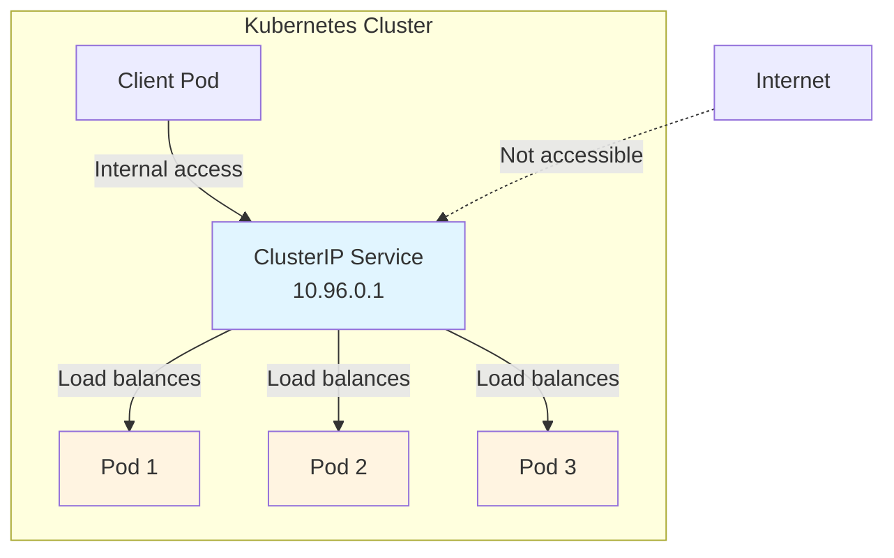

# ClusterIP Service

ClusterIP is the default Service type in Kubernetes. It exposes your Service on a cluster-internal IP address, making it accessible only from within your cluster, perfect for internal communication between Pods.



## ClusterIP Overview

When you create a Service without specifying a type, Kubernetes automatically sets it to ClusterIP. This Service type:
- Assigns an IP address from a pool reserved for Services (the cluster IP)
- Makes the Service only reachable from within the cluster
- Provides a stable virtual IP that never changes, even when Pods are recreated

It's like an internal phone number that only works within your company's building. External traffic can't reach it directly, but all internal services can communicate using this stable address.

## Service Definition Example

Here's a complete example of a ClusterIP Service:

```yaml
apiVersion: v1
kind: Service
metadata:
  name: my-service
spec:
  selector:
    app.kubernetes.io/name: MyApp
  ports:
    - name: http
      protocol: TCP
      port: 80
      targetPort: 9376
```

In this example:
- The Service targets Pods with the label `app.kubernetes.io/name: MyApp`
- It listens on port 80 (the Service port)
- It forwards traffic to port 9376 on the Pods (the target port)
- By default, `targetPort` equals `port` if not specified

View the cluster IP assigned to your Service:

```bash
kubectl describe service my-service
```

## Virtual IP Mechanism

Kubernetes assigns the Service a cluster IP that is used by the virtual IP address mechanism. This IP is stable and doesn't change as Pods are created or destroyed. When you send traffic to this IP, Kubernetes automatically load-balances it to the Pods that match the Service's selector.

The Service controller continuously scans for Pods that match the selector and updates the EndpointSlices accordingly, ensuring traffic always reaches healthy Pods.
