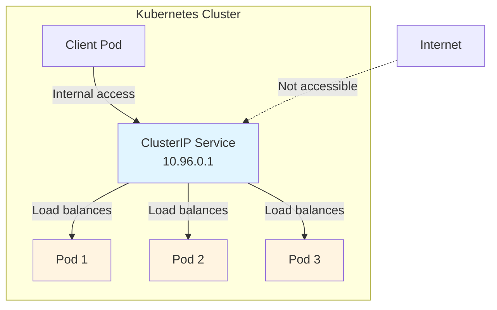

# Service ClusterIP

ClusterIP est le type de Service par défaut dans Kubernetes. Il expose votre Service sur une adresse IP interne au cluster, le rendant accessible uniquement depuis votre cluster, parfait pour la communication interne entre Pods.



## Vue d'ensemble de ClusterIP

Lorsque vous créez un Service sans spécifier de type, Kubernetes le définit automatiquement sur ClusterIP. Ce type de Service :

- Assigne une adresse IP depuis un pool réservé pour les Services (l'IP du cluster)
- Rend le Service accessible uniquement depuis le cluster
- Fournit une IP virtuelle stable qui ne change jamais, même lorsque les Pods sont recréés

C'est comme un numéro de téléphone interne qui ne fonctionne que dans le bâtiment de votre entreprise. Le trafic externe ne peut pas l'atteindre directement, mais tous les services internes peuvent communiquer en utilisant cette adresse stable.

## Exemple de définition de Service

Voici un exemple complet d'un Service ClusterIP :

```yaml
apiVersion: v1
kind: Service
metadata:
  name: my-service
spec:
  selector:
    app.kubernetes.io/name: MyApp
  ports:
    - name: http
      protocol: TCP
      port: 80
      targetPort: 9376
```

Dans cet exemple :

- Le Service cible les Pods avec le label `app.kubernetes.io/name: MyApp`
- Il écoute sur le port 80 (le port du Service)
- Il transfère le trafic vers le port 9376 sur les Pods (le port cible)
- Par défaut, `targetPort` est égal à `port` si non spécifié

Visualisez l'IP du cluster assignée à votre Service :

```bash
kubectl describe service my-service
```

## Mécanisme d'IP virtuelle

Kubernetes assigne au Service une IP de cluster qui est utilisée par le mécanisme d'adresse IP virtuelle. Cette IP est stable et ne change pas lorsque les Pods sont créés ou détruits. Lorsque vous envoyez du trafic à cette IP, Kubernetes équilibre automatiquement la charge vers les Pods qui correspondent au selector du Service.

Le contrôleur de Service scanne continuellement les Pods qui correspondent au selector et met à jour les EndpointSlices en conséquence, garantissant que le trafic atteint toujours les Pods sains.
