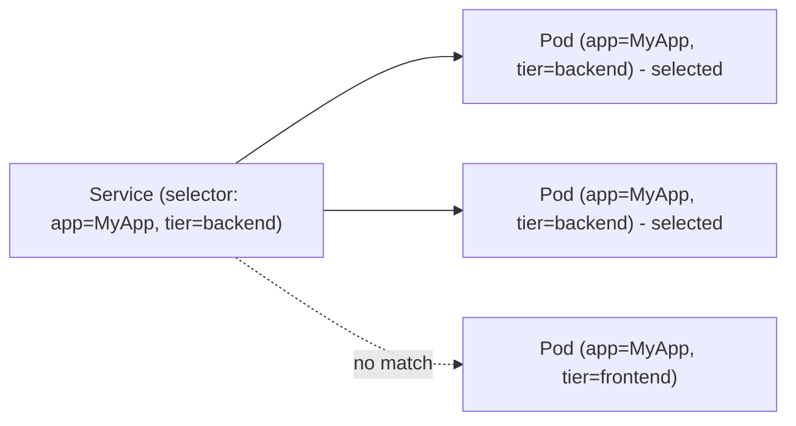

# Service Selectors

You've seen that Services use label selectors to find their backend Pods. But how exactly does this connection work? What happens when labels change? And how do you verify that the right Pods are receiving traffic?

Understanding selectors deeply is essential — a misconfigured selector is one of the most common causes of "my Service isn't working."

## How Selectors Connect Services to Pods

A Service's `.spec.selector` defines a set of label key-value pairs. Kubernetes continuously watches for Pods that match **all** of these labels. When it finds matches, it creates **EndpointSlice** objects that list the Pod IPs — these are the actual targets for traffic.

```yaml
apiVersion: v1
kind: Service
metadata:
  name: my-service
spec:
  selector:
    app.kubernetes.io/name: MyApp
    tier: backend
  ports:
    - protocol: TCP
      port: 80
      targetPort: 8080
```

This Service routes traffic to Pods that have **both** labels. A Pod with only `app.kubernetes.io/name: MyApp` won't be selected — it also needs `tier: backend`.



## EndpointSlices: The Connection Registry

When Pods match a Service's selector, Kubernetes automatically creates and updates **EndpointSlice** objects. These are the lists of "who should receive traffic." You don't need to manage them manually — the Service controller handles everything.

The process is continuous:
- New Pod matches the selector? Added to EndpointSlices.
- Pod deleted or labels changed? Removed from EndpointSlices within seconds.
- Pod fails readiness probe? Removed until it's healthy again.

```bash
# See which Pods the Service currently selects
kubectl get endpoints my-service

# More detailed view with EndpointSlices
kubectl get endpointslices -l kubernetes.io/service-name=my-service
```

## Exact Match — No Fuzzy Logic

Service selectors use **exact matching**. Labels must match precisely, including case:

- `app: MyApp` does NOT match `app: myapp`
- `app: nginx ` (with trailing space) does NOT match `app: nginx`

:::warning
Selectors are case-sensitive and require exact matches. `app: MyApp` and `app: myapp` are completely different labels. Use consistent labeling conventions across your workloads to avoid silent mismatches.
:::

## Multiple Services, Same Pods

Multiple Services can select the same Pods — and this is sometimes intentional. For example, you might have:

- An internal ClusterIP Service on port 80 for other Pods
- A monitoring Service on port 9090 for Prometheus scraping

Both target the same Pods but expose different ports. This is perfectly valid.

## Verifying Selector Matching

When a Service doesn't seem to work, always verify the selector chain:

```bash
# Step 1: What does the Service select?
kubectl describe service my-service | grep Selector

# Step 2: Do any Pods match that selector?
kubectl get pods -l 'app.kubernetes.io/name=MyApp,tier=backend'

# Step 3: Are the endpoints populated?
kubectl get endpoints my-service
```

If Step 2 returns no Pods, your selector doesn't match — check the labels on your Pods with `kubectl get pods --show-labels`.

:::info
When you remove a label from a Pod, the Service immediately stops sending traffic to it. This can be a useful debugging technique: temporarily removing a selector label takes a Pod out of rotation so you can inspect it without live traffic.
:::

## Wrapping Up

Service selectors are the bridge between the stable Service abstraction and the dynamic world of Pods. They use exact label matching to find backends, and Kubernetes keeps the EndpointSlices updated automatically. Always verify the full chain: Service selector → Pod labels → Endpoints. In the next lesson, we'll explore service discovery — how Pods find and connect to Services by name.
