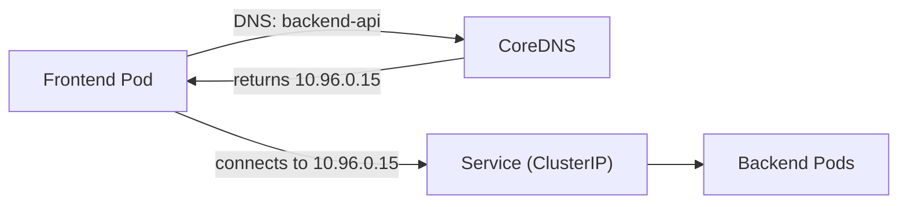

# Service Discovery

Your Service has a stable IP and matching Pods. But how do other Pods actually **find** it? They need to know the IP address or name to connect to.

Kubernetes provides two mechanisms for this: **environment variables** and **DNS**. DNS is the recommended approach, but understanding both helps you debug issues when they arise.

## DNS — The Recommended Way

Kubernetes runs a built-in DNS server (CoreDNS) that automatically creates DNS records for every Service. This means your application can connect to other Services **by name** — no IP addresses needed.

A Service named `backend-api` in the `default` namespace is reachable at:

```
backend-api                              # From the same namespace
backend-api.default                      # From any namespace (short form)
backend-api.default.svc.cluster.local    # Fully qualified domain name (FQDN)
```

In practice, this looks like:

```yaml
env:
  - name: API_URL
    value: "http://backend-api:8080"
```

Your frontend Pod connects to `backend-api:8080`, and the cluster DNS resolves it to the Service's cluster IP. No hard-coded IPs, no manual configuration.

For cross-namespace access, include the namespace:

```yaml
env:
  - name: DB_HOST
    value: "postgres.production.svc.cluster.local"
```



:::info
DNS works regardless of creation order — even if the Service is created after the Pod, DNS resolution will work as soon as the Service exists. This makes it more reliable than environment variables.
:::

## Environment Variables — The Legacy Way

When a Pod starts, kubelet injects environment variables for every Service in the same namespace:

```bash
BACKEND_API_SERVICE_HOST=10.96.0.15
BACKEND_API_SERVICE_PORT=80
```

The Service name is uppercased, dashes become underscores, and `_SERVICE_HOST` / `_SERVICE_PORT` are appended.

This mechanism has a significant limitation:

:::warning
Environment variables are only set when the Pod starts. If the Service doesn't exist yet, the environment variables won't be populated. This ordering requirement makes environment variables less flexible than DNS.
:::

## DNS SRV Records

For Services with named ports, Kubernetes also creates **SRV records** that include port information:

```bash
# Query the SRV record for the "http" port of my-service
nslookup -type=SRV _http._tcp.my-service.default.svc.cluster.local
```

This returns both the hostname and port number, useful for advanced service discovery patterns.

## Testing Service Discovery

Use a temporary Pod to verify DNS resolution:

```bash
# Quick DNS test
kubectl run -it dns-test --image=busybox --restart=Never --rm \
  -- nslookup backend-api.default.svc.cluster.local

# Test connectivity
kubectl run -it curl-test --image=curlimages/curl --restart=Never --rm \
  -- curl -s http://backend-api:8080/health
```

If DNS resolution fails:
1. Check that the Service exists: `kubectl get svc backend-api`
2. Verify CoreDNS is running: `kubectl get pods -n kube-system -l k8s-app=kube-dns`
3. Allow a few seconds for DNS propagation after creating a new Service

## Wrapping Up

DNS is the preferred service discovery mechanism in Kubernetes — it's flexible, doesn't depend on creation order, and works across namespaces. Environment variables still work but are limited by ordering requirements. Use Service names in your application configuration, and Kubernetes handles the resolution. In the next chapter, we'll explore the different Service types — NodePort, LoadBalancer, and ExternalName — that control how Services are exposed.
