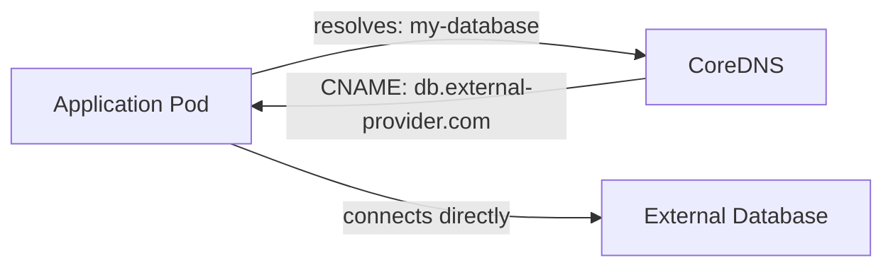

# ExternalName Service

All the Service types we've seen so far route traffic to Pods inside the cluster. But what about services that live **outside** the cluster — an external database, a third-party API, or a legacy system that hasn't been containerized yet?

**ExternalName** Services handle this by creating a DNS alias. They don't route traffic or load-balance — they simply tell the cluster DNS "when someone asks for this Service name, point them to this external hostname."

## How It Works

Think of it as a redirect in your phone book. When someone dials "database" on the internal phone system, the system automatically redirects the call to an external number.

```yaml
apiVersion: v1
kind: Service
metadata:
  name: my-database
  namespace: production
spec:
  type: ExternalName
  externalName: db.external-provider.com
```

When a Pod resolves `my-database.production.svc.cluster.local`, the cluster DNS returns a **CNAME record** pointing to `db.external-provider.com`. The Pod then connects directly to the external service — no proxying, no load balancing by Kubernetes.



Notice there's no selector — ExternalName Services don't target Pods.

## Why Use ExternalName?

The key advantage is **abstraction**. Your application code always connects to `my-database`. What changes between environments is the ExternalName:

- **Development**: `externalName: localhost` or a local database
- **Staging**: `externalName: db.staging.example.com`
- **Production**: `externalName: db.production.example.com`

This is also valuable during **gradual migration** to Kubernetes. As you containerize services one by one, the ones still running outside can be referenced through ExternalName.

:::info
ExternalName Services provide DNS-level redirection without proxying. No EndpointSlices, no load balancing — the Pod connects directly to the external host. <a target="_blank" href="https://kubernetes.io/docs/concepts/services-networking/service/#externalname">Learn more about ExternalName Services</a>
:::

## The Hostname Mismatch Problem

ExternalName has an important limitation with HTTP and HTTPS. When your Pod connects to `my-database.production.svc.cluster.local`, the DNS redirects to `db.external-provider.com`. But:

- **HTTP**: The `Host` header still contains `my-database.production.svc.cluster.local`, which the external server may not recognize
- **HTTPS/TLS**: The external server's certificate is for `db.external-provider.com`, not your internal Service name — TLS validation fails

This makes ExternalName best suited for protocols that don't rely on hostname matching — like database connections (PostgreSQL, MySQL, Redis) where the client connects by address, not hostname.

:::warning
ExternalName can cause issues with HTTP and HTTPS due to hostname mismatches. The client sends the internal Service name in the Host header, but the external server expects its own hostname. For HTTP/HTTPS, consider using an Ingress or manual EndpointSlices instead.
:::

## Verifying ExternalName

```bash
# Check the Service configuration
kubectl get svc my-database -o yaml

# Test DNS resolution from inside the cluster
kubectl run -it dns-test --image=busybox --restart=Never --rm \
  -- nslookup my-database.production.svc.cluster.local
```

You should see a CNAME record pointing to the external hostname.

## Wrapping Up

ExternalName Services provide DNS aliases to external resources — useful for abstracting dependencies and gradual migration. They don't proxy traffic; the Pod connects directly to the external host. Be mindful of hostname mismatches with HTTP/HTTPS. For full control over external endpoints, consider manual EndpointSlices instead. Next: a decision guide to help you choose the right Service type for every situation.
