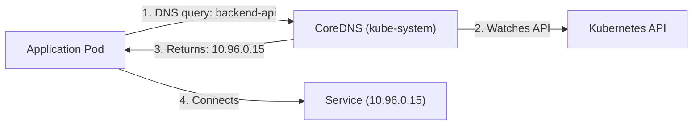

# Kubernetes DNS

You've been using Service names like `backend-api` in your configuration. But how does a Pod know that `backend-api` translates to IP `10.96.0.15`? The answer is **CoreDNS** — Kubernetes' built-in DNS server that makes service discovery seamless.

Think of CoreDNS as the phone directory for your cluster. Every Service gets an entry, and any Pod can look up any Service by name.

## How It Works

CoreDNS runs as a Deployment in the `kube-system` namespace. It watches the Kubernetes API for new Services and automatically creates DNS records for each one. When a Pod needs to connect to a Service, it queries CoreDNS, which returns the Service's cluster IP.



This happens automatically — Pods are configured to use CoreDNS as their nameserver by default (via kubelet).

## Service DNS Names

Every Service gets a DNS name following this pattern:

```
<service-name>.<namespace>.svc.cluster.local
```

The good news: you usually don't need the full name. Depending on where the client Pod is:

| Client Location | What You Can Use | Example |
|----------------|-----------------|---------|
| Same namespace | Service name only | `backend-api` |
| Different namespace | Name + namespace | `backend-api.production` |
| Anywhere (explicit) | Full FQDN | `backend-api.production.svc.cluster.local` |

In practice, same-namespace communication uses just the Service name — clean and simple:

```yaml
env:
  - name: DB_HOST
    value: "postgres"
  - name: CACHE_HOST
    value: "redis"
```

For cross-namespace access:

```yaml
env:
  - name: DB_HOST
    value: "postgres.data.svc.cluster.local"
```

:::info
Pods in the same namespace can use just the Service name (e.g., `redis`). For cross-namespace access, add the namespace: `redis.cache-namespace`. The FQDN is rarely needed but useful for explicitness.
:::

If DNS lookups fail, verify CoreDNS is running: `kubectl get pods -n kube-system -l k8s-app=kube-dns`.

## The ndots Trap

By default, Pods have `ndots: 5` in their DNS configuration. This means any name with fewer than 5 dots triggers a **search list** — Kubernetes tries appending `.default.svc.cluster.local`, `.svc.cluster.local`, `.cluster.local`, etc.

This is great for short names like `redis` — they resolve correctly through the search list. But for external names like `api.example.com` (only 2 dots), Kubernetes tries the search list first, generating unnecessary DNS queries.

The fix: use a trailing dot for external FQDNs:

```yaml
value: "api.example.com."  # Trailing dot = skip the search list
```

:::warning
DNS resolution only works from within the cluster. External clients cannot resolve `*.svc.cluster.local` names unless they have access to the cluster DNS. For external access, use Services (NodePort, LoadBalancer) or Ingress.
:::

---

## Hands-On Practice

### Step 1: Create a Service and Pod

```bash
kubectl create deployment dns-demo --image=nginx --replicas=1
kubectl label deployment dns-demo app=dns-demo --overwrite
kubectl expose deployment dns-demo --port=80
```

**Observation:** You have a Service `dns-demo` and a Pod in the default namespace.

### Step 2: Resolve the Service Using FQDN

```bash
POD=$(kubectl get pods -l app=dns-demo -o jsonpath='{.items[0].metadata.name}')
kubectl exec $POD -- nslookup dns-demo.default.svc.cluster.local
```

**Observation:** CoreDNS returns the Service's cluster IP. The FQDN resolves correctly.

### Step 3: Try the Short Name

```bash
kubectl exec $POD -- nslookup dns-demo
```

**Observation:** From the same namespace, the short name also resolves via the DNS search domains.

### Step 4: Clean Up

```bash
kubectl delete deployment dns-demo
kubectl delete service dns-demo
```

## Wrapping Up

CoreDNS provides automatic DNS records for every Service, making service discovery as simple as using a name. Pods in the same namespace use the Service name directly; cross-namespace access adds the namespace. Watch out for the ndots behavior with external names — use FQDNs with a trailing dot. Next: Pod DNS records and headless Services for direct Pod addressing.
