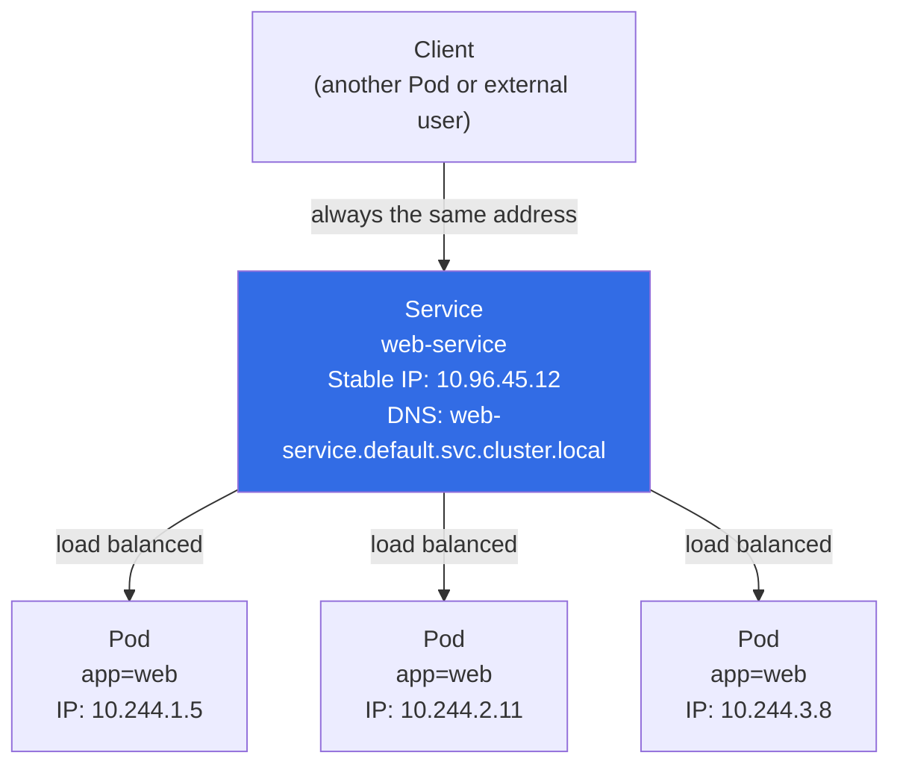

# Why Services? The Problem with Pod IPs

You've learned how to create Pods and Deployments. Now imagine you have a frontend Pod that needs to talk to a backend API running in another Pod. The obvious first instinct is: find the backend Pod's IP address and have the frontend connect to it directly. It seems simple. It seems like it should work. And it will , right up until the moment the backend Pod is replaced, which in Kubernetes happens constantly.

This is the fundamental problem that Services solve.

:::info
A Kubernetes **Service** gives a stable IP and DNS name to a dynamic group of Pods, abstracting away their ephemeral individual IPs.
:::

## Pod IPs Are Ephemeral

Every Pod in Kubernetes gets its own IP address from the cluster's internal network. But this address has a critical property: it is temporary. When a Pod is deleted and recreated , whether because of a rolling update, a node failure, a liveness probe failure, or a simple `kubectl delete pod` , the replacement Pod gets a completely different IP address. There is no reservation, no DNS record automatically updated, no forwarding from the old address. The old IP is gone; the new IP is unknown until the Pod starts.

In a Deployment with three replicas, you face a compounded version of this problem: there are three IP addresses, all of which can change independently at any time, and clients need to distribute traffic across all three , not just find one.

Think of it like trying to call a friend whose phone number changes every time they restart their phone. Even if you save their number in your contacts this morning, by tonight it might belong to someone else entirely. You'd need some kind of intermediary , a switchboard, a directory service , that always knows the current number and connects you regardless of what it is.

That intermediary is a Kubernetes **Service**.

## What a Service Provides

A Service is a Kubernetes object that gives a stable identity , a fixed IP address and a DNS name , to a dynamic group of Pods. Once you create a Service, that identity never changes. You can reboot Pods, roll out updates, scale up and down , the Service's IP and DNS name stay constant. Any client inside the cluster (or outside it, depending on the Service type) can reliably reach those Pods through the Service without ever needing to know the current Pod IPs.

Beyond stability, a Service provides automatic load balancing, traffic is distributed across all matching Pods with no manual configuration:

- Add a Pod with the right label → it immediately starts receiving traffic.
- Remove or replace a Pod → traffic stops going to it instantly.
- The Service never needs to be reconfigured.

## How Services Find Their Pods: Label Selectors

Services don't maintain a manual list of Pod IPs. Instead, they use the same label-selector mechanism you already know from ReplicaSets. A Service has a `selector` field that specifies a set of labels. Any Pod in the same namespace whose labels match the selector is automatically included in the Service's backend pool.

This means the relationship between a Service and its Pods is completely dynamic. You never tell the Service "here are your Pods" , you tell the Service "find any Pod with these labels." Kubernetes watches for Pods matching that description and keeps the routing up to date automatically.



When one of those Pods is replaced , say Pod `10.244.1.5` becomes `10.244.1.9` after a restart , the Service automatically updates its internal routing. The client doesn't notice. It still sends requests to `web-service`, and the Service figures out which Pods are healthy and available behind the scenes.

## Services and DNS

One of Kubernetes' most convenient features is its built-in DNS service (typically CoreDNS). Every Service gets a DNS name automatically, in the format:

```
<service-name>.<namespace>.svc.cluster.local
```

For a Service named `web-service` in the `default` namespace, the full DNS name is `web-service.default.svc.cluster.local`. Within the same namespace, you can shorten this to just `web-service`. Pods can reach each other using these human-readable names instead of ever dealing with IP addresses.

This is how microservices communicate in Kubernetes: `http://auth-service/api/login`, `http://database-service:5432`, and so on. The names are stable configuration , they go into your application's environment variables or config files once and never need to change.

:::info
The `svc.cluster.local` suffix is the cluster's domain. It can be customized when the cluster is created, but the vast majority of clusters use the default. You'll rarely need to type the full qualified name , within the same namespace, the short name works fine.
:::

## Services Also Handle Load Balancing

Behind the scenes, each Kubernetes node runs a component called `kube-proxy`. Its job is to program the node's kernel networking (via iptables or IPVS rules) so that traffic sent to a Service's virtual IP gets forwarded to one of the backend Pods. This happens entirely at the network level, before it ever reaches your application code.

The load balancing provided by kube-proxy's default mode is simple round-robin (or random selection in IPVS mode). It's not sophisticated , there's no connection draining, no request weighting, no health-based routing. But for the vast majority of stateless workloads, it's perfectly adequate. For more advanced load balancing behaviour, you'd layer an Ingress controller or a service mesh on top.

:::warning
kube-proxy's load balancing is connection-level for TCP, not request-level. This means that with a long-lived connection (such as HTTP/2 multiplexing or a database connection pool), all requests on that connection go to the same backend Pod. If your clients use persistent connections, you may see uneven load distribution across Pods.
:::

## Hands-On Practice

Let's create a Deployment and see the problem directly , and then solve it with a Service.

**1. Create a backend Deployment**

```bash
kubectl apply -f - <<EOF
apiVersion: apps/v1
kind: Deployment
metadata:
  name: backend
spec:
  replicas: 2
  selector:
    matchLabels:
      app: backend
  template:
    metadata:
      labels:
        app: backend
    spec:
      containers:
        - name: backend
          image: nginx:1.25
EOF
kubectl rollout status deployment/backend
```

**2. Find the Pod IPs and demonstrate they change**

```bash
# Record the current Pod IPs
kubectl get pods -l app=backend -o wide
# NAME                        READY   STATUS    NODE      IP
# backend-6d4b9c7f8-abc12    1/1     Running   node-1    10.244.1.5
# backend-6d4b9c7f8-def34    1/1     Running   node-2    10.244.2.11
```

Now delete one Pod and watch it get replaced with a new IP:

```bash
POD=$(kubectl get pods -l app=backend -o name | head -1)
kubectl delete $POD

sleep 5
kubectl get pods -l app=backend -o wide
# The replacement Pod has a different IP address!
```

**3. Create a Service to give the backend a stable address**

```bash
kubectl apply -f - <<EOF
apiVersion: v1
kind: Service
metadata:
  name: backend-service
spec:
  selector:
    app: backend
  ports:
    - port: 80
      targetPort: 80
EOF
```

**4. See the stable Service IP**

```bash
kubectl get service backend-service
# NAME              TYPE        CLUSTER-IP     EXTERNAL-IP   PORT(S)   AGE
# backend-service   ClusterIP   10.96.45.12    <none>        80/TCP    10s
```

The `CLUSTER-IP` here (`10.96.45.12`) is your stable address. It will not change regardless of how many times the backend Pods are replaced.

**5. Look up the DNS name from inside the cluster**

```bash
# Run a temporary Pod and use nslookup to resolve the Service name
kubectl run dns-test --image=busybox --rm -it --restart=Never -- \
  nslookup backend-service
# Server:    10.96.0.10
# Address 1: 10.96.0.10 kube-dns.kube-system.svc.cluster.local
#
# Name:      backend-service
# Address 1: 10.96.45.12 backend-service.default.svc.cluster.local
```

**6. Delete all backend Pods and watch the Service remain stable**

```bash
kubectl delete pods -l app=backend

sleep 5
kubectl get pods -l app=backend -o wide
# New Pods with new IPs

kubectl get service backend-service
# Same CLUSTER-IP as before , the Service never changed
```

**7. Clean up**

```bash
kubectl delete deployment backend
kubectl delete service backend-service
```

Try the cluster visualizer (telescope icon) after step 3. You'll see the Service object connected to the backend Pods. After step 6 and the Pods' replacement, refresh the view , the Service connection arrows will point to the new Pods automatically.
