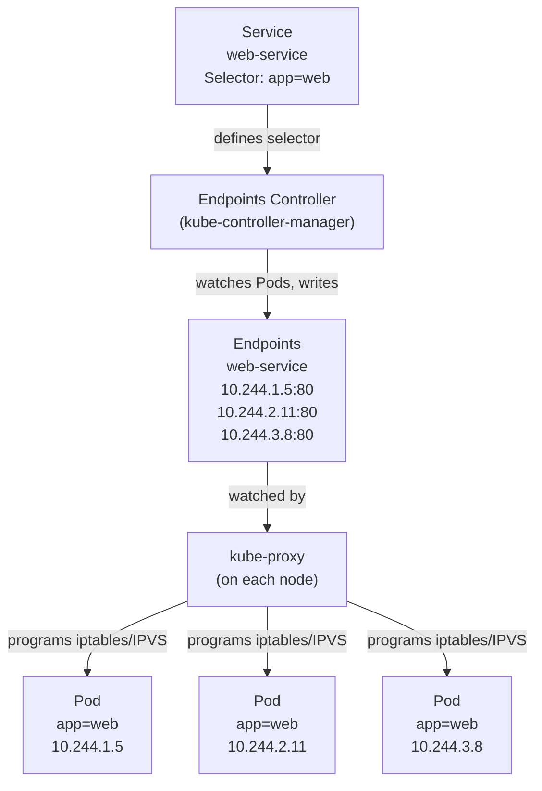

# Services and Endpoints

In the previous lesson you saw that a Service provides a stable IP and DNS name in front of a dynamic group of Pods. But how does Kubernetes actually keep track of _which_ Pod IPs are currently behind a Service? The answer is an object you may never have heard of: the **Endpoints** object (or its modern successor, **EndpointSlices**). Understanding this layer helps you debug Service connectivity issues and opens the door to some advanced patterns.

:::info
Every Service with a `selector` automatically gets a companion **Endpoints** object, Kubernetes' internal address book, updated in real time as Pods come and go.
:::

## The Endpoints Object: Kubernetes' Address Book

When you create a Service with a `selector`, Kubernetes automatically creates a companion Endpoints object with the same name. This object is a flat list of IP addresses and port numbers , one entry for every Pod that currently matches the Service's selector and is considered healthy.

You can inspect it directly:

```bash
kubectl get endpoints web-service
# NAME          ENDPOINTS                                         AGE
# web-service   10.244.1.5:80,10.244.2.11:80,10.244.3.8:80      5m
```

Those three IP:port pairs are the current backend Pods. The Endpoints controller (part of `kube-controller-manager`) watches for Pod events , creates, updates, and deletes , and keeps this list perpetually up to date. When a Pod dies and a replacement starts up with a new IP, the Endpoints list is updated automatically within seconds.

`kube-proxy` on every node watches the Endpoints object. Whenever it changes, kube-proxy updates the node's iptables or IPVS rules to reflect the new backend set. This is how the Service's virtual IP ends up routing to the right Pods, even as those Pods come and go.



## Readiness Probes and Endpoints: Only Ready Pods Get Traffic

This is one of Kubernetes' most important safety mechanisms, and it's easy to overlook. A Pod is only added to the Endpoints list if it is **Ready:** meaning it has passed its readiness probe. A Pod that is still starting up, running its initialization logic, or failing its health check will not appear in the Endpoints list and will not receive any traffic, even if it is technically `Running`.

This ensures safe rolling updates and automatic recovery:

- **During rollouts:** new Pods only receive traffic after their readiness probe passes; old Pods keep serving until they are actually terminated.
- **During degradation:** a Pod failing its probe is removed from the Endpoints list until it recovers, then automatically re-added, live, infrastructure-level circuit-breaking.

:::info
If you don't define a readiness probe, Kubernetes assumes your container is ready as soon as it starts. This is fine for simple use cases but can cause traffic errors during rolling updates if your application needs time to warm up. Always define a readiness probe for production services.
:::

## Describing Endpoints

For more detail than `kubectl get endpoints` provides, use `kubectl describe`:

```bash
kubectl describe endpoints web-service
# Name:         web-service
# Namespace:    default
# Labels:       <none>
# Annotations:  <none>
# Subsets:
#   Addresses:    10.244.1.5,10.244.2.11,10.244.3.8
#   NotReadyAddresses:  10.244.4.2
#   Ports:
#     Name     Port  Protocol
#     ----     ----  --------
#     <unset>  80    TCP
```

Notice the `NotReadyAddresses` field. Any Pod that matches the selector but is not yet Ready appears here , tracked but not receiving traffic. This field is invaluable for debugging: if a Pod you expect to be serving traffic is in `NotReadyAddresses`, its readiness probe is failing.

## Headless Services: Direct Pod Discovery

Sometimes you don't want a virtual IP at all. Some applications , especially stateful ones, like clustered databases , need to discover individual Pod IPs directly, not route through a virtual IP. Kubernetes supports this with **headless Services**.

To create a headless Service, set `spec.clusterIP: None`:

```yaml
apiVersion: v1
kind: Service
metadata:
  name: db-headless
spec:
  clusterIP: None
  selector:
    app: db
  ports:
    - port: 5432
```

A headless Service does not get a virtual ClusterIP. Instead, the DNS query for `db-headless` returns the individual Pod IPs directly. This lets clients choose which Pod to connect to, implement their own load balancing, or discover all members of a cluster.

Headless Services are fundamental to how StatefulSets work: each Pod in a StatefulSet gets a stable DNS name of the form `<pod-name>.<service-name>.<namespace>.svc.cluster.local`, which always resolves to that specific Pod's IP, even as the Pod is replaced.

:::info
A StatefulSet Pod named `db-0` in a namespace called `default` with a headless Service named `db-headless` can be reached at `db-0.db-headless.default.svc.cluster.local`. This name is stable , if the Pod is deleted and recreated, the new Pod gets the same name and the DNS record is updated to point to the new IP.
:::

## ExternalName Services: Mapping to External DNS

A third special type of Service is the **ExternalName** Service. It doesn't select any Pods at all , instead, it returns a CNAME record pointing to an external DNS name.

```yaml
apiVersion: v1
kind: Service
metadata:
  name: external-db
spec:
  type: ExternalName
  externalName: my-database.example.com
```

With this Service in place, any Pod in the cluster that makes a DNS query for `external-db` will get a CNAME pointing to `my-database.example.com`. This is useful for abstracting external dependencies: your application code uses the in-cluster name `external-db`, and if you ever move the database into the cluster, you just change the Service definition , no application code changes needed.

## EndpointSlices: The Modern Alternative

For large clusters, Endpoints objects can become massive , a single Service with 1000 backend Pods produces one Endpoints object with 1000 entries, and every update (even a single Pod restart) causes the entire object to be re-distributed to every node.

Kubernetes introduced **EndpointSlices** to solve this scaling problem. Instead of one large Endpoints object, Kubernetes creates multiple EndpointSlice objects, each holding at most 100 endpoints. Updates are smaller, network traffic is reduced, and the overall system is more efficient.

EndpointSlices are created and managed automatically. You don't need to interact with them directly , but it's useful to know they exist if you're looking at cluster internals:

```bash
kubectl get endpointslices -l kubernetes.io/service-name=web-service
```

For compatibility and troubleshooting, you can still inspect the legacy object:

```bash
kubectl get endpoints web-service
```

:::info
EndpointSlice is enabled by default in Kubernetes 1.21 and later. Kubernetes now treats Endpoints as a legacy API, but keeps it synchronized for compatibility and debugging workflows.
:::

## Hands-On Practice

**1. Create a Deployment and Service**

```yaml
# web-deployment.yaml
apiVersion: apps/v1
kind: Deployment
metadata:
  name: web
spec:
  replicas: 3
  selector:
    matchLabels:
      app: web
  template:
    metadata:
      labels:
        app: web
    spec:
      containers:
        - name: web
          image: nginx:1.28
          readinessProbe:
            httpGet:
              path: /
              port: 80
            initialDelaySeconds: 2
            periodSeconds: 5
apiVersion: v1
kind: Service
metadata:
  name: web-service
spec:
  selector:
    app: web
  ports:
    - port: 80
      targetPort: 80
```

```bash
kubectl apply -f web-deployment.yaml
kubectl rollout status deployment/web
```

**2. Inspect the automatically-created Endpoints**

```bash
kubectl get endpoints web-service
kubectl describe endpoints web-service
```

You should see three Pod IPs listed under `Addresses`.

**3. Kill a Pod and watch the Endpoints update**

```bash
# Run kubectl get pods -l app=web, pick one pod NAME from the output, then:
kubectl delete pod <POD-NAME>
```

Watch the cluster visualizer: the Endpoints object will flash to two IPs while the Pod is being deleted, then return to three as the replacement Pod comes up and passes its readiness probe. You can also confirm with:

```bash
kubectl get endpoints web-service
```

**4. Force a Pod to fail its readiness probe**

```bash
# Exec into a Pod and remove the index.html (nginx will return 403/404, failing the probe)
# Run kubectl get pods -l app=web, pick one pod NAME, then:
kubectl exec <POD-NAME> -- rm /usr/share/nginx/html/index.html

sleep 15  # wait for the probe to detect the failure

kubectl describe endpoints web-service
# The Pod's IP should now appear in NotReadyAddresses instead of Addresses
```

**5. Restore the file and see the Pod re-added**

```bash
# Use the same pod NAME as in the previous step:
kubectl exec <POD-NAME> -- bash -c 'echo "ok" > /usr/share/nginx/html/index.html'
sleep 10

kubectl describe endpoints web-service
# The Pod's IP should be back in Addresses
```

**6. Create a headless Service and observe the DNS difference**

```yaml
# web-headless-service.yaml
apiVersion: v1
kind: Service
metadata:
  name: web-headless
spec:
  clusterIP: None
  selector:
    app: web
  ports:
    - port: 80
```

```bash
kubectl apply -f web-headless-service.yaml

# Query DNS from inside the cluster
kubectl run dns-test --image=busybox --rm -it --restart=Never -- sh -c \
  'nslookup web-service && echo "---" && nslookup web-headless'
```

For `web-service` you'll see a single IP (the ClusterIP). For `web-headless` you'll see multiple A records , one per Pod IP.

**7. Clean up**

```bash
kubectl delete deployment web
kubectl delete service web-service web-headless
```
