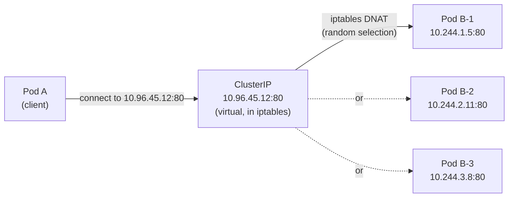

# ClusterIP , The Default Service Type

When you create a Service without specifying a type, Kubernetes uses `ClusterIP`. It's the most fundamental Service type, and all the other types build on top of it. Understanding ClusterIP thoroughly means you understand the core of how Service networking works in Kubernetes.

## What ClusterIP Means

A ClusterIP Service receives a virtual IP address , the "cluster IP" , from a reserved range in the cluster's network configuration (typically something like `10.96.0.0/12`). This IP is special: it doesn't belong to any Node, and no network interface anywhere actually holds it. It exists only in the routing rules programmed by `kube-proxy` on every node. Despite being virtual, it is completely stable , it's assigned when the Service is created and stays the same for the life of the Service.

:::info
`ClusterIP` is the **default** Service type. Omitting `type:` in a Service manifest gives you a ClusterIP Service.
:::

"ClusterIP" in the name refers to scope: the Service is reachable only from within the cluster. External clients, your laptop, users on the internet, cannot reach it directly.

This is a deliberate security boundary. Databases, caches, and internal APIs should only be accessible to other cluster components, not the outside world. ClusterIP enforces that by default.

## Creating a ClusterIP Service

Here's a complete Service manifest:

```yaml
apiVersion: v1
kind: Service
metadata:
  name: web-service
spec:
  selector:
    app: web
  ports:
    - port: 80
      targetPort: 80
```

Since `type` is omitted, this is a ClusterIP Service. The `ports` section has two fields that are often confused:

**`port`** is the port that the Service itself listens on , the port you connect to when you use the Service's IP or DNS name. In this case, `port: 80` means clients connect to `web-service:80`.

**`targetPort`** is the port on the Pod where your container is actually listening. Traffic arriving at the Service on port 80 will be forwarded to port 80 on the backend Pods. These two values don't have to match , for example, if your container listens on port 8080 but you want to expose it as port 80, you'd write `port: 80, targetPort: 8080`.

You can also expose multiple ports on a single Service by adding more entries to the `ports` list:

```yaml
ports:
  - name: http
    port: 80
    targetPort: 8080
  - name: metrics
    port: 9090
    targetPort: 9090
```

When exposing multiple ports, the `name` field becomes required , Kubernetes needs a way to distinguish between them.

## How kube-proxy Makes It Work

The magic behind ClusterIP is `kube-proxy`, a DaemonSet that runs on every node in the cluster. Its job is to watch the Kubernetes API for Service and Endpoint changes and translate them into local networking rules.

In the most common configuration, kube-proxy programs **iptables rules** on every node. When a packet is destined for a ClusterIP (say, `10.96.45.12:80`), the kernel intercepts it before it even leaves the node's network stack and rewrites the destination IP to one of the actual backend Pod IPs, chosen randomly from the current Endpoints list. The original source IP is preserved, so the Pod can see where the request came from.

In clusters configured to use IPVS mode, kube-proxy uses the kernel's IPVS (IP Virtual Server) subsystem instead of iptables. IPVS is faster at scale (handles thousands of Services more efficiently than chains of iptables rules) and supports more sophisticated load balancing algorithms. The observable behaviour is the same.



## Reaching a ClusterIP Service from Inside the Cluster

Once a Service exists, any Pod in the cluster can reach it in multiple ways.

**By DNS name (recommended):** Kubernetes' built-in DNS (CoreDNS) automatically creates DNS records for every Service. Within the same namespace, you can use just the Service name:

```bash
curl http://web-service
curl http://web-service:80
```

From a different namespace, use the fully qualified name:

```bash
curl http://web-service.default.svc.cluster.local
```

**By ClusterIP directly:** You can also connect using the virtual IP address, though this is less flexible (if you recreate the Service with a different IP for some reason, your clients break):

```bash
curl http://10.96.45.12
```

**Via environment variables (legacy):** Kubernetes automatically injects environment variables for every Service that exists when a Pod starts. For a Service named `web-service`, Pods get variables like `WEB_SERVICE_SERVICE_HOST` and `WEB_SERVICE_SERVICE_PORT`. This mechanism predates in-cluster DNS and is considered legacy , prefer DNS.

:::warning
Environment variable injection only captures Services that existed _before_ the Pod was created. If you create a Pod first and a Service later, the Pod won't have the new Service's variables. DNS works regardless of creation order, which is another reason to prefer it.
:::

## A Note on Specifying the ClusterIP Explicitly

Kubernetes assigns the ClusterIP automatically from a configured range. In most cases, you should let Kubernetes choose. However, you can request a specific IP if needed (for example, to match a legacy configuration):

```yaml
spec:
  clusterIP: 10.96.10.10
```

The requested IP must be within the cluster's service CIDR range and must not already be in use. If it is, the API server will reject the manifest.

:::info
You can find your cluster's service IP range by looking at the kube-apiserver flags: `--service-cluster-ip-range`. On most clusters created with kubeadm this defaults to `10.96.0.0/12`.
:::

## Hands-On Practice

**1. Create a Deployment and a ClusterIP Service**

```yaml
# web-deployment.yaml
apiVersion: apps/v1
kind: Deployment
metadata:
  name: web
spec:
  replicas: 3
  selector:
    matchLabels:
      app: web
  template:
    metadata:
      labels:
        app: web
    spec:
      containers:
        - name: web
          image: nginx:1.28
          ports:
            - containerPort: 80
apiVersion: v1
kind: Service
metadata:
  name: web-service
spec:
  selector:
    app: web
  ports:
    - port: 80
      targetPort: 80
```

```bash
kubectl apply -f web-deployment.yaml
kubectl rollout status deployment/web
```

**2. Inspect the Service**

```bash
kubectl get service web-service
# NAME          TYPE        CLUSTER-IP     EXTERNAL-IP   PORT(S)   AGE
# web-service   ClusterIP   10.96.45.12    <none>        80/TCP    10s

kubectl describe service web-service
# Look at: Selector, IP, Port, TargetPort, Endpoints
```

**3. Verify the Endpoints are populated**

```bash
kubectl get endpoints web-service
# NAME          ENDPOINTS                                      AGE
# web-service   10.244.1.5:80,10.244.2.11:80,10.244.3.8:80   10s
```

**4. Test connectivity from inside the cluster using DNS**

```bash
kubectl run curl-test --image=curlimages/curl --rm -it --restart=Never -- \
  curl -s http://web-service | head -5
# Should return nginx's HTML , the request was load-balanced to one of the three Pods
```

**5. Test the fully-qualified DNS name from a different namespace**

```bash
kubectl run curl-test --image=curlimages/curl --rm -it --restart=Never \
  -n kube-system -- curl -s http://web-service.default.svc.cluster.local | head -5
# Should also return nginx's HTML , crossing namespace boundary via FQDN
```

**6. Confirm the environment variables injected into a Pod**

```bash
POD=$(kubectl get pods -l app=web -o name | head -1)
kubectl exec $POD -- env | grep WEB_SERVICE
# WEB_SERVICE_SERVICE_HOST=10.96.45.12
# WEB_SERVICE_SERVICE_PORT=80
# WEB_SERVICE_PORT=tcp://10.96.45.12:80
# WEB_SERVICE_PORT_80_TCP=tcp://10.96.45.12:80
# WEB_SERVICE_PORT_80_TCP_PROTO=tcp
# WEB_SERVICE_PORT_80_TCP_PORT=80
# WEB_SERVICE_PORT_80_TCP_ADDR=10.96.45.12
```

**7. Show what happens when a port mismatch would cause issues**

```bash
# Try to reach the Service on a port it's not listening on
kubectl run curl-test --image=curlimages/curl --rm -it --restart=Never -- \
  curl -s --connect-timeout 3 http://web-service:9999 || echo "Connection failed as expected"
```

**8. Clean up**

```bash
kubectl delete deployment web
kubectl delete service web-service
```
