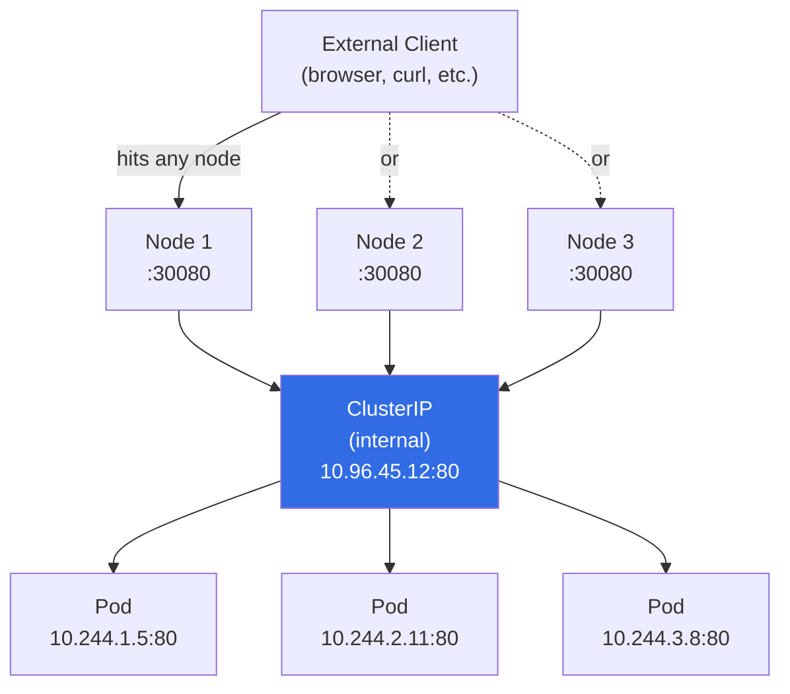

# NodePort , Exposing Services Outside the Cluster

ClusterIP Services are perfect for internal communication, but sometimes you need something outside the cluster to talk to your application , a browser, a load balancer, a monitoring system, or your laptop during development. `NodePort` is the simplest way to make a Service reachable from outside the cluster. It works by opening a specific port on every Node in the cluster and routing incoming traffic through to your Service.

:::info
A NodePort Service is a superset of ClusterIP, it keeps the stable internal IP while also opening a port on every Node for external access.
:::

## How NodePort Works

When you create a NodePort Service, Kubernetes does two things simultaneously: it creates a regular ClusterIP Service (with a stable internal IP), and it opens the specified port on every Node's network interface. Any traffic that arrives at `<any-node-IP>:<node-port>` is intercepted by kube-proxy and forwarded to the Service, which then forwards it to one of the backend Pods , regardless of which Node the Pod happens to be running on.

This "any node" property is important. You don't need to know which Node is running your Pods. Traffic arrives at Node 1's NodePort, gets forwarded to a Pod on Node 3 if that's where the matching Pod happens to live. kube-proxy handles this cross-node routing transparently.

The NodePort range is 30000–32767 by default. You can either let Kubernetes pick an available port in this range automatically, or specify one yourself. Ports below 30000 (like 80 or 443) are off-limits for NodePort , those are considered privileged and reserved for system processes.

## The NodePort Manifest

Here's a complete NodePort Service manifest:

```yaml
apiVersion: v1
kind: Service
metadata:
  name: web-service
spec:
  type: NodePort
  selector:
    app: web
  ports:
    - port: 80
      targetPort: 80
      nodePort: 30080
```

Three port-related fields work together here:

**`nodePort: 30080`:** The port opened on every Node. External clients connect to `<node-ip>:30080`.

**`port: 80`:** The Service's internal port. Inside the cluster, Pods still reach this Service at `web-service:80`, just like a regular ClusterIP Service.

**`targetPort: 80`:** The port on the backend Pods where the container is listening.

If you omit `nodePort`, Kubernetes picks an available port from the 30000–32767 range automatically. You can find the assigned port with `kubectl get service`.



## Accessing the Service

Once created, you can reach the Service from outside the cluster at any Node's IP on the NodePort:

```bash
curl http://<node-ip>:30080
```

From inside the cluster, the Service continues to be accessible through its ClusterIP and DNS name exactly as before:

```bash
curl http://web-service:80
curl http://web-service.default.svc.cluster.local:80
```

NodePort doesn't replace or remove the ClusterIP , it adds external accessibility on top of it. The Service is always accessible both internally and externally.

## Finding the Node IPs

In a real cluster, Node IPs are the IP addresses of the physical or virtual machines. You can find them with:

```bash
kubectl get nodes -o wide
# NAME     STATUS   ROLES    AGE   VERSION   INTERNAL-IP     EXTERNAL-IP
# node-1   Ready    master   5d    v1.28     192.168.1.100   <none>
# node-2   Ready    <none>   5d    v1.28     192.168.1.101   <none>
```

Use any of the `INTERNAL-IP` values with your NodePort. In cloud environments, Nodes may also have external IPs , either a public IP in the `EXTERNAL-IP` column or via the cloud provider's routing.

In **minikube**, a convenience command makes this easy:

```bash
minikube service web-service --url
# http://192.168.49.2:30080
```

In **kind** (Kubernetes in Docker), NodePort is accessible through the mapped Docker port if you configured port mappings when creating the cluster.

## When to Use NodePort

NodePort is best suited for specific scenarios:

- **Local development and testing** the quickest way to expose a Service in minikube, kind, or a bare-metal lab cluster; requires no additional infrastructure.
- **On-premises clusters** where `LoadBalancer` Services can't auto-provision, NodePort combined with an external load balancer or HAProxy provides external access.
- **Quick demos or tests** when simplicity matters more than production-grade routing.

:::info
For production-grade external access in cloud environments, prefer `LoadBalancer` type Services or an Ingress controller. NodePort works, but it requires clients to know the port number (which is in the awkward 30000–32767 range) and the Node IP. A LoadBalancer hides both of these details behind a clean external IP or hostname.
:::

## Drawbacks of NodePort

NodePort is convenient but comes with real limitations that matter in production.

**Every node gets the port opened.** Even nodes that aren't running any matching Pods still have the port open. This expands your attack surface , all nodes need firewall rules updated when you add a NodePort Service.

**The port range is awkward.** End users don't expect to type port numbers above 30000 into their browsers. You'd typically put a reverse proxy or load balancer in front to map ports 80/443 to the NodePort, which adds complexity.

**No built-in health checks on the node level.** If a Node goes down, clients pointing directly at that Node's IP will fail. An external load balancer (the next lesson) handles this by periodically health-checking nodes and routing around failures.

**Port conflicts can occur.** If you have many Services, you have to manage the NodePort range to avoid collisions. Kubernetes prevents duplicate assignments automatically, but at scale, keeping track of which ports are used becomes a chore.

:::warning
Do not expose sensitive internal Services with NodePort unless your cluster nodes are behind a firewall. The port is opened on every node, meaning anyone who can reach any node in your cluster can reach the NodePort , even if the Service was meant to be internal.
:::

## Hands-On Practice

**1. Create a Deployment and a NodePort Service**

```bash
kubectl apply -f - <<EOF
apiVersion: apps/v1
kind: Deployment
metadata:
  name: web
spec:
  replicas: 2
  selector:
    matchLabels:
      app: web
  template:
    metadata:
      labels:
        app: web
    spec:
      containers:
        - name: web
          image: nginx:1.25
          ports:
            - containerPort: 80
apiVersion: v1
kind: Service
metadata:
  name: web-nodeport
spec:
  type: NodePort
  selector:
    app: web
  ports:
    - port: 80
      targetPort: 80
      nodePort: 30080
EOF
kubectl rollout status deployment/web
```

**2. Inspect the Service**

```bash
kubectl get service web-nodeport
# NAME            TYPE       CLUSTER-IP     EXTERNAL-IP   PORT(S)        AGE
# web-nodeport    NodePort   10.96.45.12    <none>        80:30080/TCP   10s
```

Note the `PORT(S)` column: `80:30080/TCP` means the Service's internal port is 80, and the NodePort is 30080.

**3. Find the Node IP**

```bash
kubectl get nodes -o wide
# Use the INTERNAL-IP value from the output
NODE_IP=$(kubectl get nodes -o jsonpath='{.items[0].status.addresses[?(@.type=="InternalIP")].address}')
echo "Node IP: $NODE_IP"
```

**4. Access the Service from outside the cluster**

```bash
curl http://$NODE_IP:30080
# You should see nginx's HTML
```

If you're using minikube:

```bash
minikube service web-nodeport --url
# Then curl or open that URL
```

**5. Confirm internal access still works**

```bash
kubectl run curl-test --image=curlimages/curl --rm -it --restart=Never -- \
  curl -s http://web-nodeport:80 | head -3
# Still works via ClusterIP internally
```

**6. Let Kubernetes pick the port automatically**

```bash
kubectl apply -f - <<EOF
apiVersion: v1
kind: Service
metadata:
  name: web-nodeport-auto
spec:
  type: NodePort
  selector:
    app: web
  ports:
    - port: 80
      targetPort: 80
EOF

kubectl get service web-nodeport-auto
# PORT(S) column will show something like 80:31423/TCP , Kubernetes picked 31423
```

**7. Clean up**

```bash
kubectl delete deployment web
kubectl delete service web-nodeport web-nodeport-auto
```
