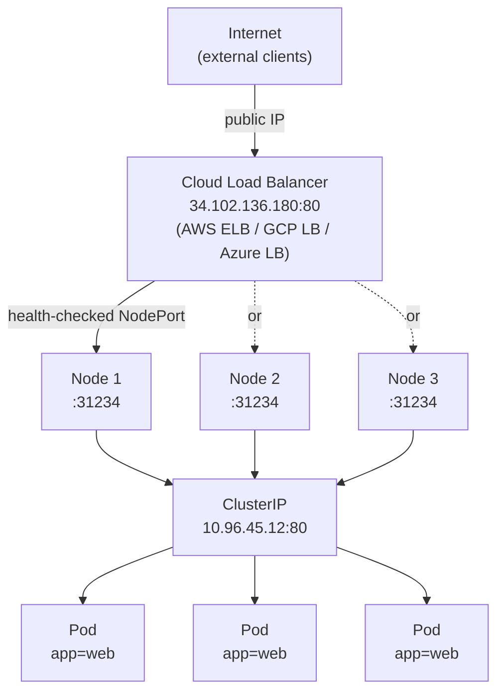

# LoadBalancer , Cloud-Native External Access

NodePort gets traffic from outside the cluster to your Service, but it asks clients to use awkward port numbers and to know Node IPs , which can change. For production workloads in cloud environments, Kubernetes offers a more elegant solution: the `LoadBalancer` Service type. It automatically provisions a cloud load balancer in front of your cluster and assigns a single, stable, public-facing IP address or hostname that external clients use.

:::info
`LoadBalancer` builds on top of NodePort and ClusterIP, it creates all three layers and adds a cloud-provisioned external load balancer on top. From a client perspective, it's just one IP.
:::

## How LoadBalancer Services Work

The `LoadBalancer` type is an extension of NodePort. When you create a LoadBalancer Service, Kubernetes actually creates all three layers in sequence:

1. A **ClusterIP:** the stable internal IP, as always.
2. A **NodePort:** a port opened on every cluster node, so traffic can enter the cluster.
3. A **cloud load balancer:** provisioned automatically via the cloud provider's API (AWS Elastic Load Balancer, GCP Cloud Load Balancing, Azure Load Balancer, etc.).

The cloud load balancer is configured to send traffic to the NodePort on every healthy node. Kubernetes' cloud controller manager handles this orchestration: it watches for `LoadBalancer` Services and calls the cloud provider's API to create and configure the load balancer, then writes the assigned public IP or hostname back into the Service's `status.loadBalancer.ingress` field.

From a client perspective, it's simple: hit one IP (or hostname), traffic lands. The NodePort and ClusterIP layers are hidden implementation details.

## Creating a LoadBalancer Service

The manifest is almost identical to a ClusterIP Service , just add `type: LoadBalancer`:

```yaml
apiVersion: v1
kind: Service
metadata:
  name: web-service
spec:
  type: LoadBalancer
  selector:
    app: web
  ports:
    - port: 80
      targetPort: 80
```

After applying this manifest in a cloud cluster, Kubernetes will provision the load balancer. After a minute or so (provisioning takes time), the external IP appears:

```bash
kubectl get service web-service
# NAME          TYPE           CLUSTER-IP     EXTERNAL-IP      PORT(S)        AGE
# web-service   LoadBalancer   10.96.45.12    34.102.136.180   80:31234/TCP   90s
```

The `EXTERNAL-IP` column shows the public IP assigned by the cloud provider. External clients send traffic to `34.102.136.180:80` and it arrives at your Pods. The `31234` in the `PORT(S)` column is the underlying NodePort that's also been created , you can use it in the rare cases where you need direct node access, but normally you ignore it.

## The Traffic Flow



The cloud load balancer health-checks the nodes at the NodePort level. If a Node becomes unhealthy, the load balancer stops sending traffic to it , providing resilience that bare NodePort doesn't offer. This is one of the key advantages over using NodePort directly.

## Watching the External IP Appear

When you first create a LoadBalancer Service, the external IP is in a `<pending>` state while the cloud load balancer is being provisioned:

```bash
kubectl get service web-service -w
# NAME          TYPE           CLUSTER-IP     EXTERNAL-IP   PORT(S)        AGE
# web-service   LoadBalancer   10.96.45.12    <pending>     80:31234/TCP   5s
# web-service   LoadBalancer   10.96.45.12    <pending>     80:31234/TCP   20s
# web-service   LoadBalancer   10.96.45.12    34.102.136.180   80:31234/TCP   45s
```

The transition from `<pending>` to a real IP typically takes 30 seconds to 2 minutes depending on the cloud provider. In AWS, the external address is often a DNS hostname rather than an IP:

```
a1b2c3d4e5f6g7h8i9j0.us-east-1.elb.amazonaws.com
```

Both are equally valid for clients to connect to.

## Local Environments: The Pending Problem

In local development clusters , minikube, kind, k3s , there is no cloud controller manager. The LoadBalancer Service will be created, but the `EXTERNAL-IP` will remain `<pending>` indefinitely because nothing in the environment knows how to provision a cloud load balancer.

Several solutions exist for local environments:

**`minikube tunnel`:** Run `minikube tunnel` in a separate terminal. It provisions local routing that makes LoadBalancer Services get a real IP (usually `127.0.0.1` or from minikube's network range).

```bash
minikube tunnel  # run in a separate terminal
kubectl get service web-service  # EXTERNAL-IP will now have a value
```

**MetalLB:** A popular open-source load balancer implementation for bare-metal and local clusters. It watches for LoadBalancer Services and assigns IPs from a pre-configured pool. Many kind and k3s users install MetalLB to get functional LoadBalancer Services.

**Cloud provider emulation:** Tools like LocalStack emulate cloud provider APIs locally, including load balancer provisioning.

:::info
For development, NodePort or `kubectl port-forward` are usually simpler than trying to make LoadBalancer work locally. Reserve LoadBalancer Services for staging and production environments where a real cloud provider is available.
:::

## Cost and Resource Considerations

Each LoadBalancer Service provisions a separate cloud load balancer. In most cloud providers, load balancers are billed independently of your compute resources , typically a small hourly fee plus data transfer charges.

In a large application with dozens of Services that need external access, this can add up quickly. For this reason, many production architectures use only one or two LoadBalancer Services to expose an **Ingress controller** (like nginx-ingress or Traefik), which then routes traffic to many backend Services internally. This gives you the benefits of a single external IP with the routing flexibility of many Services, at a fraction of the cost.

:::warning
Accidentally creating many LoadBalancer Services in a cloud cluster is a common source of unexpected cloud bills. Each Service creates a cloud LB. If you're experimenting in a shared cluster, use NodePort or ClusterIP whenever external access isn't strictly needed, and always clean up LoadBalancer Services when done.
:::

## Cloud Provider Annotations

Cloud providers support custom behaviour via annotations on the Service. These vary by provider but commonly include:

```yaml
metadata:
  annotations:
    # AWS: use an internal (private) load balancer
    service.beta.kubernetes.io/aws-load-balancer-internal: 'true'
    # AWS: use a Network Load Balancer instead of Classic
    service.beta.kubernetes.io/aws-load-balancer-type: 'nlb'
    # GCP: set a static IP
    cloud.google.com/load-balancer-ip: '34.102.136.180'
```

These annotations are the primary way to customize load balancer behaviour for your cloud environment. Check your cloud provider's Kubernetes documentation for the full list.

## Hands-On Practice

These steps demonstrate LoadBalancer behaviour. In a local cluster without a cloud provider, you'll see the `<pending>` state and learn how to work around it.

**1. Create a Deployment and a LoadBalancer Service**

```yaml
# web-deployment.yaml
apiVersion: apps/v1
kind: Deployment
metadata:
  name: web
spec:
  replicas: 3
  selector:
    matchLabels:
      app: web
  template:
    metadata:
      labels:
        app: web
    spec:
      containers:
        - name: web
          image: nginx:1.28
          ports:
            - containerPort: 80
apiVersion: v1
kind: Service
metadata:
  name: web-lb
spec:
  type: LoadBalancer
  selector:
    app: web
  ports:
    - port: 80
      targetPort: 80
```

```bash
kubectl apply -f web-deployment.yaml
kubectl rollout status deployment/web
```

**2. Watch for the external IP**

```bash
kubectl get service web-lb -w
# In a cloud cluster, the EXTERNAL-IP will appear within 1-2 minutes.
# In minikube or kind, it will stay <pending>.
```

**3. If using minikube, run tunnel in a second terminal**

```bash
# Second terminal:
minikube tunnel

# Back in your primary terminal, check the service again:
kubectl get service web-lb
# EXTERNAL-IP should now be populated (typically 127.0.0.1 or a minikube IP)
```

**4. Test external access**

```bash
EXTERNAL_IP=$(kubectl get service web-lb -o jsonpath='{.status.loadBalancer.ingress[0].ip}')
# or for hostname-based (AWS):
# EXTERNAL_IP=$(kubectl get service web-lb -o jsonpath='{.status.loadBalancer.ingress[0].hostname}')

curl http://$EXTERNAL_IP
# Should return nginx HTML
```

**5. Inspect the underlying NodePort that was also created**

```bash
kubectl get service web-lb
# PORT(S) column shows something like: 80:31234/TCP
# The 31234 is the NodePort , LoadBalancer includes it

NODE_IP=$(kubectl get nodes -o jsonpath='{.items[0].status.addresses[?(@.type=="InternalIP")].address}')
NODE_PORT=$(kubectl get service web-lb -o jsonpath='{.spec.ports[0].nodePort}')
curl http://$NODE_IP:$NODE_PORT
# Also works , the LoadBalancer forwards to this NodePort
```

**6. See all three layers of the hierarchy**

```bash
kubectl describe service web-lb
# Type:                     LoadBalancer
# IP:                       10.96.45.12        ← ClusterIP layer
# LoadBalancer Ingress:     34.102.136.180     ← External IP layer
# Port:                     80/TCP             ← Service port
# TargetPort:               80/TCP             ← Pod port
# NodePort:                 31234/TCP          ← NodePort layer
# Endpoints:                10.244.1.5:80,...  ← Current Pod IPs
```

**7. Clean up**

```bash
kubectl delete deployment web
kubectl delete service web-lb
# In minikube, you can also stop the tunnel (Ctrl+C in the second terminal)
```
