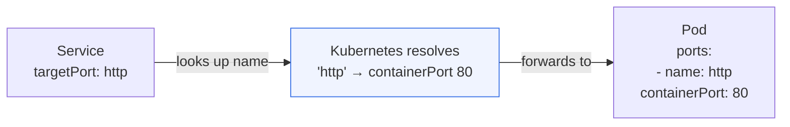

# Named Ports

Throughout this module, all the Service manifests have referenced ports by number: `targetPort: 80`, `targetPort: 8080`, and so on. This works perfectly well for simple cases. But as your application grows , more containers, more ports, more teams managing different parts of the stack , hardcoded port numbers become a maintenance problem. Named ports solve this elegantly, and they're one of those small practices that make the difference between a brittle manifest and a robust one.

:::info
With named ports, a container's port number is defined in exactly one place, the Pod spec, and everything else (Services, probes, policies) references it by name.
:::

## The Problem with Port Numbers

Imagine you have a container that listens on port 8080, and you have a Service that forwards traffic to it:

```yaml
# Service
ports:
  - port: 80
    targetPort: 8080
```

This works fine, until the port number needs to change. A single update ripples through every resource that hardcodes `8080`:

- The Service manifest
- Readiness and liveness probes
- NetworkPolicies

Named ports break this coupling. You give the port a name in the Pod spec, and everything else references that name. The port number is now defined in exactly one place.

## Naming a Port in the Pod Spec

Ports are named in the `containers[].ports` field of the Pod template:

```yaml
containers:
  - name: web
    image: nginx
    ports:
      - name: http
        containerPort: 80
      - name: metrics
        containerPort: 9090
```

The `name` field is just a string , any valid DNS label works. Common conventions are `http`, `https`, `grpc`, `metrics`, `admin`, or domain-specific names like `api` or `health`.

:::info
Port names must be lowercase and can contain hyphens, but must start and end with a letter or digit. They follow DNS label syntax. Avoid underscores , `http_api` is invalid; `http-api` is fine.
:::

## Referencing the Named Port in the Service

Once ports are named in the Pod template, a Service can reference them by name in `targetPort`:

```yaml
apiVersion: v1
kind: Service
metadata:
  name: web-service
spec:
  selector:
    app: web
  ports:
    - name: http
      port: 80
      targetPort: http # ← name, not a number
    - name: metrics
      port: 9090
      targetPort: metrics # ← name, not a number
```

When Kubernetes processes this Service, it looks up the name `http` in the matching Pods' port definitions and resolves it to the actual port number (`80`). If you later change the container's `containerPort` from `80` to `8080`, you only update the Pod template , the Service manifest is untouched, because it refers to the port by name, not by number.



## Named Ports Beyond Services

The usefulness of named ports extends beyond Services. The same names can be referenced in several other contexts:

**Readiness and liveness probes** can reference port names instead of numbers:

```yaml
readinessProbe:
  httpGet:
    path: /health
    port: http # resolves to containerPort 80
```

**NetworkPolicy** rules can reference named ports when targeting specific traffic. This is especially useful in policies that need to allow traffic on a semantic port (like "the metrics port") without being tied to a specific number.

**Ingress rules** reference Service ports, which in turn reference named Pod ports , the chain of names carries all the way through.

The result is that changing a port number in a mature application becomes a surgical change in one place , the Pod template , rather than a scavenger hunt across Services, probes, and policies.

## A Complete Example

Here's a real-world-style manifest showing a web application with an HTTP port and a metrics port, all wired up by name:

```yaml
apiVersion: apps/v1
kind: Deployment
metadata:
  name: web-app
spec:
  replicas: 3
  selector:
    matchLabels:
      app: web
  template:
    metadata:
      labels:
        app: web
    spec:
      containers:
        - name: web
          image: myapp:1.0
          ports:
            - name: http
              containerPort: 8080
            - name: metrics
              containerPort: 9090
          readinessProbe:
            httpGet:
              path: /ready
              port: http        # ← using the name
            initialDelaySeconds: 5
            periodSeconds: 10
          livenessProbe:
            httpGet:
              path: /health
              port: http        # ← using the name
            initialDelaySeconds: 10
            periodSeconds: 30
apiVersion: v1
kind: Service
metadata:
  name: web-service
spec:
  selector:
    app: web
  ports:
    - name: http
      port: 80
      targetPort: http      # ← resolves to 8080
    - name: metrics
      port: 9090
      targetPort: metrics   # ← resolves to 9090
```

If the team later decides the application should listen on 8443 instead of 8080, the only change needed is `containerPort: 8080` → `containerPort: 8443` in the Pod template. The Service, the readiness probe, and the liveness probe all continue to work unchanged, because they reference `http` , not `8080`.

## Named Ports and Port Discovery

In a headless Service (covered in the Endpoints lesson), named ports also influence DNS-SD (Service Discovery). The SRV DNS records that a headless Service generates include the port name, which allows sophisticated clients to discover not just Pod IPs but also which named port to connect to on each Pod.

This is especially relevant for gRPC services and other protocols that use DNS-SRV records for load balancing and service discovery.

:::info
Named ports are particularly important in multi-container Pods (sidecars), where each container may expose multiple ports. Giving each port a meaningful name avoids confusion when a Service or probe needs to target a specific container's specific port.
:::

## Best Practices

- **Always name ports in production manifests**, it pays dividends when you're debugging at midnight and need to understand what `targetPort: 8080` means without cross-referencing four other files.
- **Use semantic names** that reflect protocol or purpose: `http`, `https`, `grpc`, `metrics`, `admin`, `debug`. Avoid `port1` or `p80`, they add nothing over the number itself.
- **Keep names consistent across your organization.** If every team uses `http` for HTTP, dashboards, alerting rules, and NetworkPolicies can be written generically and applied uniformly.

:::warning
If you use the same Service to route to containers with different port names that resolve to different numbers , for example, a canary Pod where `http` maps to 8080 and a stable Pod where `http` maps to 9090 , the traffic routing will appear correct from the Service's perspective but the actual destination ports will differ. This is rarely intentional; ensure your port names resolve consistently across all Pods in a Service's selector.
:::

## Hands-On Practice

**1. Create a Deployment with named ports**

```bash
kubectl apply -f - <<EOF
apiVersion: apps/v1
kind: Deployment
metadata:
  name: web-named
spec:
  replicas: 2
  selector:
    matchLabels:
      app: web-named
  template:
    metadata:
      labels:
        app: web-named
    spec:
      containers:
        - name: web
          image: nginx:1.25
          ports:
            - name: http
              containerPort: 80
          readinessProbe:
            httpGet:
              path: /
              port: http
            initialDelaySeconds: 2
            periodSeconds: 5
EOF
kubectl rollout status deployment/web-named
```

**2. Create a Service using the named port**

```bash
kubectl apply -f - <<EOF
apiVersion: v1
kind: Service
metadata:
  name: web-named-svc
spec:
  selector:
    app: web-named
  ports:
    - name: http
      port: 80
      targetPort: http
EOF
```

**3. Verify the Service works**

```bash
kubectl run curl-test --image=curlimages/curl --rm -it --restart=Never -- \
  curl -s http://web-named-svc | head -3
```

**4. Inspect the resolved port in the Endpoints**

```bash
kubectl describe endpoints web-named-svc
# The endpoints will list the actual port number (80), resolved from the name "http"
```

**5. Simulate changing the port number**

Now change the container port to 8080 (using a container that actually listens there) and observe that only the Pod template changes:

```bash
# Patch the deployment to use a different port number, keeping the name "http"
kubectl patch deployment web-named --type='json' -p='[
  {"op": "replace", "path": "/spec/template/spec/containers/0/ports/0/containerPort", "value": 8080},
  {"op": "replace", "path": "/spec/template/spec/containers/0/image", "value": "nginx:1.26"}
]'
```

The Service manifest hasn't changed at all , it still says `targetPort: http`. But after the rollout, the Endpoints will show port 8080 instead of 80, because Kubernetes re-resolved the name `http` from the updated Pod template.

```bash
kubectl rollout status deployment/web-named
kubectl describe endpoints web-named-svc
# Endpoints now show :8080 instead of :80
```

Note: nginx listens on port 80 by default, so if you test connectivity after this patch it will actually fail , this step is purely to demonstrate the port name resolution mechanism. In a real application, the new image would actually listen on 8080.

**6. Restore and verify**

```bash
kubectl set image deployment/web-named web=nginx:1.25
kubectl patch deployment web-named --type='json' -p='[
  {"op": "replace", "path": "/spec/template/spec/containers/0/ports/0/containerPort", "value": 80}
]'
kubectl rollout status deployment/web-named

kubectl run curl-test --image=curlimages/curl --rm -it --restart=Never -- \
  curl -s http://web-named-svc | head -3
# Back to working
```

**7. Clean up**

```bash
kubectl delete deployment web-named
kubectl delete service web-named-svc
```
