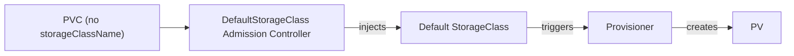

# Default StorageClass

In many clusters, especially cloud-managed ones, you can create a PVC without specifying a `storageClassName` — and it just works. Storage is provisioned, the PVC is bound, and your Pod gets its volume. How? Thanks to the **default StorageClass**.

## How the Default Works

When a PVC doesn't include a `storageClassName`, the Kubernetes **DefaultStorageClass admission controller** steps in. It looks for a StorageClass marked as the default and automatically injects its name into the PVC. From that point on, the PVC behaves as if you'd specified the class explicitly.

Think of it like a default shipping method on an online store. If you don't choose express or standard shipping, the store picks one for you. The default StorageClass does the same thing — it provides a sensible default so users don't have to think about storage classes for simple use cases.



## Which StorageClass Is the Default?

List your StorageClasses — the default one is clearly marked:

```bash
kubectl get storageclass
```

You'll see `(default)` next to the default class in the output. Under the hood, it's identified by an annotation:

```
storageclass.kubernetes.io/is-default-class: "true"
```

:::info
Cloud-managed clusters (EKS, GKE, AKS) typically configure a default StorageClass during setup. On EKS, it's usually `gp2` or `gp3`; on GKE, it's `standard` or `premium-rwo`. Check what's available in your cluster before creating PVCs.
:::

## Creating a PVC Without StorageClass

When a default exists, this is all you need:

```yaml
apiVersion: v1
kind: PersistentVolumeClaim
metadata:
  name: simple-pvc
spec:
  accessModes:
    - ReadWriteOnce
  resources:
    requests:
      storage: 5Gi
```

No `storageClassName` specified. The admission controller fills it in with the default class, the provisioner creates a PV, and the PVC is bound.

## Setting or Changing the Default

To mark a StorageClass as default, add the annotation:

```yaml
apiVersion: storage.k8s.io/v1
kind: StorageClass
metadata:
  name: fast-ssd
  annotations:
    storageclass.kubernetes.io/is-default-class: "true"
provisioner: ebs.csi.aws.com
parameters:
  type: gp3
reclaimPolicy: Delete
volumeBindingMode: WaitForFirstConsumer
```

If you need to change the default, remove the annotation from the current one and add it to the new one:

```bash
# Remove default from the old class
kubectl patch storageclass old-default -p '{"metadata": {"annotations": {"storageclass.kubernetes.io/is-default-class": "false"}}}'

# Set the new default
kubectl patch storageclass fast-ssd -p '{"metadata": {"annotations": {"storageclass.kubernetes.io/is-default-class": "true"}}}'
```

## Verifying It Works

Let's create a PVC without a class and confirm the default was injected:

```bash
kubectl apply -f simple-pvc.yaml

# Check which StorageClass was assigned
kubectl get pvc simple-pvc -o jsonpath='{.spec.storageClassName}'
```

The output should show your default StorageClass name.

:::warning
Only **one** StorageClass should be marked as default per cluster. Having multiple defaults leads to unpredictable behavior — Kubernetes may pick any one of them. If you see unexpected PVC behavior, check `kubectl get storageclass` for multiple defaults.
:::

## When There's No Default

If no StorageClass is marked as default and a PVC omits `storageClassName`, the PVC stays in `Pending` indefinitely. The admission controller has nothing to inject, and no provisioner is triggered. You'll need to either:

- Set a StorageClass as default
- Or explicitly specify `storageClassName` in every PVC

## Wrapping Up

The default StorageClass provides a seamless experience for users who just need storage without worrying about which class to pick. It's set via an annotation and injected automatically by the admission controller. Most cloud clusters come with one pre-configured. Just make sure you have exactly one default — and that it matches the storage characteristics your team needs most. In the next lesson, we'll see the full dynamic provisioning flow in action.
