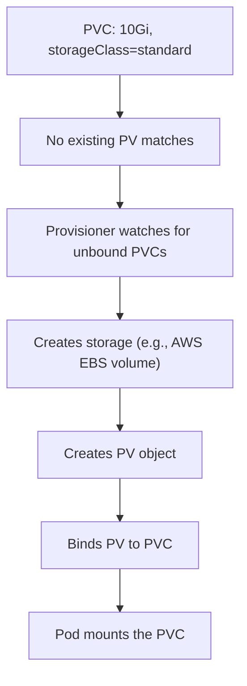

# Dynamic Provisioning with StorageClass

This is where everything comes together. In previous lessons, you learned about PVs (storage resources), PVCs (storage requests), and StorageClasses (storage menus). Dynamic provisioning is the magic that connects them: you create a PVC, and Kubernetes automatically creates the PV for you. No admin needed, no manual setup.

## The Full Flow

Here's what happens when dynamic provisioning is in place:

1. You create a PVC with a `storageClassName` (or rely on the default)
2. No existing PV matches the request
3. The StorageClass's **provisioner** kicks in
4. The provisioner creates actual storage in the backend (a cloud disk, a network volume, etc.)
5. It creates a PV representing that storage
6. Kubernetes binds the PV to the PVC
7. Your Pod can now mount the PVC

The entire process is automatic. You write a PVC, apply it, and within seconds you have a bound volume ready to use.



:::info
Dynamic provisioning eliminates the manual PV creation step entirely. In cloud environments, this means you can go from "I need storage" to "I have storage" with a single `kubectl apply` — no tickets, no waiting for an admin.
:::

## Trying It Out

Create a PVC that references a StorageClass with a provisioner:

```yaml
apiVersion: v1
kind: PersistentVolumeClaim
metadata:
  name: dynamic-pvc
spec:
  accessModes:
    - ReadWriteOnce
  storageClassName: standard
  resources:
    requests:
      storage: 10Gi
```

Apply it and watch what happens:

```bash
# Apply the PVC
kubectl apply -f dynamic-pvc.yaml

# Watch the PVC status transition to Bound
kubectl get pvc dynamic-pvc -w

# See the automatically created PV
kubectl get pv

# Inspect the provisioned PV
kubectl describe pv <pv-name>
```

If the StorageClass uses `WaitForFirstConsumer` binding mode, the PVC will stay in `Pending` until a Pod references it. Once you create a Pod that mounts this PVC, provisioning triggers — and the provisioner knows which node the Pod will run on, so it can create storage in the correct zone.

## What Happens with WaitForFirstConsumer

In multi-zone clusters, `WaitForFirstConsumer` is crucial. Without it, the provisioner might create a disk in zone A, but the scheduler puts your Pod in zone B — and the Pod can't reach the disk.

With `WaitForFirstConsumer`, provisioning is deferred until the Pod is scheduled. The provisioner sees which node was chosen and creates the disk in the same zone. Problem solved.

```bash
# With WaitForFirstConsumer, the PVC stays Pending...
kubectl get pvc dynamic-pvc
# STATUS: Pending

# ...until you create a Pod that uses it
kubectl apply -f pod-with-pvc.yaml

# Now the PVC becomes Bound
kubectl get pvc dynamic-pvc
# STATUS: Bound
```

## When Provisioning Fails

If the PVC stays in `Pending` longer than expected, something went wrong. Here's how to diagnose:

```bash
# Check PVC events
kubectl describe pvc dynamic-pvc

# Check provisioner logs (usually in kube-system)
kubectl logs -n kube-system -l app=ebs-csi-controller
```

Common causes:

- **No provisioner installed** — The StorageClass references a provisioner (like a CSI driver) that isn't deployed in the cluster
- **Cloud credentials missing** — The provisioner can't authenticate with the cloud provider
- **Quota exceeded** — Your cloud account has hit its storage quota
- **Incompatible parameters** — The StorageClass parameters don't work with the backend (wrong disk type, unsupported region, etc.)

:::warning
If a StorageClass uses `kubernetes.io/no-provisioner`, there's no dynamic provisioning — an admin must create PVs manually. This provisioner name explicitly means "I'll handle PV creation myself." Make sure your StorageClass uses a real provisioner if you want automatic provisioning.
:::

## Cleanup and Reclaim

When you delete a PVC, the reclaim policy determines what happens to the dynamically provisioned PV:

- **Delete** (default for most dynamic provisioners) — The PV and its underlying cloud disk are deleted automatically. Clean and simple.
- **Retain** — The PV and disk are kept, but the PV moves to `Released` state. An admin must manually clean up.

For development environments, `Delete` keeps things tidy. For production data you can't afford to lose, consider `Retain`.

## Wrapping Up

Dynamic provisioning is one of the most powerful features of the Kubernetes storage model. It turns storage into a self-service resource: users create PVCs, provisioners create PVs, and everything is bound automatically. Combined with StorageClasses that offer different tiers and topologies, it enables a storage experience that's both flexible and hands-off. With this chapter complete, you have a solid understanding of Kubernetes storage — from ephemeral `emptyDir` volumes all the way to dynamically provisioned persistent storage.
