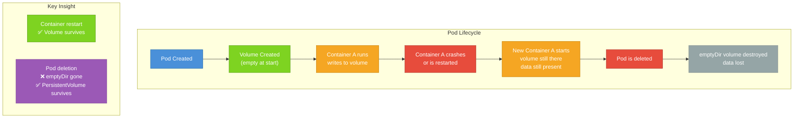

# Why Do We Need Volumes?

Containers are designed to be disposable. When a container process exits, crashes, or is replaced, it takes everything it wrote to its own filesystem with it. That's not a bug — it's a feature. Stateless containers are predictable, reproducible, and easy to scale. You can spin up ten identical copies of a container knowing each one will start with the exact same blank slate.

But reality is messier than that ideal. Applications frequently need to store things: log files, uploaded media, database records, caches, temporary computation results, configuration files that need to be shared between running processes. And sometimes two containers in the same Pod need to pass files back and forth. Pure statelessness simply isn't sufficient for these cases.

Kubernetes solves this with **Volumes**.

## The Whiteboard and the Filing Cabinet

Here's an analogy that captures the difference between a container's own filesystem and a volume. Imagine a contractor who comes to your office every day to work. Each morning they sit down at a whiteboard and draw out everything they need: their to-do list, notes, diagrams, calculations. When the workday ends and they go home, someone erases the whiteboard completely. The next morning it's blank again — the contractor starts fresh.

That whiteboard is the container's own filesystem. Anything written there is gone the moment the container stops, regardless of why it stopped.

Now imagine the contractor also has a filing cabinet in the corner of the office. They can store documents in it, retrieve them the next day, update them, and share them with other contractors working in the same room. The filing cabinet doesn't get emptied every night just because the contractor goes home. Its contents persist independently of any individual person's presence.

That filing cabinet is a Kubernetes volume. It persists across individual container restarts. If the container crashes and Kubernetes starts a fresh replacement, the new container can open the same filing cabinet and pick up right where the previous one left off.

## What Is a Volume?

A **Volume** in Kubernetes is a directory that is accessible to containers in a Pod. Unlike the container's private filesystem, which is torn down with the container, a volume's lifecycle is tied to the **Pod**, not to individual containers within it.

This is a critical distinction:

- A container restarts → the volume is still there, data intact
- A Pod is deleted → the volume goes with it (for ephemeral volume types)

There's a whole separate category called **PersistentVolumes** that survive Pod deletion — we'll cover those in later lessons. For now, understand that the volumes discussed in this module are all about storage that lives as long as the Pod that uses it.

## The Two-Step Declaration

Using a volume always involves two separate declarations in your Pod spec, and both are necessary.

**Step 1: Declare the volume** in `spec.volumes[]`. This defines the volume — its name and its type (where the storage actually comes from).

**Step 2: Mount the volume** in `spec.containers[].volumeMounts[]`. This attaches the volume to a specific path inside a specific container's filesystem. Without a mount, the volume exists but is inaccessible to any container.

```yaml
spec:
  volumes:
    - name: my-storage         # Step 1: declare it
      emptyDir: {}
  containers:
    - name: app
      image: my-app:latest
      volumeMounts:
        - name: my-storage     # Step 2: mount it (must match the name above)
          mountPath: /data      # where it appears inside the container
```

The `name` field connects the two declarations — it's the glue between the volume definition and the mount. You can mount the same volume into multiple containers in the same Pod, each at the same or different paths.

## Volume vs PersistentVolume: A Quick Orientation

People often confuse "volumes" with "persistent storage." In Kubernetes, these are related but distinct concepts that exist on different levels of abstraction.

A **Volume** (as used in this module) is an inline storage declaration that lives in the Pod spec. Its lifetime is directly tied to the Pod. When the Pod goes away — whether it was deleted manually, evicted, or replaced during a rolling update — the volume goes with it. Some volume types like `emptyDir` store data only in memory or on the node's local disk; others like `configMap` and `secret` draw from Kubernetes API objects. None of these survive Pod deletion.

A **PersistentVolume** (PV) is a separately managed cluster resource that represents durable storage — a cloud disk, an NFS share, a storage system. A PersistentVolumeClaim (PVC) is a request for that storage, which Pods use to get access. PVs survive Pod deletion. They're provisioned once and can be reattached to new Pods. We'll cover PVs and PVCs in depth in the next module.

:::info
If you're building a database or any workload that absolutely cannot lose data when a Pod is replaced, you need PersistentVolumes. The volumes in this module (emptyDir, hostPath, configMap, secret) are for different use cases: sharing data between containers, scratch space, injecting configuration, and accessing node-level resources.
:::

## The Lifecycle in Pictures

Let's visualize what happens to volumes across different events:



## Types of Volumes You'll Encounter

Kubernetes supports many volume types, each suited to a different use case. This module focuses on four of the most commonly used ones:

**emptyDir** is a temporary scratch space — created empty when the Pod starts, destroyed when the Pod ends. Great for sharing data between containers in the same Pod.

**hostPath** mounts a path from the underlying node's filesystem directly into the container. Useful for system-level tools that need access to node resources, but comes with security implications.

**configMap** and **secret** allow you to inject configuration data stored in Kubernetes API objects as files inside your containers — an elegant alternative to environment variables for complex config.

Each of the next three lessons covers one of these types in detail with complete examples and hands-on exercises.

## Hands-On Practice

Before diving into specific volume types, let's see what happens to a container's filesystem without any volume — and confirm that data is indeed lost on container restart. Use the terminal on the right panel.

**1. Create a Pod and write a file to its container's local filesystem:**

```bash
kubectl run ephemeral-test --image=busybox:1.36 -- sh -c "echo 'I will not survive' > /tmp/message.txt && sleep 3600"
```

**2. Wait for the Pod to be running, then read the file:**

```bash
kubectl get pod ephemeral-test
kubectl exec ephemeral-test -- cat /tmp/message.txt
```

You should see: `I will not survive`

**3. Force restart the container by killing the sleep process:**

```bash
kubectl exec ephemeral-test -- kill 1
```

**4. Wait for the container to restart (watch the restart count go up):**

```bash
kubectl get pod ephemeral-test --watch
```

Press Ctrl+C once the restart count increases to 1.

**5. Try to read the file again:**

```bash
kubectl exec ephemeral-test -- cat /tmp/message.txt
```

The file is gone. The container restarted with a completely fresh filesystem — the `/tmp/message.txt` file was never saved to disk persistently.

**6. Check the Pod description to confirm it restarted:**

```bash
kubectl describe pod ephemeral-test | grep -A 5 "Containers:"
```

Look for the `Restart Count` field — it should show 1.

**7. Clean up:**

```bash
kubectl delete pod ephemeral-test
```

You've just witnessed the ephemeral nature of container filesystems. In the next lesson, we'll create an `emptyDir` volume and prove that data stored there survives a container restart.
