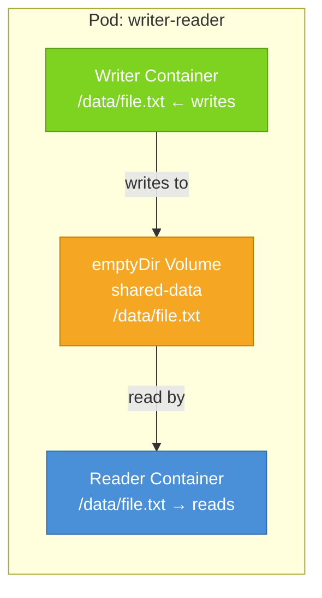

# emptyDir Volumes

Of all the volume types Kubernetes offers, `emptyDir` is the simplest to understand and the easiest to use. It does exactly what its name suggests: when a Pod starts, Kubernetes creates an empty directory for it. That directory is mounted into the container (or containers) you specify. The directory persists for the entire lifetime of the Pod — surviving container restarts within the Pod — and is permanently deleted when the Pod is removed from the cluster.

Think of `emptyDir` as a temporary shared notepad that the entire Pod can write on. Individual team members (containers) might come and go — someone steps out to take a call, comes back, and the notepad is right there on the table. But when the meeting ends and everyone leaves the room (the Pod is deleted), the notepad is thrown away.

## When to Use emptyDir

There are two primary use cases for `emptyDir`.

The first is **sharing data between containers in the same Pod**. This is the classic sidecar pattern: one container produces files and another container processes or forwards them. Because both containers are in the same Pod, they have access to the same volumes, and `emptyDir` is the natural choice for this kind of in-Pod coordination.

A concrete example: an application writes processed events to a directory as JSON files. A sidecar container reads those files and ships them to a centralized logging system. Neither container needs to know anything about the other's internals — they just read and write to a shared directory. The sidecar doesn't need to reach into the main app's memory; it just watches the shared filesystem.

The second use case is **scratch space for a single container**. Some workloads need significant temporary storage — a video transcoder might need space to work with large intermediate files, an AI inference service might unpack a large model into memory-mapped files before processing, or a build tool might compile source code into a temporary output directory. In these cases, `emptyDir` gives the container a place to work that won't pollute the container image or consume the container's layered filesystem.

## The Manifest

Here's the minimum declaration:

```yaml
spec:
  volumes:
    - name: shared-data
      emptyDir: {}
```

The `{}` is not a placeholder — it's valid YAML for an empty object, which means "use all defaults." There's nothing else required to get a working `emptyDir`. The name is the only required field.

## A Multi-Container Example

Let's look at a full example with two containers sharing a single `emptyDir` volume:

```yaml
apiVersion: v1
kind: Pod
metadata:
  name: writer-reader
spec:
  volumes:
    - name: shared-data
      emptyDir: {}
  containers:
    - name: writer
      image: busybox
      command: ["sh", "-c", "echo hello > /data/file.txt && sleep 3600"]
      volumeMounts:
        - name: shared-data
          mountPath: /data
    - name: reader
      image: busybox
      command: ["sh", "-c", "sleep 2 && cat /data/file.txt && sleep 3600"]
      volumeMounts:
        - name: shared-data
          mountPath: /data
```

When this Pod starts, Kubernetes creates the `shared-data` emptyDir volume. Both containers mount it — the writer at `/data` and the reader also at `/data`. The writer container runs first and writes `hello` to `/data/file.txt`. The reader waits two seconds (to give the writer a head start), then reads from the same path and prints the contents.

Notice that both containers use the same `mountPath` here, but that's not required. You could mount the same volume at `/output` in the writer and `/input` in the reader. The path inside the container is independent of the volume definition.

## How Containers Communicate Through a Volume



The volume is the single source of truth. There's no network call, no serialization overhead, no API to agree on — just a shared filesystem path.

## Surviving Container Restarts

The key benefit of `emptyDir` over writing to the container's own filesystem is that it survives container restarts. If the writer container crashes after writing half its files and Kubernetes restarts it, the new container instance finds those partially-written files still in the volume. The reader can continue processing without interruption.

This makes `emptyDir` useful as a crash-recovery buffer: a container can checkpoint its progress to the volume, and after any restart, it picks up from the last checkpoint rather than starting from scratch.

:::warning
`emptyDir` does NOT survive Pod deletion or Pod rescheduling. If the Pod is evicted from a node, deleted manually, or replaced during a Deployment rollout, the emptyDir is gone. Do not use `emptyDir` for anything that needs to outlive the Pod itself. For durable persistence, use PersistentVolumes.
:::

## Memory-Backed emptyDir

By default, Kubernetes stores `emptyDir` data on the node's disk. But you can opt for a **tmpfs** (in-memory) backing by setting `medium: Memory`:

```yaml
volumes:
  - name: fast-scratch
    emptyDir:
      medium: Memory
      sizeLimit: 512Mi
```

A memory-backed `emptyDir` is significantly faster than disk — reads and writes operate at memory speed. This is useful for high-throughput workloads where disk I/O would be a bottleneck: caching parsed configuration, working with large arrays of binary data, or storing intermediate results that will be consumed immediately.

The downside is that memory-backed volumes count against the container's memory limit. If a container writes 200Mi to a `medium: Memory` volume, that 200Mi comes out of the container's memory budget and can trigger an OOM kill if the container is close to its limit. Plan accordingly.

:::info
You can set `sizeLimit` on any `emptyDir` (disk or memory). Kubernetes will evict the Pod if the volume exceeds this limit. This is a safety valve to prevent a runaway container from filling up a node's disk or exhausting its memory.
:::

## readOnly Mounts

When multiple containers share the same volume, you might want to prevent one of them from accidentally modifying files that another container wrote. You can mount a volume as read-only in a specific container using the `readOnly` field in the volumeMount:

```yaml
volumeMounts:
  - name: shared-data
    mountPath: /data
    readOnly: true
```

With this setting, the container can read from the volume but any attempt to write will return a permission error. This is useful for enforcing clear ownership: only the writer container has a read-write mount, while all consumer containers have read-only mounts.

## Hands-On Practice

Let's recreate the writer-reader pattern and confirm that data survives a container restart. Use the terminal on the right panel.

**1. Apply the multi-container Pod manifest:**

```bash
kubectl apply -f - <<EOF
apiVersion: v1
kind: Pod
metadata:
  name: writer-reader
spec:
  volumes:
    - name: shared-data
      emptyDir: {}
  containers:
    - name: writer
      image: busybox:1.36
      command: ["sh", "-c", "echo 'Written by writer container' > /data/message.txt && sleep 3600"]
      volumeMounts:
        - name: shared-data
          mountPath: /data
    - name: reader
      image: busybox:1.36
      command: ["sh", "-c", "sleep 2 && while true; do cat /data/message.txt; sleep 10; done"]
      volumeMounts:
        - name: shared-data
          mountPath: /data
EOF
```

**2. Wait for the Pod to be running:**

```bash
kubectl get pod writer-reader
```

**3. Check the reader's logs to confirm it read the file written by the writer:**

```bash
kubectl logs writer-reader -c reader
```

You should see: `Written by writer container`

**4. Confirm both containers share the same volume contents:**

```bash
kubectl exec writer-reader -c writer -- ls /data
kubectl exec writer-reader -c reader -- ls /data
```

Both should show `message.txt`.

**5. Prove the volume survives a container restart — kill the writer and check:**

```bash
kubectl exec writer-reader -c writer -- kill 1
```

Wait a moment for it to restart:

```bash
kubectl get pod writer-reader
```

The restart count on the writer should increment to 1.

**6. Read the file from the reader — it should still be there:**

```bash
kubectl exec writer-reader -c reader -- cat /data/message.txt
```

The file is still there. The volume was not affected by the writer container's restart.

**7. Now try the memory-backed version:**

```bash
kubectl apply -f - <<EOF
apiVersion: v1
kind: Pod
metadata:
  name: memory-scratch
spec:
  volumes:
    - name: ramdisk
      emptyDir:
        medium: Memory
        sizeLimit: 64Mi
  containers:
    - name: app
      image: busybox:1.36
      command: ["sh", "-c", "dd if=/dev/zero of=/scratch/bigfile bs=1M count=10 && ls -lh /scratch/ && sleep 3600"]
      volumeMounts:
        - name: ramdisk
          mountPath: /scratch
EOF
```

**8. Check the output — it wrote 10MB to memory:**

```bash
kubectl logs memory-scratch -c app
```

You should see the `bigfile` listed at 10MB, written entirely to RAM.

**9. Clean up:**

```bash
kubectl delete pod writer-reader memory-scratch
```

You've now seen `emptyDir` in action for both of its primary use cases. In the next lesson, we'll look at `hostPath` volumes, which mount directories from the underlying node's filesystem directly into Pods.
