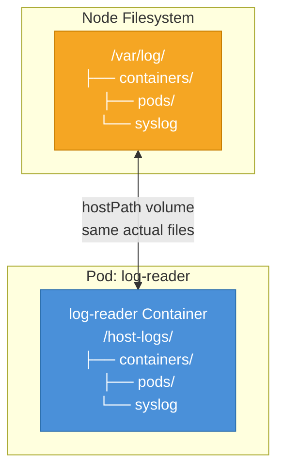

# hostPath Volumes

Every Kubernetes Pod runs on a node, a machine running Linux with its own filesystem, its own `/var/log`, its own `/proc`, its own device files. Most of the time, containerized workloads are completely isolated from the node's filesystem by design. But sometimes you specifically need to reach down and touch the host's filesystem directly. That's what `hostPath` volumes are for.

A `hostPath` volume mounts a file or directory from the **node's own filesystem** into a Pod. The container sees a path inside its own filesystem, but reads and writes go directly to the corresponding location on the underlying node.

:::warning
`hostPath` is one of the most powerful, and most dangerous, volume types in Kubernetes. Because it gives a container direct access to the node's filesystem, it should only be used for system-level tooling with a clear, justified need.
:::

## When hostPath Makes Sense

The most legitimate uses of `hostPath` fall into a specific category: **system-level observability and monitoring tools**. These are almost always deployed as DaemonSets, running exactly one instance per node.

Common valid scenarios:

- A **log collection agent** (e.g. Fluentd, Filebeat) reading `/var/log/containers/` to pick up container logs written by the runtime
- A **node-level metrics collector** (e.g. Prometheus node-exporter) reading from `/proc` and `/sys` to gather CPU, memory, disk, and network metrics about the node itself
- A **security scanning agent** inspecting the container runtime socket (`/run/containerd/containerd.sock`) to enumerate running containers
- A **CNI plugin or network agent** that needs access to network configuration files on the host
- A **performance monitoring tool** accessing hardware performance counters via `/sys/bus/event_source`

In all these cases, the tools are privileged system-level software that exist specifically to observe or manage the node.

## The Manifest

Here's a complete example of a Pod using a `hostPath` volume to read the node's log directory:

```yaml
apiVersion: v1
kind: Pod
metadata:
  name: log-reader
spec:
  volumes:
    - name: node-logs
      hostPath:
        path: /var/log
        type: Directory
  containers:
    - name: log-reader
      image: busybox:1.36
      command: ["sh", "-c", "ls /host-logs && sleep 3600"]
      volumeMounts:
        - name: node-logs
          mountPath: /host-logs
```

Inside the container, `/host-logs` is actually the node's `/var/log`. Any file the container reads from `/host-logs/foo.log` is literally the same file as `/var/log/foo.log` on the host node.

## The type Field

The `type` field in a `hostPath` definition is optional but highly recommended. It tells Kubernetes to validate that the host path exists and is the right kind of thing before mounting it. Without `type`, Kubernetes will attempt to mount whatever is at that path regardless of whether it exists or what kind of object it is.

| Type | Behavior |
|------|----------|
| `Directory` | Must exist as a directory on the host |
| `File` | Must exist as a file on the host |
| `DirectoryOrCreate` | Creates the directory if it doesn't exist (permissions 0755) |
| `FileOrCreate` | Creates the file if it doesn't exist (permissions 0644) |
| `Socket` | Must exist as a Unix socket |
| `CharDevice` | Must be a character device file |
| `BlockDevice` | Must be a block device file |

Using `DirectoryOrCreate` or `FileOrCreate` makes your Pod more resilient to path variation across nodes, but use them carefully, as automatically creating directories on node filesystems can be surprising.

## The Architecture: Pod Sees Host



The arrows go both ways intentionally: the container can read *and write* to the host path, unless you add `readOnly: true` to the volumeMount. This is a crucial security consideration.

## Security Warnings

Because `hostPath` gives a container direct access to the node's filesystem, it can be misused to:

- Read sensitive files from the node (TLS certificates, kubeconfig files, secret credentials stored on disk)
- Write arbitrary files to the node, potentially modifying system configuration
- Access the container runtime socket and thereby control all containers on the node
- Escape the container's isolation if combined with other privilege escalation techniques

:::warning
**Never allow untrusted users to create Pods with `hostPath` volumes.** A container with access to `/` on the host is essentially root on the host machine. Production clusters should use **PodSecurity admission** or an OPA/Gatekeeper policy to restrict which paths (if any) are allowed in `hostPath` volumes, and which users are allowed to create such Pods.
:::

:::warning
`hostPath` volumes create tight coupling between a Pod and a specific node. If a Pod mounts `/var/specialtool/data` and that path only exists on certain nodes, the Pod can only run on those nodes, unless you use `nodeSelector` or node affinity to enforce placement. This can cause mysterious scheduling failures that are hard to debug.
:::

## Node Coupling and Scheduling

Because `hostPath` depends on what's physically present on the node's filesystem, Pods using it may be tied to specific nodes. If you use `DirectoryOrCreate`, Kubernetes will create the directory on whichever node the Pod lands on, but the data written there will only be accessible on that specific node. If the Pod is rescheduled to a different node, the new node won't have the data.

This is why `hostPath` is almost exclusively used in DaemonSets:

- A DaemonSet runs one Pod per node, so there's no ambiguity about "which node"
- Each Pod runs on exactly one node and accesses that node's local filesystem
- The DaemonSet guarantees coverage across all nodes while `hostPath` gives each agent Pod access to its local node's files

## Mounting the Docker/Containerd Socket

One specific and common `hostPath` use case is mounting the container runtime socket. Tools like Falco (security monitoring), cAdvisor (container metrics), or custom container introspection tools need to speak the container runtime's API to list running containers, read their metadata, or monitor their behavior.

```yaml
volumes:
  - name: runtime-socket
    hostPath:
      path: /run/containerd/containerd.sock
      type: Socket
containers:
  - name: introspector
    image: my-introspection-tool:latest
    volumeMounts:
      - name: runtime-socket
        mountPath: /run/containerd/containerd.sock
```

Mounting the container runtime socket effectively gives the container the ability to manage all other containers on the node, treat it with the same respect you'd give root access.

## Hands-On Practice

Let's use `hostPath` to read from the node's log directory and verify the data comes from the real host. Use the terminal on the right panel.

**1. Create a Pod that reads from the node's `/var/log` directory:**

```bash
kubectl apply -f - <<EOF
apiVersion: v1
kind: Pod
metadata:
  name: hostpath-demo
spec:
  volumes:
    - name: host-logs
      hostPath:
        path: /var/log
        type: Directory
  containers:
    - name: log-browser
      image: busybox:1.36
      command: ["sh", "-c", "ls /node-logs && sleep 3600"]
      volumeMounts:
        - name: host-logs
          mountPath: /node-logs
          readOnly: true
EOF
```

**2. Wait for it to start, then list the node's log directory from inside the container:**

```bash
kubectl get pod hostpath-demo
kubectl exec hostpath-demo -- ls /node-logs
```

You should see the real contents of the node's `/var/log` directory.

**3. Read a system log file directly from the container:**

```bash
kubectl exec hostpath-demo -- ls /node-logs/pods/ 2>/dev/null | head -5
```

These are the actual log directories that kubelet writes for each Pod running on this node, real host data, visible inside your container.

**4. Verify the readOnly mount prevents writing:**

```bash
kubectl exec hostpath-demo -- touch /node-logs/testfile
```

You should see a "Read-only file system" error. The `readOnly: true` on the volumeMount protects the host from accidental writes.

**5. Create a second Pod using `DirectoryOrCreate` to write to a node path:**

```bash
kubectl apply -f - <<EOF
apiVersion: v1
kind: Pod
metadata:
  name: hostpath-writer
spec:
  volumes:
    - name: custom-dir
      hostPath:
        path: /tmp/kube-demo
        type: DirectoryOrCreate
  containers:
    - name: writer
      image: busybox:1.36
      command: ["sh", "-c", "echo 'Node-level data' > /custom/data.txt && sleep 3600"]
      volumeMounts:
        - name: custom-dir
          mountPath: /custom
EOF
```

**6. Confirm the file was written and read it back:**

```bash
kubectl exec hostpath-writer -- cat /custom/data.txt
```

**7. Inspect the volume details in the Pod spec:**

```bash
kubectl describe pod hostpath-demo | grep -A 10 "Volumes:"
kubectl describe pod hostpath-writer | grep -A 10 "Volumes:"
```

**8. Clean up:**

```bash
kubectl delete pod hostpath-demo hostpath-writer
```

You've now seen `hostPath` in action, both as a read-only window into host system files and as a read-write path for node-local data. In the next lesson, we'll move away from raw filesystem mounting and look at how to inject structured configuration into Pods using ConfigMap and Secret volumes.
