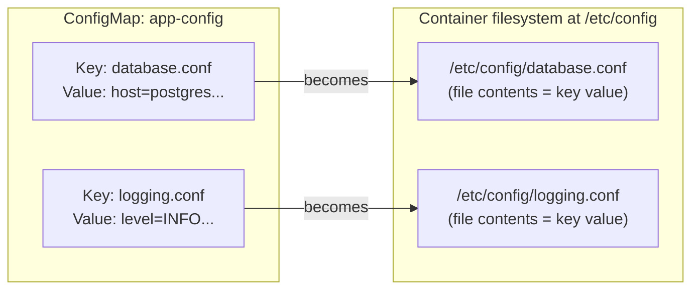

# Mounting ConfigMaps and Secrets as Volumes

Injecting config as environment variables has real limitations. Some applications don't read environment variables at all, they expect a config file at a specific path. Others have configuration too complex for a flat list of key-value pairs:

- A multi-section NGINX config or full application properties file
- A TLS certificate bundle
- Many related values that logically belong together in one file

Kubernetes solves all of this by letting you mount ConfigMaps and Secrets directly as files inside your containers, using the same volume mechanism you've already learned.

## The Core Idea: Keys Become Files

When you mount a ConfigMap (or Secret) as a volume, each key in that ConfigMap becomes a file inside the container at the specified mount path. The file's content is the key's value, a direct, one-to-one mapping.

:::info
The application can read these files like any ordinary files, it doesn't need to know they came from Kubernetes at all. No SDK, no special integration required.
:::

Imagine you have a ConfigMap with two keys: `app.properties` and `log4j.xml`. After mounting it, the container sees exactly those two files inside the mount directory, with exactly the correct content in each.

## Mounting a ConfigMap as a Volume

Here's the complete process. First, create a ConfigMap with some configuration data:

```yaml
apiVersion: v1
kind: ConfigMap
metadata:
  name: app-config
data:
  database.conf: |
    host=postgres-service
    port=5432
    name=mydb
    pool_size=10
  logging.conf: |
    level=INFO
    format=json
    output=stdout
```

Then reference it as a volume in your Pod spec:

```yaml
spec:
  volumes:
    - name: app-config
      configMap:
        name: app-config
  containers:
    - name: app
      image: my-app:latest
      volumeMounts:
        - name: app-config
          mountPath: /etc/config
```

Inside the container, `/etc/config` will contain exactly two files: `database.conf` and `logging.conf`, each with the correct multi-line content.

## Mounting a Secret as a Volume

The syntax for mounting a Secret is nearly identical, you just replace `configMap:` with `secret:` and provide the Secret's name:

```yaml
spec:
  volumes:
    - name: tls-certs
      secret:
        secretName: my-tls-secret
  containers:
    - name: app
      image: my-app:latest
      volumeMounts:
        - name: tls-certs
          mountPath: /etc/tls
          readOnly: true
```

When mounted, Secret files have restrictive permissions by default, `0400` (readable only by the owner). This is intentional: Secrets often contain credentials or private keys that should be tightly restricted.

:::info
Setting `readOnly: true` on the volumeMount is a best practice for both ConfigMap and Secret mounts. Your application should be reading configuration files, not writing to them. A readOnly mount prevents accidental writes and makes it immediately clear in the manifest that this volume is input data.
:::

## The Keys-to-Files Mapping



## Mounting Only Specific Keys

If a ConfigMap contains many keys but you only want to mount a subset, or you want to control what the file is named inside the container, you can use the `items` field:

```yaml
volumes:
  - name: partial-config
    configMap:
      name: app-config
      items:
        - key: database.conf
          path: db/connection.conf
        - key: logging.conf
          path: logs/settings.conf
```

With this declaration, the container will see two files: `/etc/config/db/connection.conf` and `/etc/config/logs/settings.conf`. This lets you adapt the Kubernetes key names to whatever file layout your application expects, without modifying the ConfigMap. Any keys not listed in `items` are simply not mounted.

## The Hot-Reload Superpower

One of the most compelling advantages of volume-mounted ConfigMaps over environment variables: **when the ConfigMap changes, the mounted files update automatically**, no Pod restart required.

Kubernetes's kubelet periodically syncs volume-mounted ConfigMaps (typically within 30–60 seconds). When it detects an update, it writes the new file contents to the mounted directory. Applications that watch for file changes can pick up the new configuration entirely live.

This enables a powerful operational pattern: update a ConfigMap, and within a minute, your application reloads its configuration without any downtime, without any rollout, without any Pod restart.

:::warning
**Environment variables from ConfigMaps do NOT hot-reload.** If you inject a ConfigMap key as an environment variable (`env.valueFrom.configMapKeyRef`), the only way to pick up a changed value is to restart the Pod. Volume mounts are the only path to live configuration updates, choose your injection method based on whether live reload matters to you.
:::

## Practical Example: NGINX Configuration

Let's tie this together with a realistic scenario: NGINX with a custom configuration stored in a ConfigMap, so you can update the config without rebuilding the container image.

First, the ConfigMap with the NGINX configuration:

```yaml
apiVersion: v1
kind: ConfigMap
metadata:
  name: nginx-config
data:
  nginx.conf: |
    events {}
    http {
      server {
        listen 80;
        location / {
          return 200 "Hello from configmap-driven nginx!<br/>";
          add_header Content-Type text/plain;
        }
      }
    }
```

Then the Pod that mounts it:

```yaml
apiVersion: v1
kind: Pod
metadata:
  name: nginx-custom
spec:
  volumes:
    - name: nginx-config
      configMap:
        name: nginx-config
  containers:
    - name: nginx
      image: nginx:1.28
      volumeMounts:
        - name: nginx-config
          mountPath: /etc/nginx/nginx.conf
          subPath: nginx.conf
          readOnly: true
```

Notice the `subPath` field. Normally, mounting a volume to `/etc/nginx/nginx.conf` would replace the entire `/etc/nginx/` directory with the ConfigMap's contents, wiping out all other NGINX configuration files. `subPath` lets you mount a single key to a single specific file path, without disturbing anything else in the parent directory.

:::warning
There is an important limitation of `subPath`: **files mounted with `subPath` do NOT receive live updates when the ConfigMap changes**. The hot-reload feature only works for full-directory mounts, not `subPath` mounts. If you need hot reloading, mount the ConfigMap to a separate directory and symlink your target path to it, or restructure your configuration to use a directory-based layout.
:::

## Default File Permissions

By default, files mounted from a ConfigMap have permissions `0644`, readable by everyone, writable only by the owner. Secrets default to `0400`, readable only by the owner. You can override the default permissions for all files in a volume with the `defaultMode` field, expressed as a decimal integer:

```yaml
volumes:
  - name: app-config
    configMap:
      name: app-config
      defaultMode: 0640
```

You can also set different permissions for individual keys when using `items[]`, using the `mode` field on each item.

## Hands-On Practice

Let's mount a ConfigMap as files and then update the ConfigMap to see the live reload. Use the terminal on the right panel.

**1. Create a ConfigMap with some configuration data:**

```bash
kubectl create configmap demo-config \
  --from-literal=greeting.txt="Hello from ConfigMap!" \
  --from-literal=settings.conf="color=blue<br/>size=large"
```

**2. Verify the ConfigMap was created:**

```bash
kubectl get configmap demo-config -o yaml
```

**3. Create a Pod that mounts the ConfigMap:**

```yaml
# config-reader-pod.yaml
apiVersion: v1
kind: Pod
metadata:
  name: config-reader
spec:
  volumes:
    - name: config-vol
      configMap:
        name: demo-config
  containers:
    - name: reader
      image: busybox:1.36
      command:
        [
          'sh',
          '-c',
          "while true; do echo '---'; ls /config; cat /config/greeting.txt; sleep 10; done"
        ]
      volumeMounts:
        - name: config-vol
          mountPath: /config
          readOnly: true
```

```bash
kubectl apply -f config-reader-pod.yaml
```

**4. Wait for it to start, then check the logs:**

```bash
kubectl get pod config-reader
kubectl logs config-reader
```

You should see the directory listing showing both files, and the content of `greeting.txt`.

**5. List the files inside the mounted directory:**

```bash
kubectl exec config-reader -- ls /config
kubectl exec config-reader -- cat /config/greeting.txt
kubectl exec config-reader -- cat /config/settings.conf
```

**6. Update the ConfigMap and watch for the live update:**

```bash
kubectl create configmap demo-config \
  --from-literal=greeting.txt="Updated greeting, no restart needed!" \
  --from-literal=settings.conf="color=green<br/>size=small" \
  --dry-run=client -o yaml | kubectl apply -f -
```

**7. Wait about 60 seconds, then check the file contents inside the container:**

```bash
kubectl exec config-reader -- cat /config/greeting.txt
```

After the sync period, you should see the updated greeting without having restarted the Pod.

**8. Verify the Pod was NOT restarted:**

```bash
kubectl get pod config-reader
```

The restart count should still be 0. The configuration updated live.

**9. Now create a Secret and mount it the same way:**

```bash
kubectl create secret generic demo-secret \
  --from-literal=api-key="super-secret-value-12345" \
  --from-literal=token="eyJhbGciOiJIUzI1NiJ9..."
```

```yaml
# secret-reader-pod.yaml
apiVersion: v1
kind: Pod
metadata:
  name: secret-reader
spec:
  volumes:
    - name: secret-vol
      secret:
        secretName: demo-secret
  containers:
    - name: reader
      image: busybox:1.36
      command: ['sh', '-c', 'ls /secrets && cat /secrets/api-key && sleep 3600']
      volumeMounts:
        - name: secret-vol
          mountPath: /secrets
          readOnly: true
```

```bash
kubectl apply -f secret-reader-pod.yaml
```

**10. Read the secret file from inside the container:**

```bash
kubectl logs secret-reader
```

**11. Check file permissions on the Secret mount, they should be 0400:**

```bash
kubectl exec secret-reader -- ls -la /secrets/
```

Notice the permissions: `-r--------`, readable only by the owner, as expected for sensitive data.

**12. Clean up:**

```bash
kubectl delete pod config-reader secret-reader
kubectl delete configmap demo-config
kubectl delete secret demo-secret
```

You've now mastered all four volume types covered in this module: the Pod-scoped persistence of `emptyDir`, the node-coupled power and danger of `hostPath`, and the elegant configuration injection capabilities of ConfigMap and Secret volumes. These tools cover the vast majority of storage needs for stateless and semi-stateful workloads in Kubernetes.
