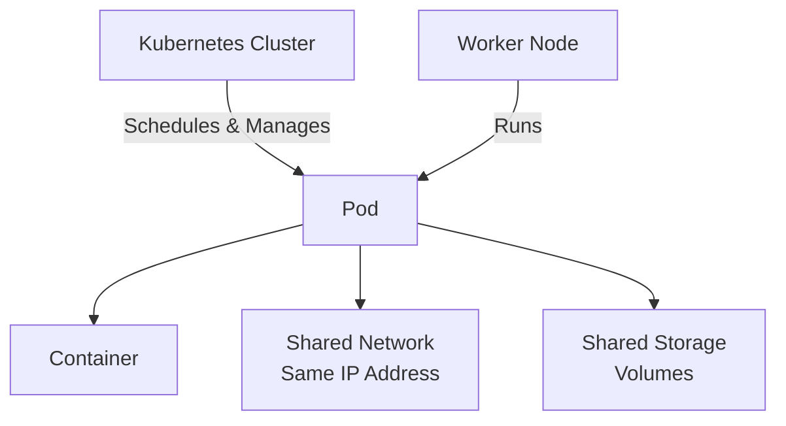

# What is a Pod?

Pods are the smallest deployable units of computing that you can create and manage in Kubernetes. Think of a Pod as a wrapper that contains one or more containers and gives them a shared environment to work together.



## Understanding Pods

A Pod (like a pod of whales or a pea pod) is a group of one or more containers that share storage and network resources. The containers in a Pod are always placed together on the same node and scheduled together, they're like roommates sharing the same apartment.

The key idea is that containers in a Pod share:
- **The same network**: They have the same IP address and can talk to each other using `localhost`
- **The same storage**: They can access shared volumes to exchange files
- **The same lifecycle**: They start and stop together

## The Most Common Pattern

The "one-container-per-Pod" model is by far the most common way to use Pods in Kubernetes. Kubernetes manages Pods rather than managing containers directly, which gives Kubernetes more control and flexibility.

When you deploy a web application, you typically create one Pod with one container running your application. If you need more instances, you create multiple Pods,one for each instance. This is called replication, and it's usually handled by workload resources like Deployments.

:::command
To list all Pods in your cluster, try:

```bash
kubectl get pods
```
:::

## Pod Characteristics

Pods are designed to be relatively ephemeral and disposable. When you create a Pod, Kubernetes schedules it to run on a node in your cluster. The Pod stays on that node until one of these things happens:

- The Pod finishes its work (if it's a job)
- You delete the Pod
- The Pod is evicted because the node runs out of resources
- The node itself fails

:::info
You'll rarely create Pods directly in production. Instead, you'll use workload resources like Deployments, StatefulSets, or Jobs, which create and manage Pods for you. These resources provide features like automatic scaling, rolling updates, and self-healing that you don't get with standalone Pods.
:::

## Why Pods Exist

You might wonder why Kubernetes doesn't just manage containers directly. The answer is that Pods provide a useful abstraction. This design makes it easier to build applications where multiple processes need to work closely together, while still keeping the common case (one container per Pod) simple and straightforward.
