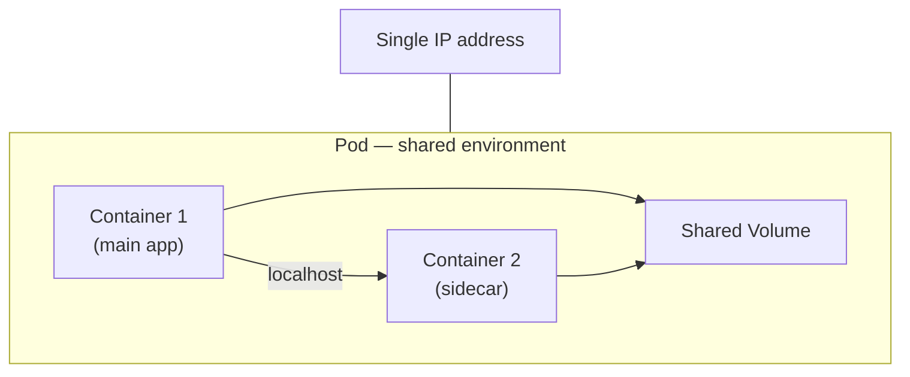
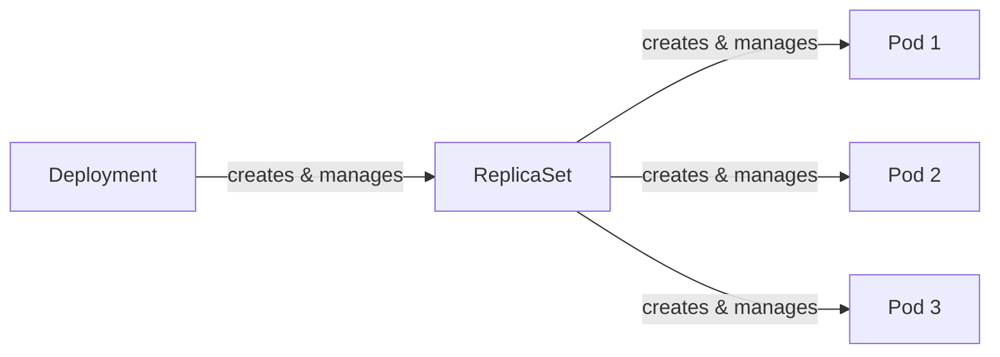

# What Is a Pod?

Welcome to the world of Kubernetes workloads. Before you can deploy applications, scale them, or roll out updates, you need to understand the fundamental building block that makes it all possible: the **Pod**.

## The Smallest Unit You Can Deploy

In Kubernetes, you do not deploy containers directly. Instead, you deploy **Pods**. A Pod is the smallest deployable unit in the Kubernetes ecosystem — a thin wrapper around one or more containers that gives them a shared environment to live in.

Think of a Pod as a **small apartment**. The containers inside it are the roommates. They share the same address (IP), they share the kitchen and living room (volumes and storage), and they move in and move out together (lifecycle). From the outside world, the apartment has a single address. Inside, the roommates can talk to each other face-to-face without going through the front door — they communicate over `localhost`.



## Why Not Just Use Containers?

Containers are isolated by design — that is their superpower. But sometimes, isolation gets in the way. Imagine you have a web server that needs a helper process to collect and ship its logs. These two processes need to read the same log files and share the same network interface. Running them in separate, fully isolated containers would force you to set up external networking and shared storage between them.

Pods solve this elegantly. By grouping tightly coupled containers together, a Pod gives them:

- **A shared network namespace** — all containers in the Pod share one IP address and can communicate over `localhost`.
- **Shared storage volumes** — containers can read and write to the same files.
- **A shared lifecycle** — containers start together, run together, and are terminated together.

This makes Pods the natural unit for patterns like sidecar containers (log shippers, proxies, config reloaders) and init containers (setup tasks that run before your main app starts).

:::info
The most common pattern is **one container per Pod**. Multi-container Pods are reserved for cases where containers truly need to share resources and lifecycle. When in doubt, start with one container per Pod.
:::

## Pods Are Ephemeral

Here is one of the most important mental shifts when working with Kubernetes: **Pods are not permanent**. They are designed to be created, destroyed, and replaced. A Pod stays on its assigned node until it finishes execution, gets deleted, is evicted due to resource pressure, or its node fails.

This is by design. Kubernetes treats Pods like cattle, not pets — when one goes down, a controller simply creates a new one to take its place. You will rarely create Pods by hand in production. Instead, higher-level workload resources like **Deployments**, **StatefulSets**, and **Jobs** create and manage Pods for you, providing scaling, self-healing, and rolling updates.



## Seeing Pods in Action

Even at this early stage, you can list the Pods running in your cluster to get a feel for what is happening:

```bash
kubectl get pods
```

This command shows each Pod's name, status (`Pending`, `Running`, `Succeeded`, `Failed`), the number of ready containers, and how long it has been running. It is one of the commands you will use most often.

For more detail on a specific Pod — including events, container states, and the node it landed on — use:

```bash
kubectl describe pod <pod-name>
kubectl get pod <pod-name> -o wide
```

:::warning
Standalone Pods created without a controller will **not** be restarted if they crash or are evicted. Always use a workload resource (Deployment, StatefulSet, Job) for anything beyond quick experiments. Controllers give you self-healing, scaling, and update strategies that bare Pods simply cannot provide.
:::

## Wrapping Up

A Pod is the atomic unit of deployment in Kubernetes — a shared environment where one or more containers live together with the same network identity, storage, and lifecycle. Most of the time, you will work with one container per Pod, and you will let controllers like Deployments manage those Pods for you. Pods are intentionally ephemeral: they come and go, and Kubernetes keeps your desired state running.

With this foundation in place, the next lesson takes you inside the Pod to explore its internal structure — metadata, spec, and status — so you can read and write Pod definitions with confidence.
