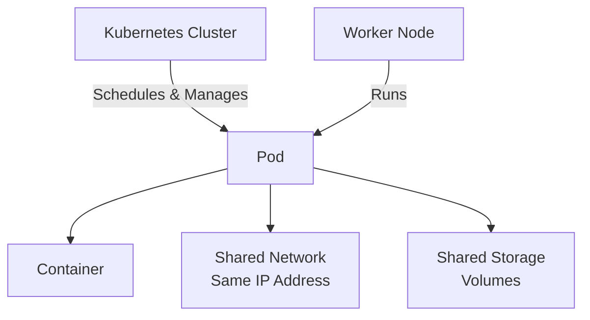

# Qu'est-ce qu'un Pod ?

Les Pods sont les plus petites unités de calcul déployables que vous pouvez créer et gérer dans Kubernetes. Pensez à un Pod comme à un wrapper qui contient un ou plusieurs conteneurs et leur donne un environnement partagé pour travailler ensemble.



## Comprendre les Pods

Un Pod (comme un groupe de baleines ou une cosse de pois) est un groupe d'un ou plusieurs conteneurs qui partagent des ressources de stockage et de réseau. Les conteneurs dans un Pod sont toujours placés ensemble sur le même nœud et planifiés ensemble, ils sont comme des colocataires partageant le même appartement.

L'idée clé est que les conteneurs dans un Pod partagent :
- **Le même réseau** : Ils ont la même adresse IP et peuvent communiquer entre eux en utilisant `localhost`
- **Le même stockage** : Ils peuvent accéder à des volumes partagés pour échanger des fichiers
- **Le même cycle de vie** : Ils démarrent et s'arrêtent ensemble

## Le modèle le plus courant

Le modèle "un conteneur par Pod" est de loin la façon la plus courante d'utiliser les Pods dans Kubernetes. Kubernetes gère les Pods plutôt que de gérer les conteneurs directement, ce qui donne à Kubernetes plus de contrôle et de flexibilité.

Lorsque vous déployez une application web, vous créez généralement un Pod avec un conteneur exécutant votre application. Si vous avez besoin de plus d'instances, vous créez plusieurs Pods, un pour chaque instance. C'est ce qu'on appelle la réplication, et c'est généralement géré par des ressources de charge de travail comme les Deployments.

Pour lister tous les Pods dans votre cluster, essayez :

```bash
kubectl get pods
```

## Caractéristiques des Pods

Les Pods sont conçus pour être relativement éphémères et jetables. Lorsque vous créez un Pod, Kubernetes le planifie pour qu'il s'exécute sur un nœud dans votre cluster. Le Pod reste sur ce nœud jusqu'à ce que l'une de ces choses se produise :

- Le Pod termine son travail (s'il s'agit d'un job)
- Vous supprimez le Pod
- Le Pod est expulsé parce que le nœud manque de ressources
- Le nœud lui-même échoue

:::info
Vous créerez rarement des Pods directement en production. Au lieu de cela, vous utiliserez des ressources de charge de travail comme les Deployments, StatefulSets ou Jobs, qui créent et gèrent des Pods pour vous. Ces ressources fournissent des fonctionnalités comme la mise à l'échelle automatique, les mises à jour progressives et l'auto-guérison que vous n'obtenez pas avec des Pods autonomes.
:::

## Pourquoi les Pods existent

Vous pourriez vous demander pourquoi Kubernetes ne gère pas simplement les conteneurs directement. La réponse est que les Pods fournissent une abstraction utile. Cette conception facilite la construction d'applications où plusieurs processus doivent travailler étroitement ensemble, tout en gardant le cas commun (un conteneur par Pod) simple et direct.
