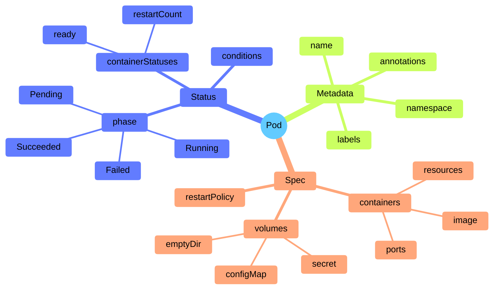
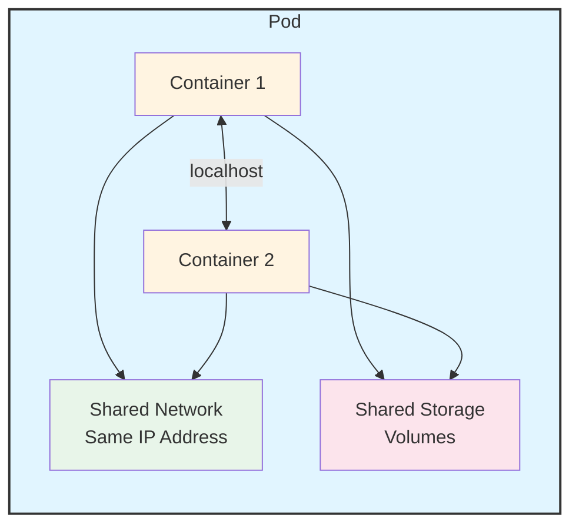

# Pod Structure

Understanding a Pod's structure helps you work with them effectively. Let's break down what makes up a Pod and how its components work together.

## The Anatomy of a Pod

A Pod is a Kubernetes object, which means it follows the standard Kubernetes object structure. Every Pod has:

- **Metadata**: Information that identifies the Pod (name, namespace, labels, etc.)
- **Spec**: The desired state you want for the Pod (which containers to run, what resources they need, etc.)
- **Status**: The current state of the Pod (which containers are running, their health, etc.)

To see a Pod's complete structure with all three sections (metadata, spec, status), try:

```bash
kubectl get pod web -o yaml
```

When you create a Pod, you define both the **metadata** (to identify it) and the **spec** (to describe what you want). The **status** is automatically maintained by Kubernetes as it works to make your desired state a reality.



## Pod Components

Inside a Pod, you'll find:

- **Containers**: One or more application containers that run your code
- **Shared storage**: Volumes that all containers in the Pod can access
- **Network identity**: Each Pod gets a unique IP address on the cluster network



## Shared Network Resources

Each Pod is assigned a unique IP address for each address family (IPv4 and/or IPv6). This is one of the most important aspects of Pod networking:

- **Same IP address**: Every container in a Pod shares the network namespace, meaning they all have the same IP address
- **Localhost communication**: Containers in the same Pod can talk to each other using `localhost`.
- **Port coordination**: Since containers share the network, they need to coordinate which ports they use to avoid conflicts

This shared network makes it easy for containers in a Pod to work together. For example, a web server container and a logging container in the same Pod can communicate directly without needing to go through the network.

## Shared Storage Resources

A Pod can specify a set of shared storage volumes. All containers in the Pod can access these volumes, allowing them to share files and data:

- **Shared volumes**: Containers can read and write to the same files
- **Data persistence**: If a container restarts, data in shared volumes remains available to other containers
- **Flexible storage**: Volumes can be temporary (like emptyDir) or persistent (like cloud storage)

This shared storage is perfect for scenarios where one container generates data (like downloading files) and another container processes it (like a web server serving those files).

## Pod Template

When you use workload resources like Deployments or StatefulSets, you don't create Pods directly. Instead, you define a **pod template** that describes what Pods should look like. The workload resource then uses this template to create actual Pods.

The pod template is like a blueprint. When you update the template, the workload resource creates new Pods based on the updated template, gradually replacing the old ones. This is how rolling updates work in Kubernetes.

:::info
The pod template is part of the spec of workload resources. When you change the template, Kubernetes doesn't modify existing Pods, it creates new ones with the updated configuration. This ensures updates are safe and can be rolled back if needed.
:::

## Required Fields

Every Pod manifest must include the standard Kubernetes object fields:

- **apiVersion**: `v1` for Pod objects
- **kind**: `Pod`
- **metadata**: At minimum, a `name` field
- **spec**: The specification describing what containers to run and how

The spec is where you define your containers, their images, resource requirements, and any volumes they need. This is the heart of your Pod definition.
