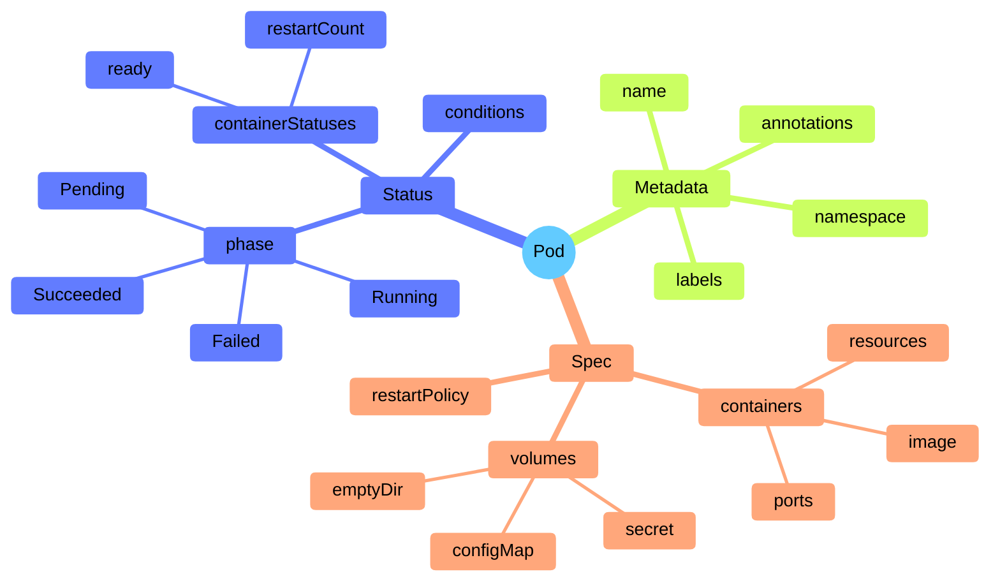
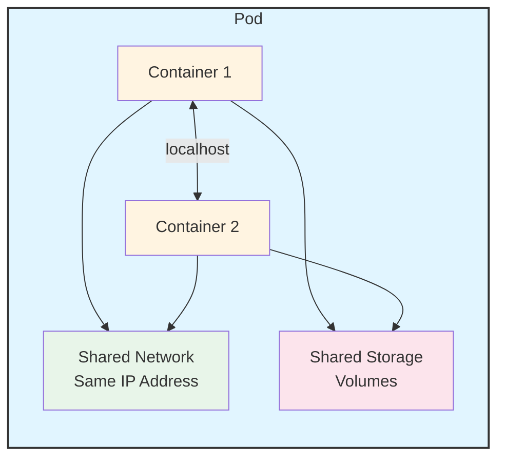

# Structure d'un Pod

Comprendre la structure d'un Pod vous aide à travailler avec eux efficacement. Décomposons ce qui compose un Pod et comment ses composants fonctionnent ensemble.

## L'anatomie d'un Pod

Un Pod est un objet Kubernetes, ce qui signifie qu'il suit la structure standard des objets Kubernetes. Chaque Pod a :

- **Metadata** : Informations qui identifient le Pod (nom, namespace, labels, etc.)
- **Spec** : L'état souhaité que vous voulez pour le Pod (quels conteneurs exécuter, quelles ressources ils ont besoin, etc.)
- **Status** : L'état actuel du Pod (quels conteneurs fonctionnent, leur santé, etc.)

Pour voir la structure complète d'un Pod avec les trois sections (metadata, spec, status), essayez :

```bash
kubectl get pod web -o yaml
```

Lorsque vous créez un Pod, vous définissez à la fois les **metadata** (pour l'identifier) et le **spec** (pour décrire ce que vous voulez). Le **status** est automatiquement maintenu par Kubernetes pendant qu'il travaille pour rendre votre état souhaité réalité.



## Composants d'un Pod

À l'intérieur d'un Pod, vous trouverez :

- **Conteneurs** : Un ou plusieurs conteneurs d'application qui exécutent votre code
- **Stockage partagé** : Des volumes auxquels tous les conteneurs du Pod peuvent accéder
- **Identité réseau** : Chaque Pod obtient une adresse IP unique sur le réseau du cluster



## Ressources réseau partagées

Chaque Pod se voit attribuer une adresse IP unique pour chaque famille d'adresses (IPv4 et/ou IPv6). C'est l'un des aspects les plus importants du réseau des Pods :

- **Même adresse IP** : Chaque conteneur dans un Pod partage l'espace de noms réseau, ce qui signifie qu'ils ont tous la même adresse IP
- **Communication localhost** : Les conteneurs dans le même Pod peuvent communiquer entre eux en utilisant `localhost`
- **Coordination des ports** : Comme les conteneurs partagent le réseau, ils doivent coordonner quels ports ils utilisent pour éviter les conflits

Ce réseau partagé facilite le travail ensemble des conteneurs dans un Pod. Par exemple, un conteneur de serveur web et un conteneur de journalisation dans le même Pod peuvent communiquer directement sans avoir à passer par le réseau.

## Ressources de stockage partagées

Un Pod peut spécifier un ensemble de volumes de stockage partagés. Tous les conteneurs du Pod peuvent accéder à ces volumes, leur permettant de partager des fichiers et des données :

- **Volumes partagés** : Les conteneurs peuvent lire et écrire dans les mêmes fichiers
- **Persistance des données** : Si un conteneur redémarre, les données dans les volumes partagés restent disponibles pour les autres conteneurs
- **Stockage flexible** : Les volumes peuvent être temporaires (comme emptyDir) ou persistants (comme le stockage cloud)

Ce stockage partagé est parfait pour les scénarios où un conteneur génère des données (comme télécharger des fichiers) et un autre conteneur les traite (comme un serveur web servant ces fichiers).

## Modèle de Pod

Lorsque vous utilisez des ressources de charge de travail comme les Deployments ou StatefulSets, vous ne créez pas de Pods directement. Au lieu de cela, vous définissez un **modèle de pod** qui décrit à quoi les Pods devraient ressembler. La ressource de charge de travail utilise ensuite ce modèle pour créer des Pods réels.

Le modèle de pod est comme un plan. Lorsque vous mettez à jour le modèle, la ressource de charge de travail crée de nouveaux Pods basés sur le modèle mis à jour, remplaçant progressivement les anciens. C'est ainsi que fonctionnent les mises à jour progressives dans Kubernetes.

:::info
Le modèle de pod fait partie du spec des ressources de charge de travail. Lorsque vous modifiez le modèle, Kubernetes ne modifie pas les Pods existants, il en crée de nouveaux avec la configuration mise à jour. Cela garantit que les mises à jour sont sûres et peuvent être annulées si nécessaire.
:::

## Champs requis

Chaque manifest de Pod doit inclure les champs standard des objets Kubernetes :

- **apiVersion** : `v1` pour les objets Pod
- **kind** : `Pod`
- **metadata** : Au minimum, un champ `name`
- **spec** : La spécification décrivant quels conteneurs exécuter et comment

Le spec est l'endroit où vous définissez vos conteneurs, leurs images, les exigences de ressources et tous les volumes dont ils ont besoin. C'est le cœur de votre définition de Pod.
