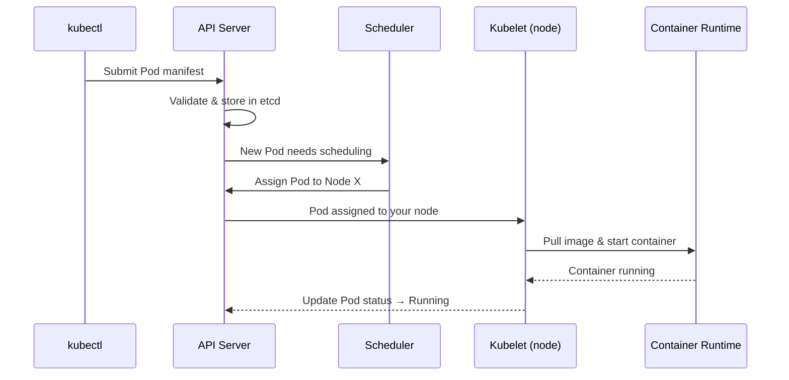

# Creating Your First Pod

Theory is valuable, but nothing solidifies understanding like doing it yourself. In this lesson, you will write a Pod manifest from scratch, hand it to Kubernetes, and watch a running container appear in your cluster. By the end, you will have a clear mental model of the journey a manifest takes — from a file on your machine to a live workload on a node.

## Writing the Manifest

Every Pod starts as a YAML file — a declarative description of what you want Kubernetes to create. Here is a simple manifest that runs an Nginx web server:

```yaml
apiVersion: v1
kind: Pod
metadata:
  name: nginx-pod
spec:
  containers:
    - name: nginx
      image: nginx:1.27
      ports:
        - containerPort: 80
```

Let's break this down field by field:

| Field                   | What it does                                                       |
|-------------------------|--------------------------------------------------------------------|
| `apiVersion: v1`        | Tells Kubernetes which API version to use. Pods belong to the core `v1` group. |
| `kind: Pod`             | Declares the type of object you are creating.                      |
| `metadata.name`         | A unique name for the Pod within its namespace. Must be lowercase, alphanumeric, with hyphens allowed. |
| `spec.containers`       | A list of containers to run. Even for a single container, this is an array. |
| `spec.containers[].name`  | A human-readable name for the container — required and must be unique within the Pod. |
| `spec.containers[].image` | The container image to pull. Use an explicit tag (like `1.27`) rather than `latest` for reproducibility. |
| `spec.containers[].ports` | Declares which ports the container listens on. This is informational but also used by Services for discovery. |

:::info
The `name` field under `metadata` must be unique within a namespace. If you try to create a Pod with a name that already exists, Kubernetes will reject the request. You can use different namespaces to avoid naming collisions.
:::

## Applying the Manifest

Save the YAML above to a file — for example, `nginx-pod.yaml` — and then tell Kubernetes to create the Pod:

```bash
kubectl apply -f nginx-pod.yaml
```

You should see output confirming the creation:

```
pod/nginx-pod created
```

The `apply` command is **declarative**: it tells Kubernetes "make reality match this file." If the Pod does not exist, Kubernetes creates it. If it already exists, Kubernetes updates it to match the file (where possible). This declarative approach is central to how Kubernetes works — you describe the *desired state*, and the system converges toward it.

## What Happens Behind the Scenes

When you run `kubectl apply`, a chain of events unfolds inside the cluster. Understanding this flow helps enormously when something goes wrong:



1. **Validation** — the API server checks your manifest for correctness and stores it in etcd, the cluster's data store.
2. **Scheduling** — the scheduler finds a node with enough resources and assigns the Pod to it.
3. **Execution** — the kubelet on the chosen node pulls the container image and starts the container.
4. **Status updates** — the kubelet continuously reports the Pod's state back to the API server.

If anything goes wrong at any step — an invalid field, no available nodes, a missing image — the Pod's status will reflect the problem, and events will explain what happened.

## Verifying Your Pod

Once the Pod is created, your first instinct should be to check its status:

```bash
kubectl get pods
```

You will see output like:

```
NAME        READY   STATUS    RESTARTS   AGE
nginx-pod   1/1     Running   0          12s
```

The `READY` column shows how many containers are ready out of the total. `1/1` means your single container is up and healthy. If you see `ContainerCreating`, the image is still being pulled — give it a moment.

For a deeper look, use `describe` to see the full story: events, conditions, resource allocations, and container states:

```bash
kubectl describe pod nginx-pod
```

Scroll to the **Events** section at the bottom — it reads like a timeline of everything that happened to your Pod, from scheduling to image pull to container start.

To see which node the Pod landed on and its IP address:

```bash
kubectl get pod nginx-pod -o wide
```

## Quick Cleanup

When you are done experimenting, remove the Pod to free up cluster resources:

```bash
kubectl delete pod nginx-pod
```

Or delete it using the same manifest file:

```bash
kubectl delete -f nginx-pod.yaml
```

:::warning
In production, you should almost never create standalone Pods like this. Use a **Deployment** instead — it wraps your Pod in a controller that provides self-healing (automatic restarts), scaling (run multiple replicas), and rolling updates (zero-downtime deployments). Direct Pod creation is ideal for learning and quick experiments, but a Deployment is what keeps your application resilient.
:::

## Wrapping Up

You have just completed the full loop: writing a Pod manifest, applying it to the cluster, and verifying that Kubernetes brought it to life. Along the way, you saw the chain of events — validation, scheduling, image pull, container start — that turns a YAML file into a running workload. You also learned how to inspect and clean up your Pods.

This is the foundation everything else builds on. In the upcoming lessons, you will explore the Pod lifecycle — phases, container states, conditions, and restart policies — to understand what happens after a Pod is running, and what Kubernetes does when things go wrong.
