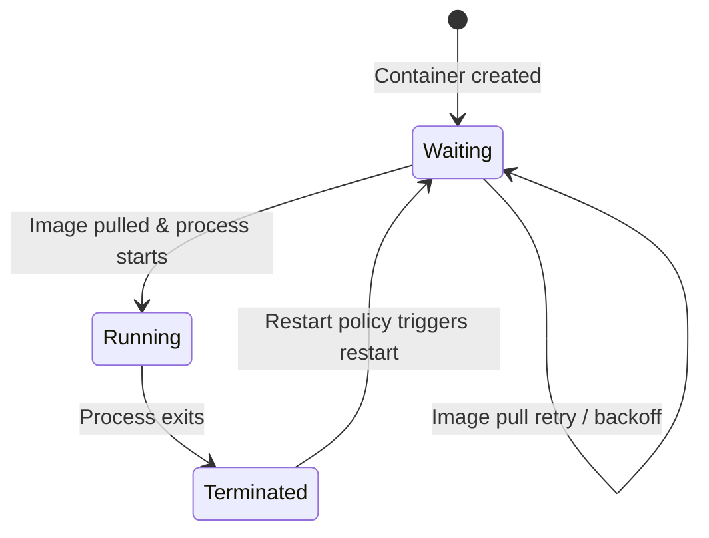

# Container States

In the previous lesson, you learned that a Pod's **phase** gives you a bird's-eye view of its lifecycle. But a Pod can hold multiple containers, and each one has its own story. That is where **container states** come in. If the Pod phase is the weather report for a city, container states are the temperature readings for each neighborhood — same city, much more detail.

Kubernetes tracks three possible states for every container: **Waiting**, **Running**, and **Terminated**. Understanding these states (and the *reasons* attached to them) is one of the most practical debugging skills you will develop.

## The Three Container States

Each container's state is recorded in `status.containerStatuses[].state`. Let's walk through them:

### Waiting

The container exists but is not executing yet. Something needs to happen before it can start. Kubernetes attaches a **reason** to every Waiting state so you know exactly what is holding things up:

- **ContainerCreating** — The runtime is setting up the container (pulling image, mounting volumes).
- **ImagePullBackOff / ErrImagePull** — Kubernetes cannot pull the container image. Check the image name, tag, and any `imagePullSecrets`.
- **CrashLoopBackOff** — The container started, crashed, and Kubernetes is waiting before trying again (more on this below).

### Running

The container process is alive and executing. If the container spec includes a `postStart` lifecycle hook, that hook has already completed. From the container runtime's perspective, everything is nominal.

Keep in mind: *Running* does not automatically mean "healthy" or "ready to serve traffic." A web server might be running but still loading data before it can accept requests. That distinction is handled by readiness probes and the Pod's **Ready** condition, which we cover in the next lesson.

### Terminated

The container ran and then exited. Kubernetes records the **exit code**, a **reason**, and a **finishedAt** timestamp. Common reasons include:

| Reason | What happened |
|---|---|
| **Completed** | The process exited with code 0 — everything went well. |
| **Error** | The process exited with a non-zero code. |
| **OOMKilled** | The container exceeded its memory limit and was killed by the kernel. Exit code is typically 137. |



## CrashLoopBackOff — the State Within a State

You will encounter `CrashLoopBackOff` often enough that it deserves its own explanation. It is not technically a container state — it is a **reason** attached to the Waiting state. Here is what happens:

1. The container starts.
2. The process crashes (non-zero exit) almost immediately.
3. The kubelet restarts the container after a delay.
4. The container crashes again.
5. The delay grows exponentially: 10s → 20s → 40s → … up to 5 minutes.

The exponential backoff protects your cluster from a container that keeps crashing and consuming resources in a tight loop. When you see this reason, the fix is almost always in the application, its configuration, or its probes — not in Kubernetes itself.

:::warning
Exit code **137** usually means **OOMKilled** — the container tried to use more memory than its `resources.limits.memory` allows. Increase the limit if the workload genuinely needs more memory, or investigate memory leaks in your application.
:::

## Inspecting Container States

The richest view comes from `kubectl describe`:

```bash
kubectl describe pod <pod-name>
```

Look for the **State**, **Last State**, **Reason**, and **Exit Code** fields under each container. **Last State** is particularly helpful when a container has restarted — it tells you what happened in the *previous* run.

You can also extract state programmatically with JSONPath:

```bash
kubectl get pod <pod-name> -o jsonpath='{.status.containerStatuses[*].state}'
```

### Try it yourself

Apply this Pod and watch its container move from Waiting to Running:

```yaml
apiVersion: v1
kind: Pod
metadata:
  name: state-demo
spec:
  containers:
    - name: nginx
      image: nginx
      resources:
        limits:
          memory: "128Mi"
```

```bash
kubectl apply -f state-demo.yaml
kubectl get pod state-demo -w
```

Once the Pod is Running, use `kubectl describe pod state-demo` and read the container state section. Everything should show **State: Running** with a `startedAt` timestamp.

## Debugging by Container State

Here is a quick reference for the most common issues:

- **Waiting + ImagePullBackOff** — Wrong image name or tag, missing `imagePullSecrets`, or a private registry that requires authentication. Double-check your manifest and registry access.
- **Waiting + CrashLoopBackOff** — The container keeps crashing. Run `kubectl logs <pod-name>` (add `--previous` to see logs from the last crashed instance) and fix the root cause.
- **Terminated + OOMKilled** — Memory limit exceeded. Review your `resources.limits.memory` and your application's actual memory usage.
- **Terminated + Error** — The process returned a non-zero exit code. Logs are your best friend here.

:::info
When a container restarts, its previous logs are still accessible with `kubectl logs <pod-name> --previous`. This is invaluable for debugging crashes — the current container may have no useful output yet, but the previous run often reveals the error.
:::

## Wrapping Up

Container states — **Waiting**, **Running**, and **Terminated** — give you the per-container detail that Pod phases intentionally leave out. Each state comes with a **reason** that points you toward the root cause when something goes wrong. Combined with `kubectl describe` and `kubectl logs`, these states form the backbone of day-to-day Kubernetes troubleshooting. Next up, we will look at **Pod conditions**, which answer a different but equally important question: has this Pod passed the checks it needs to actually receive traffic?
