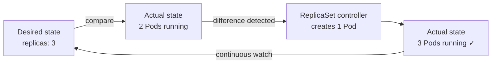
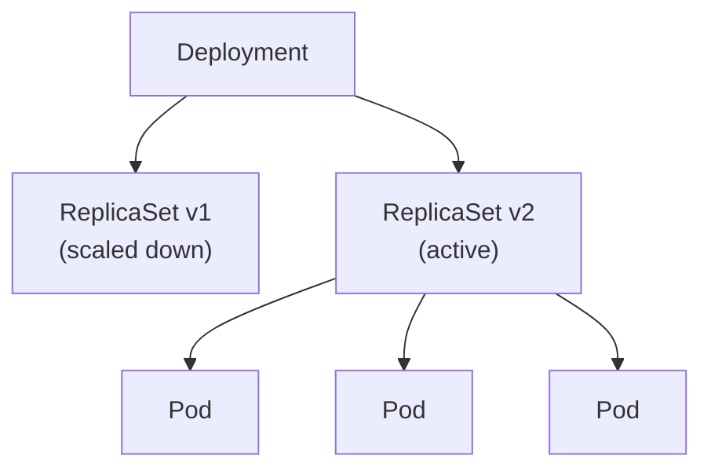

# What Is a ReplicaSet?

## The Problem: Pods Are Fragile

In the previous lessons, you learned that a Pod is the smallest deployable unit in Kubernetes. But here is an important truth: **a standalone Pod has no safety net**. If it crashes, gets evicted, or the node it lives on goes down — that Pod is gone. Nothing brings it back.

Imagine you run a small bakery. You have a single baker on shift. If that baker calls in sick, no bread gets made and your customers leave empty-handed. You need a way to guarantee that a certain number of bakers are always working, no matter what happens. That is exactly the role of a **ReplicaSet**.

## What a ReplicaSet Does

A ReplicaSet is a Kubernetes controller whose job is to maintain a **stable set of identical Pod replicas** running at all times. You tell it: *"I want 3 copies of this Pod."* The ReplicaSet controller watches the cluster and continuously makes sure that exactly 3 matching Pods exist.

- If a Pod disappears (crash, deletion, node failure), the ReplicaSet **creates a replacement**.
- If there are too many Pods (for example, after scaling down), it **terminates the extras**.

This constant loop of *observing → comparing → acting* is called the **reconciliation loop**, and it is at the heart of how Kubernetes keeps your applications running.



## The Three Building Blocks

Every ReplicaSet is defined by three essential pieces:

| Field | Purpose |
|-------|---------|
| **`spec.replicas`** | The desired number of Pod copies |
| **`spec.selector`** | A label selector that identifies which Pods belong to this ReplicaSet |
| **`spec.template`** | A Pod template used to create new Pods when needed |

Think of it this way: the **replica count** is how many bakers you want on shift, the **selector** is the uniform they wear so you can identify them, and the **template** is the hiring profile you use when you need to bring in a replacement.

## A Minimal ReplicaSet Manifest

Here is a straightforward ReplicaSet that maintains 3 Nginx Pods:

```yaml
apiVersion: apps/v1
kind: ReplicaSet
metadata:
  name: nginx-rs
spec:
  replicas: 3
  selector:
    matchLabels:
      app: nginx
  template:
    metadata:
      labels:
        app: nginx
    spec:
      containers:
        - name: nginx
          image: nginx:1.21
```

Notice that the labels in `spec.template.metadata.labels` **must match** the `spec.selector.matchLabels`. This is how the ReplicaSet knows which Pods belong to it. If they don't match, Kubernetes rejects the manifest outright.

## Seeing It in Action

You can list ReplicaSets in your cluster using the full name or the handy shortcut `rs`:

```bash
kubectl get replicasets
kubectl get rs
```

To get more details — the selector, the image, and the current vs desired replica count:

```bash
kubectl get rs -o wide
kubectl describe replicaset nginx-rs
```

You can also verify which Pods are managed by the ReplicaSet by filtering on the selector label:

```bash
kubectl get pods -l app=nginx
```

Each Pod created by a ReplicaSet carries a field called `metadata.ownerReferences` that points back to the ReplicaSet. This is how Kubernetes tracks the **ownership chain** — if the ReplicaSet is deleted, Kubernetes knows which Pods to clean up.

## ReplicaSets and Deployments

You might be wondering: *"If ReplicaSets are so useful, why don't I see them used directly very often?"*

Great question. In practice, you will almost always use a **Deployment** instead. A Deployment is a higher-level controller that creates and manages ReplicaSets for you, while adding powerful features like **rolling updates** and **rollbacks**. When you update a Deployment's Pod template, it creates a *new* ReplicaSet, gradually scales it up, and scales the old one down — all automatically.



:::info
As a general rule, use a Deployment rather than a bare ReplicaSet. Deployments give you rolling updates, rollback capabilities, and a cleaner update workflow. Understanding ReplicaSets is still essential because they are the mechanism Deployments rely on under the hood.
:::

:::warning
Avoid creating standalone Pods that happen to match a ReplicaSet's selector. The ReplicaSet may **adopt** those Pods, which can lead to unexpected behavior — such as the ReplicaSet deleting your manually created Pod to stay at the desired count.
:::

## Wrapping Up

A ReplicaSet is Kubernetes' way of guaranteeing that a specific number of identical Pods are always running. It continuously watches the cluster, compares the actual state to the desired state, and takes corrective action. It is built on three pillars: a **replica count**, a **label selector**, and a **Pod template**.

While you will rarely create ReplicaSets directly (Deployments handle that for you), understanding them is key to grasping how Kubernetes keeps your applications resilient. In the next lesson, we will take a closer look at **selectors** — the mechanism that connects a ReplicaSet to its Pods.
