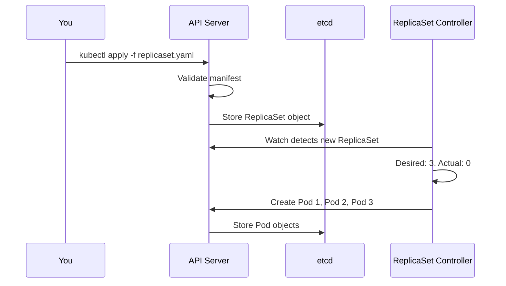
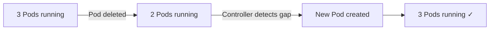

# Creating a ReplicaSet

## From Theory to Practice

You now understand what a ReplicaSet is and how selectors connect it to its Pods. It is time to put that knowledge into action. In this lesson, you will write a ReplicaSet manifest from scratch, apply it to a cluster, observe the Pods it creates, and learn how to scale it up and down.

Think of this as moving from reading a recipe to actually stepping into the kitchen. The ingredients are the same ones you have been learning about — replica count, selector, and Pod template — and now you will combine them.

## Anatomy of the Manifest

Here is a complete ReplicaSet manifest. Take a moment to read through it before we break it down:

```yaml
apiVersion: apps/v1
kind: ReplicaSet
metadata:
  name: frontend
  labels:
    app: guestbook
    tier: frontend
spec:
  replicas: 3
  selector:
    matchLabels:
      tier: frontend
  template:
    metadata:
      labels:
        tier: frontend
    spec:
      containers:
        - name: php-redis
          image: nginx:1.25
          ports:
            - containerPort: 80
```

Let's walk through each section:

| Section | What It Does |
|---------|-------------|
| `apiVersion: apps/v1` | Tells Kubernetes which API group and version to use. ReplicaSets belong to the `apps` group. |
| `kind: ReplicaSet` | The type of object you are creating. |
| `metadata.name` | A unique name for this ReplicaSet within its namespace. |
| `spec.replicas` | The desired number of Pod copies. Here, we want **3**. |
| `spec.selector.matchLabels` | The label selector. The ReplicaSet manages Pods with `tier: frontend`. |
| `spec.template` | The blueprint for creating Pods. Its labels **must match** the selector. |

:::info
The labels on the ReplicaSet's own `metadata` (like `app: guestbook`) are for your organizational purposes — they do not affect which Pods the ReplicaSet manages. Only the **selector** determines Pod ownership.
:::

## Applying the Manifest

Save the manifest to a file called `replicaset.yaml` and apply it:

```bash
kubectl apply -f replicaset.yaml
```

Kubernetes will validate the manifest, store it in etcd, and the ReplicaSet controller will immediately start working. Within seconds, it creates 3 Pods to satisfy the desired replica count.



## Verifying the Result

After applying, verify that everything is running as expected. Start by checking the ReplicaSet itself:

```bash
kubectl get rs frontend
```

You should see output similar to:

```
NAME       DESIRED   CURRENT   READY   AGE
frontend   3         3         3       30s
```

- **DESIRED** — the replica count you specified (3)
- **CURRENT** — how many Pods have been created (3)
- **READY** — how many Pods are running and healthy (3)

When all three numbers match, your ReplicaSet is fully operational.

To see the individual Pods:

```bash
kubectl get pods -l tier=frontend
```

For a deeper look at events, the selector, and the template:

```bash
kubectl describe rs frontend
```

The `Events` section at the bottom of the output is particularly useful — it shows you exactly when and why Pods were created or deleted.

## Scaling the ReplicaSet

One of the most powerful aspects of a ReplicaSet is how easy it is to change the number of replicas. There are two common approaches.

### Option 1: Edit the manifest and reapply

Change `spec.replicas` from `3` to `5` in your YAML file, then run:

```bash
kubectl apply -f replicaset.yaml
```

The ReplicaSet controller detects that 5 Pods are desired but only 3 exist, so it creates 2 more.

### Option 2: Use `kubectl scale`

For a quick, imperative change without editing files:

```bash
kubectl scale rs frontend --replicas=5
```

Both approaches work, but the declarative method (editing the file and reapplying) is preferred in production workflows because it keeps your manifest in sync with reality.

:::warning
Scaling **down** terminates Pods. If your application needs to handle in-flight requests or save state before shutting down, make sure your containers respond to the `SIGTERM` signal and perform a **graceful shutdown**. Kubernetes sends `SIGTERM` and waits for a grace period (default: 30 seconds) before forcefully killing the container.
:::

## Testing Self-Healing

This is where it gets satisfying. Delete one of the Pods manually and watch what happens:

```bash
kubectl delete pod <pod-name>
```

Now check the Pods again:

```bash
kubectl get pods -l tier=frontend
```

You will see a **new Pod** has appeared with a fresh name and a very recent `AGE`. The ReplicaSet detected that the actual count dropped below the desired count and immediately created a replacement. This self-healing behavior is what makes ReplicaSets — and by extension, Deployments — so valuable in production.



## Cleaning Up

When you are done experimenting, you can delete the ReplicaSet. By default, this also deletes all the Pods it owns:

```bash
kubectl delete rs frontend
```

If you want to delete the ReplicaSet but **keep the Pods** running (they become standalone, unmanaged Pods), use the `--cascade=orphan` flag:

```bash
kubectl delete rs frontend --cascade=orphan
```

:::info
Orphaned Pods lose their safety net — no controller will recreate them if they fail. This option is mainly useful during migrations or debugging, not for regular operations.
:::

## Wrapping Up

You have now gone through the full lifecycle of a ReplicaSet: writing the manifest, applying it, verifying the result, scaling up and down, and observing self-healing in action. The key fields to remember are `spec.replicas`, `spec.selector`, and `spec.template` — and the cardinal rule that **template labels must match the selector**.

In practice, you will rarely create ReplicaSets directly. The next chapter introduces **Deployments**, which wrap ReplicaSets with rolling update and rollback capabilities. But everything you have learned here — the reconciliation loop, selectors, ownership, and scaling — carries directly into Deployments. You now have a solid foundation to build on.
