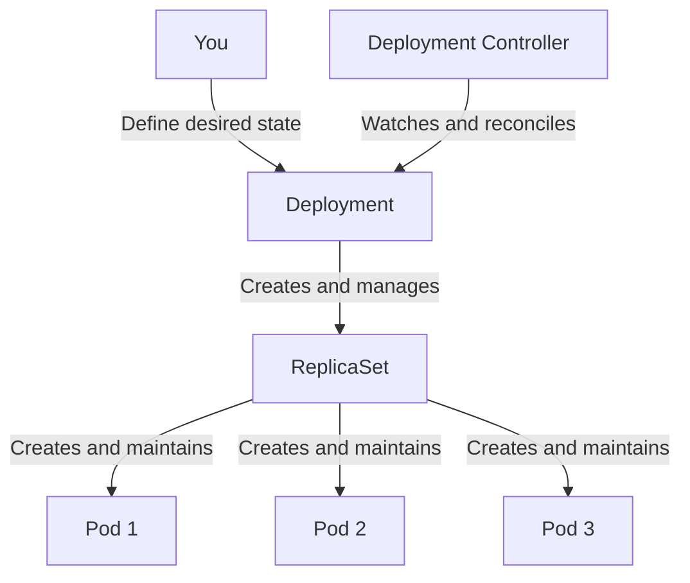

# What is a Deployment?

When you run applications in Kubernetes, you need a way to ensure they stay running, can be updated smoothly, and scale to handle traffic. This is exactly what a Deployment does.

Just like a conductor doesn't play instruments directly but coordinates musicians to create the desired symphony, a Deployment doesn't run containers directly. Instead, it manages ReplicaSets, which in turn manage the Pods that actually run your application.

## Desired State vs Actual State

Kubernetes works on a powerful principle: you describe what you want (the **desired state**), and Kubernetes works continuously to make it happen (the **actual state**).

When you create a Deployment, you're telling Kubernetes: "I want 3 copies of my web server running at all times." The Deployment controller then monitors the cluster and takes action whenever the actual state differs from your desired state. If a Pod crashes, it creates a new one. If you change the number of replicas, it adjusts accordingly.

## The Deployment Hierarchy

A Deployment creates a ReplicaSet automatically, and the ReplicaSet creates the Pods. This hierarchy exists for good reasons:

- **Deployment**: Handles high-level concerns like rolling updates and rollbacks
- **ReplicaSet**: Ensures the right number of Pod replicas are running
- **Pods**: Actually run your application containers

When you update a Deployment (like changing the container image), it creates a new ReplicaSet with the new configuration while gradually scaling down the old one. This enables smooth rolling updates.

## The pod-template-hash Label

Kubernetes automatically adds a `pod-template-hash` label to every ReplicaSet and Pod created by a Deployment. This hash is generated from the Pod template specification and ensures that each ReplicaSet manages only its own Pods. You'll see names like `nginx-deployment-75675f5897` where the suffix is this hash.

## When to Use Deployments

Deployments are ideal for **stateless applications** where any Pod can handle any request:

- Web servers and APIs
- Microservices
- Worker processes
- Frontend applications

For stateful applications that need stable network identity or persistent storage, consider using StatefulSets instead.

:::info
Deployments are the recommended way to deploy applications in Kubernetes. They handle Pod lifecycle, scaling, updates, and self-healing automatically, making them suitable for most production workloads.
:::

:::warning
Never manually modify or delete ReplicaSets that are owned by a Deployment. The Deployment controller manages them automatically, and manual changes will be overwritten or cause unexpected behavior.
:::
